# Chapter 1: Overview and High-Level Architecture

**CloseCombatFree (CCF) Technical Documentation**

Version: 0.0.5 (Development)  
Author: Tomasz 'sierdzio' Siekierda  
License: GPLv3  
Last Updated: 2024

---

## Table of Contents

1. [Gameplay Overview](#1-gameplay-overview)
2. [System Architecture](#2-system-architecture)
3. [Design Philosophy](#3-design-philosophy)
4. [Implementation Details](#4-implementation-details)
5. [Directory Structure](#5-directory-structure)
6. [Execution Flow](#6-execution-flow)
7. [Coordinate Systems](#7-coordinate-systems)
8. [Time and Simulation](#8-time-and-simulation)
9. [Debug/Development Features](#9-debugdevelopment-features)

---

## 1. Gameplay Overview

### 1.1 Genre and Concept

CloseCombatFree (CCF) is a **real-time tactical wargame** inspired by the classic Close Combat series. It represents a digital implementation of traditional tabletop wargaming mechanics, combining the strategic depth of turn-based systems with the urgency of real-time decision-making.

**Level 1 - Player Experience:**

The game places players in command of military units (tanks, infantry) on a 2D battlefield. Players issue orders through an intuitive point-and-click interface, directing units to move, attack, defend, or use special abilities. The game simulates realistic tactical considerations including:

- **Line of Sight (LOS)**: Units can only see and fire at enemies within their field of view, with terrain and obstacles blocking vision
- **Unit Psychology**: Soldiers experience suppression, morale effects, and combat stress
- **Realistic Ballistics**: Projectiles follow physical trajectories, affected by terrain and cover
- **Command and Control**: Players manage multiple units simultaneously through group selection and formation controls

### 1.2 Core Mechanics

**Level 1 - Game Systems:**

| Mechanic | Description | Implementation |
|----------|-------------|----------------|
| Unit Selection | Click to select, shift-click for multi-select, numeric keys for groups | QML MouseArea + C++ state tracking |
| Order System | Context menu (right-click) provides context-sensitive orders | `CcfQmlBaseScenario::scheduleContextAction()` |
| Movement | Click destination, choose speed (sneak, move, move fast) | Animation + C++ helper calculations |
| Combat | Select target, unit automatically fires when ready | State machine + timer-based firing |
| Zoom/Pan | Mouse wheel zooms, drag to pan | Flickable + PinchArea in QML |
| Pause | Spacebar pauses all action | Signal propagation to all units |

### 1.3 Digital Implementation Advantages

**Level 2 - Technical Benefits:**

The digital format enables mechanics impossible in physical wargames:

1. **Fog of War**: Computed dynamically based on unit positions, terrain elevation, and obstacles
2. **Real-time Physics**: Projectiles calculated frame-by-frame with collision detection
3. **Persistent State**: Complete game state saved and restored seamlessly
4. **Moddability**: All content (units, maps, scenarios) defined in declarative QML files

---

## 2. System Architecture

### 2.1 High-Level Layer Diagram

CCF follows a strict **layered architecture** with clear separation of concerns:

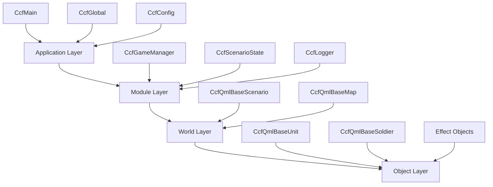

### 2.2 Layer Responsibilities

**Level 2 - Architecture Patterns:**

#### Application Layer (Foundation)

The Application Layer manages the Qt application lifecycle and provides global services:

- **CcfMain** (`src/ccfmain.h:65`): Singleton main window and QML view manager
- **CcfGlobal** (`src/ccfglobal.h:40`): Global QML-accessible utilities
- **CcfConfig** (`src/config/ccfconfig.h:46`): Configuration management with Q_PROPERTY system
- **CcfLogger** (`src/config/ccflogger.h`): Debug and runtime logging

```cpp
// src/ccfmain.h:65-97
class CcfMain : public QQuickView, public CcfError
{
    Q_OBJECT
public:
    static CcfMain *instance(CcfCommandLineParser *cmd = 0);
    bool isConfigMaximised();
    void resizeView(QSize newSize);
    CcfLogger *logger();
    CcfConfig *config();
    CcfGlobal *global();
    CcfGameManager *gameManager();
    
private:
    static CcfMain *mInstance;
    CcfConfig *mConfiguration;
    CcfGlobal *mGlobal;
    CcfGameManager *mGameManager;
    CcfEngineHelpers *mEngineHelpers;
    CcfLogger *mLogger;
};
```

#### Module Layer (Services)

The Module Layer provides specialized services used across the application:

- **CcfGameManager** (`src/ccfgamemanager.h:48`): Scenario/campaign management, save/load
- **CcfScenarioState** (`src/logic/ccfscenariostate.h:16`): Runtime scenario state tracking
- **CcfEngineHelpers** (`src/logic/ccfenginehelpers.h:41`): Geometric calculations, LOS checks

```cpp
// src/ccfgamemanager.h:48-76
class CcfGameManager : public QObject, public CcfError
{
    Q_OBJECT
public:
    explicit CcfGameManager(QObject *parent = 0);
    
    Q_INVOKABLE QString scenarioPath(int index) const;
    Q_INVOKABLE QStringList scenarioList() const;
    Q_INVOKABLE void saveGame(const QObjectList &unitList,
                              const QString &mapFile,
                              const QString &saveFileName = "saves/save1.qml");
    Q_INVOKABLE QStringList savedGamesList() const;
    
private:
    QStringList mScenarioList;
    QStringList mCampaignList;
    QString mTab;
};
```

#### World Layer (Scene Management)

The World Layer manages the game world and its spatial properties:

- **CcfQmlBaseScenario** (`src/qmlBase/ccfqmlbasescenario.h:29`): Scenario controller, input handling
- **CcfQmlBaseMap** (`src/qmlBase/ccfqmlbasemap.h`): Map data and terrain information

```cpp
// src/qmlBase/ccfqmlbasescenario.h:29-92
class CcfQmlBaseScenario : public CcfObjectBase
{
    Q_OBJECT
    
    Q_PROPERTY(QString scenarioFile READ getScenarioFile WRITE setScenarioFile NOTIFY scenarioFileChanged)
    Q_PROPERTY(QString scenarioWinStatus READ getScenarioWinStatus WRITE setScenarioWinStatus NOTIFY scenarioWinStatusChanged)
    Q_PROPERTY(qreal zoom READ getZoom WRITE setZoom NOTIFY zoomChanged)
    Q_PROPERTY(QObjectList units READ getUnits WRITE setUnits NOTIFY unitsChanged)
    
public:
    explicit CcfQmlBaseScenario(QQuickItem *parent = 0);
    
    Q_INVOKABLE void handleLeftMouseClick(QObject *mouse);
    Q_INVOKABLE void handleRightMouseClick(QObject *mouse);
    Q_INVOKABLE void handleKeyPress(QObject *event);
    Q_INVOKABLE void handleWheelEventMouseAreaMain(QObject *wheel);
    
public slots:
    void init();
    void zoomIn();
    void zoomOut();
    void scheduleContextAction(const QString &operation);
};
```

#### Object Layer (Entities)

The Object Layer contains all game entities:

- **CcfQmlBaseUnit** (`src/qmlBase/ccfqmlbaseunit.h:33`): Base class for all units
- **CcfQmlBaseSoldier** (`src/qmlBase/ccfqmlbasesoldier.h`): Infantry-specific functionality
- **CcfObjectBase** (`src/logic/ccfobjectbase.h`): Root base class with common functionality

### 2.3 Module System Flow

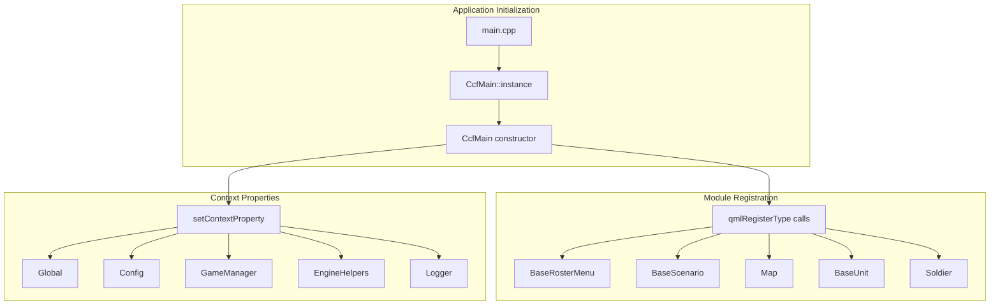

### 2.4 Communication Flow

**Level 2 - Data Flow Patterns:**

CCF uses a **hybrid communication model** combining Qt signals/slots with QML property binding:

#### Top-Down Communication (C++ to QML)

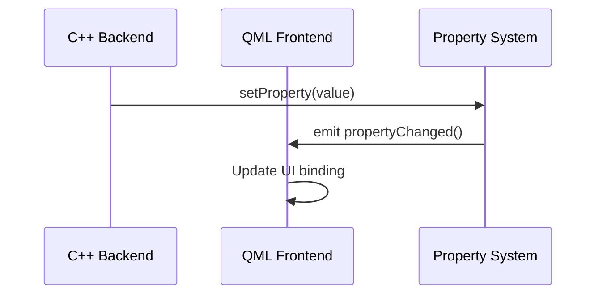

**Level 3 - Implementation:**

```cpp
// src/ccfmain.cpp:69-77
rootContext()->setContextProperty("Global", mGlobal);
rootContext()->setContextProperty("Config", mConfiguration);
rootContext()->setContextProperty("GameManager", mGameManager);
rootContext()->setContextProperty("EngineHelpers", mEngineHelpers);
rootContext()->setContextProperty("Logger", mLogger);

QString pwd = qApp->applicationDirPath() + "/";
rootContext()->setContextProperty("PWD", pwd);
```

Used in QML:

```qml
// qml/main.qml:36-37
width: Config.windowWidth
height: Config.windowHeight
```

#### Bottom-Up Communication (QML to C++)

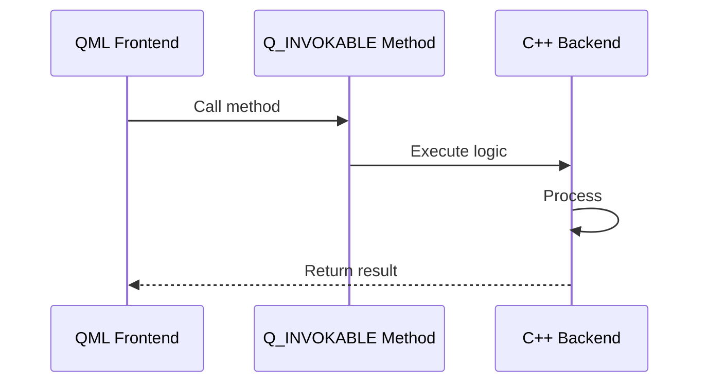

**Level 3 - Implementation:**

```cpp
// src/logic/ccfenginehelpers.h:47-57
class CcfEngineHelpers : public QObject
{
    Q_OBJECT
public:
    Q_INVOKABLE static int arrayContains(QList<QObject *> array, QObject *objToCheck);
    Q_INVOKABLE static qreal rotationAngle(qreal oldX, qreal oldY, qreal newX, qreal newY);
    Q_INVOKABLE static qreal targetDistance(qreal originX, qreal originY, qreal targetX, qreal targetY);
    Q_INVOKABLE static bool isObstacleInLOS(QList<QObject *> items, qreal x1, qreal y1,
                                     qreal x2, qreal y2, QObject *currentUnit);
};
```

---

## 3. Design Philosophy

### 3.1 C++/QML Hybrid Architecture

**Level 2 - Design Decisions:**

CCF deliberately uses a **hybrid C++/QML architecture** to leverage the strengths of each language:

| Aspect | C++ Responsibility | QML Responsibility |
|--------|-------------------|-------------------|
| Performance | Geometry calculations, LOS checks, AI | UI rendering, animations |
| Type Safety | Class hierarchies, property systems | Dynamic UI composition |
| Memory Management | Qt parent-child hierarchy | Visual element lifecycle |
| Modding | Engine core, fixed APIs | Content definition, scenarios |

**Level 3 - Pattern Implementation:**

```cpp
// src/ccfmain.cpp:54-61
CcfMain::CcfMain(CcfCommandLineParser *cmd, QWindow *parent) :
    QQuickView(parent), CcfError(), mCmdLnParser(cmd)
{
    // Register C++ types for QML instantiation
    qmlRegisterType<CcfQmlBaseRosterMenu>("QmlBase", 0, 1, "BaseRosterMenu");
    qmlRegisterType<CcfQmlBaseScenario>("QmlBase", 0, 1, "BaseScenario");
    qmlRegisterType<CcfQmlBaseMap>("QmlBase", 0, 1, "Map");
    qmlRegisterType<CcfQmlBaseUnit>("QmlBase", 0, 1, "BaseUnit");
    qmlRegisterType<CcfQmlBaseSoldier>("QmlBase", 0, 1, "Soldier");
```

### 3.2 Qt Object Model Patterns

**Level 2 - Memory Management:**

CCF extensively uses Qt's **parent-child object hierarchy** for automatic memory management:

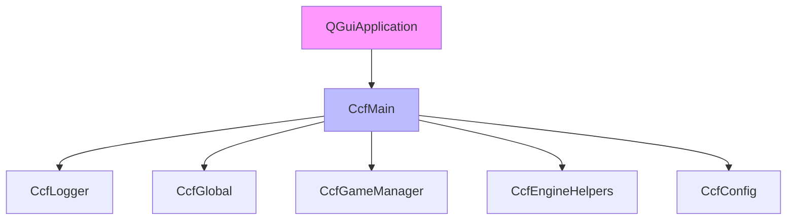

**Level 3 - Implementation:**

```cpp
// src/ccfmain.cpp:63-67
// All children of CcfMain - automatically deleted when CcfMain is destroyed
mLogger = new CcfLogger(this, mCmdLnParser->isDebug());
mGlobal = new CcfGlobal(this);
mGameManager = new CcfGameManager(this);
mEngineHelpers = new CcfEngineHelpers(this);
```

### 3.3 Singleton Pattern for Global Access

**Level 2 - Thread Safety:**

CcfMain implements the **singleton pattern** with lazy initialization:

```cpp
// src/ccfmain.h:44
#define cmain CcfMain::instance()

// src/ccfmain.h:70
static CcfMain *instance(CcfCommandLineParser *cmd = 0);

// src/ccfmain.cpp:33-46
CcfMain *CcfMain::mInstance = NULL;

CcfMain *CcfMain::instance(CcfCommandLineParser *cmd)
{
    if (!mInstance)
        mInstance = new CcfMain(cmd, 0);
    return mInstance;
}
```

### 3.4 Error Handling Strategy

**Level 2 - Error Propagation:**

All major classes inherit from **CcfError** for consistent error reporting:

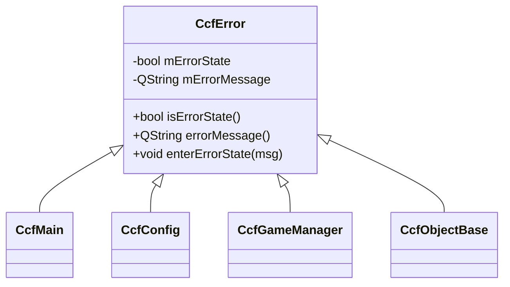

**Level 3 - Implementation:**

```cpp
// src/ccferror.h:34-45
class CcfError
{
public:
    CcfError();
    bool isErrorState() const;
    QString errorMessage() const;
    void enterErrorState(const QString &errorMessage);

private:
    bool mErrorState;
    QString mErrorMessage;
};
```

---

## 4. Implementation Details

### 4.1 C++11/14 Features Used

**Level 3 - Modern C++:**

| Feature | Usage Location | Purpose |
|---------|---------------|---------|
| `Q_DISABLE_COPY` | `src/ccfmain.h:85` | Prevent copy construction |
| `nullptr` (via Qt) | Throughout | Null pointer constant |
| `auto` | `src/logic/ccfenginehelpers.cpp:48` | Type inference |
| `emit` keyword | All signal emits | Qt signal emission marker |
| `Q_UNUSED` | `src/ccfgamemanager.cpp:154` | Mark intentionally unused parameters |

```cpp
// src/ccfmain.h:84-85
explicit CcfMain(CcfCommandLineParser *cmd, QWindow *parent = 0);
Q_DISABLE_COPY(CcfMain)
```

### 4.2 Qt-Specific Patterns

**Level 3 - Qt Idioms:**

#### Meta-Object System

```cpp
// src/qmlBase/ccfqmlbaseunit.h:35
class CcfQmlBaseUnit : public CcfObjectBase
{
    Q_OBJECT  // Required for signals/slots/properties
    
    // Property declaration with accessor methods
    Q_PROPERTY(QString objectType READ getObjectType WRITE setObjectType NOTIFY objectTypeChanged)
```

#### Signal-Slot Connections

```cpp
// src/ccfmain.cpp:80-84
connect(mConfiguration, SIGNAL(sizeModifiedInGame(int,int)), this, SLOT(forceViewportResize(int,int)));
connect(engine(), SIGNAL(quit()), this, SLOT(quit()));
connect(mConfiguration, SIGNAL(maximise()), this, SLOT(showMaximized()));
connect(mConfiguration, SIGNAL(demaximise()), this, SLOT(showNormal()));
connect(mGlobal, SIGNAL(disableQrc(QObject*)), this, SLOT(disableQrc(QObject*)));
```

#### Q_PROPERTY System

```cpp
// src/config/ccfconfig.h:55-86
Q_PROPERTY(QString uiMode READ getUiMode WRITE setUiMode NOTIFY uiModeChanged)
Q_PROPERTY(int windowWidth READ getWindowWidth WRITE setWindowWidth NOTIFY windowWidthChanged)
Q_PROPERTY(int windowHeight READ getWindowHeight WRITE setWindowHeight NOTIFY windowHeightChanged)
Q_PROPERTY(bool maximised READ isMaximised WRITE setMaximised NOTIFY maximisedChanged)
```

### 4.3 Property System Implementation

**Level 3 - Boilerplate Pattern:**

Each property requires five components:

```cpp
// 1. Private member
private:
    QString mObjectType;

// 2. Getter declaration
public:
    QString getObjectType() const;

// 3. Setter declaration  
    void setObjectType(const QString &objectType);

// 4. Signal declaration
signals:
    void objectTypeChanged();

// 5. Q_PROPERTY macro
    Q_PROPERTY(QString objectType READ getObjectType WRITE setObjectType NOTIFY objectTypeChanged)
```

Implementation:

```cpp
// src/qmlBase/ccfqmlbaseunit.cpp (typical implementation)
QString CcfQmlBaseUnit::getObjectType() const
{
    return mObjectType;
}

void CcfQmlBaseUnit::setObjectType(const QString &objectType)
{
    if (mObjectType != objectType) {
        mObjectType = objectType;
        emit objectTypeChanged();
    }
}
```

---

## 5. Directory Structure

### 5.1 Complete Project Tree

```
/home/juk/temp/closecombatfree/
├── closecombatfree.pro          # Root project file (subdirs template)
├── doc/                         # Documentation
│   ├── chapters/               # Technical documentation
│   │   └── 01-overview.md      # This document
│   ├── developer/              # Developer guides
│   └── user/                   # User documentation
├── src/                        # C++ source code
│   ├── src.pro                 # Main source project file
│   ├── globalImports.pri       # Shared build configuration
│   ├── main.cpp                # Application entry point
│   ├── ccfmain.h/.cpp          # Main window singleton
│   ├── ccfglobal.h/.cpp        # Global QML utilities
│   ├── ccfgamemanager.h/.cpp   # Game state management
│   ├── ccferror.h/.cpp         # Error handling base class
│   ├── config/                 # Configuration system
│   │   ├── ccfconfig.h/.cpp    # Main config class
│   │   ├── ccfconfigdata.h/.cpp # Config data structures
│   │   ├── ccfconfigparser.h/.cpp # Config file parsing
│   │   ├── ccfconfigsaver.h/.cpp  # Config file saving
│   │   ├── ccfcommandlineparser.h/.cpp # CLI handling
│   │   ├── ccflogger.h/.cpp    # Logging system
│   │   └── saveFileTemplate.txt # Save game template
│   ├── logic/                  # Game logic
│   │   ├── ccfenginehelpers.h/.cpp # Math/geometry helpers
│   │   ├── ccfscenariostate.h/.cpp # Scenario state tracking
│   │   └── ccfobjectbase.h/.cpp # Base object class
│   └── qmlBase/                # QML base classes (C++)
│       ├── ccfqmlbasescenario.h/.cpp # Scenario controller
│       ├── ccfqmlbasemap.h/.cpp      # Map base class
│       ├── ccfqmlbaseunit.h/.cpp     # Unit base class
│       ├── ccfqmlbasesoldier.h/.cpp  # Soldier base class
│       └── ccfqmlbaserostermenu.h/.cpp # UI roster menu
├── qml/                        # QML UI code
│   ├── main.qml                # Main entry point
│   ├── campaigns/              # Campaign UI components
│   ├── effects/                # Visual effects (explosions, etc.)
│   ├── gui/                    # Game UI components
│   │   ├── menus/              # In-game menus
│   │   └── menuEntries/        # Menu item components
│   ├── maps/                   # Map UI components
│   │   └── props/              # Map props (trees, buildings)
│   ├── menus/                  # Main menu screens
│   ├── scenarios/              # Scenario UI components
│   ├── units/                  # Unit UI components
│   │   └── tanks/              # Tank-specific UI
│   └── weather/                # Weather effects
├── scenarios/                  # Scenario definition files
├── campaigns/                  # Campaign definition files
├── maps/                       # Map definition files
│   └── props/                  # Map prop definitions
├── units/                      # Unit definition files
│   └── tanks/                  # Tank definitions
│       └── tests/              # Test unit definitions
├── saves/                      # Save game storage
├── img/                        # Image assets
│   ├── campaigns/              # Campaign images
│   ├── effects/                # Effect sprites
│   ├── gui/                    # UI elements
│   ├── maps/                   # Map textures
│   ├── menus/                  # Menu backgrounds
│   └── units/                  # Unit sprites
├── editor/                     # Scenario editor
└── tools/                      # Development tools
    ├── archiveProject/         # Archiving utility
    ├── makedocs/               # Documentation generator
    ├── relative2qrc/           # Path converter utility
    └── updateQmlTo2.0/         # Migration tool
```

### 5.2 Build System Organization

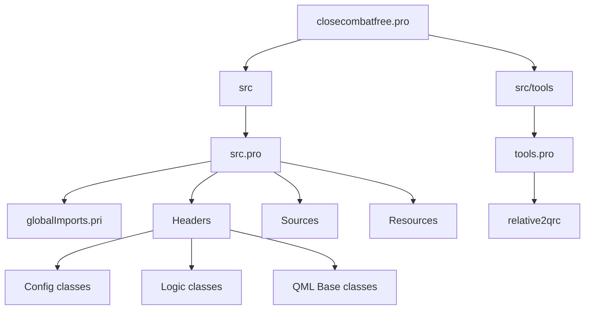

---

## 6. Execution Flow

### 6.1 Application Startup Sequence

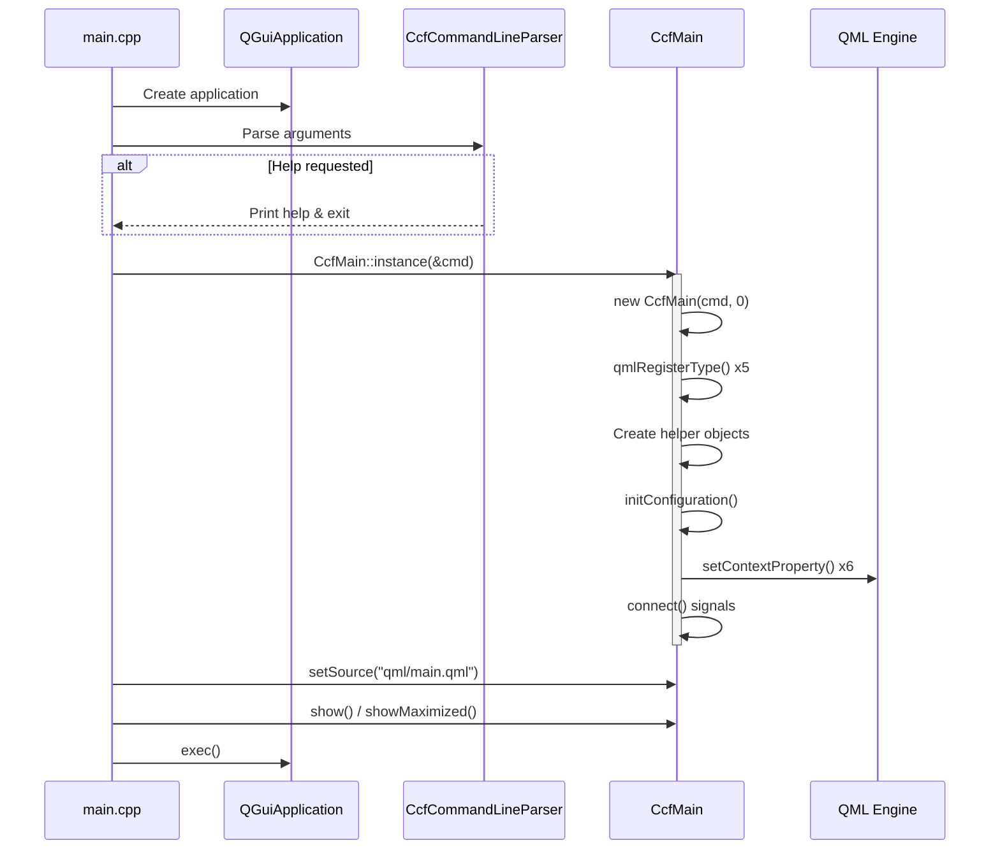

### 6.2 Detailed Startup Code Flow

**Level 3 - Implementation:**

```cpp
// src/main.cpp:39-64
int main(int argc, char *argv[])
{
    // 1. Create Qt application
    QGuiApplication a(argc, argv);
    
    // 2. Parse command line
    CcfCommandLineParser cmd(a.arguments());
    if (cmd.wasHelpRequested()) {
        qDebug(qPrintable(cmd.helpMessage()), NULL);
        return 1;
    }
    
    // 3. Initialize main window (singleton)
    CcfMain *viewer = CcfMain::instance(&cmd);
    
    // 4. Check for initialization errors
    if (!viewer->isErrorState()) {
        // 5. Load main QML file
        QUrl source = QUrl::fromLocalFile("qml/main.qml");
        viewer->setSource(source);
        
        // 6. Show window
        if (viewer->isConfigMaximised()) {
            viewer->showMaximized();
        } else {
            viewer->show();
        }
        
        // 7. Start event loop
        return a.exec();
    } else {
        // Fatal error during initialization
        qFatal(qPrintable(viewer->errorMessage()), NULL);
        return 1;
    }
}
```

### 6.3 Constructor Chain

**Level 3 - Initialization Order:**

```cpp
// src/ccfmain.cpp:54-85
CcfMain::CcfMain(CcfCommandLineParser *cmd, QWindow *parent) :
    QQuickView(parent),      // 1. Initialize QQuickView base
    CcfError(),              // 2. Initialize error state
    mCmdLnParser(cmd)        // 3. Store command line parser
{
    // 4. Register QML types (must happen before QML loads)
    qmlRegisterType<CcfQmlBaseRosterMenu>("QmlBase", 0, 1, "BaseRosterMenu");
    qmlRegisterType<CcfQmlBaseScenario>("QmlBase", 0, 1, "BaseScenario");
    qmlRegisterType<CcfQmlBaseMap>("QmlBase", 0, 1, "Map");
    qmlRegisterType<CcfQmlBaseUnit>("QmlBase", 0, 1, "BaseUnit");
    qmlRegisterType<CcfQmlBaseSoldier>("QmlBase", 0, 1, "Soldier");
    
    // 5. Create helper objects (parented to this)
    mLogger = new CcfLogger(this, mCmdLnParser->isDebug());
    mGlobal = new CcfGlobal(this);
    mGameManager = new CcfGameManager(this);
    mEngineHelpers = new CcfEngineHelpers(this);
    
    // 6. Initialize configuration (may create default)
    initConfiguration();
    
    // 7. Expose C++ objects to QML
    rootContext()->setContextProperty("Global", mGlobal);
    rootContext()->setContextProperty("Config", mConfiguration);
    rootContext()->setContextProperty("GameManager", mGameManager);
    rootContext()->setContextProperty("EngineHelpers", mEngineHelpers);
    rootContext()->setContextProperty("Logger", mLogger);
    rootContext()->setContextProperty("PWD", pwd);
    
    // 8. Configure view behavior
    setResizeMode(QQuickView::SizeRootObjectToView);
    
    // 9. Connect signals
    connect(mConfiguration, SIGNAL(sizeModifiedInGame(int,int)), 
            this, SLOT(forceViewportResize(int,int)));
    connect(engine(), SIGNAL(quit()), this, SLOT(quit()));
    // ... more connections
}
```

### 6.4 Shutdown Sequence

```cpp
// src/ccfmain.cpp:141-150
void CcfMain::quit()
{
    // 1. Save configuration
    mConfiguration->saveConfig();
    if (mConfiguration->isErrorState()) {
        qWarning(qPrintable(mConfiguration->errorMessage()), NULL);
    }
    
    // 2. Clean up (parent-child handles most)
    delete mConfiguration;
    
    // 3. Quit application
    qApp->quit();
}
```

---

## 7. Coordinate Systems

### 7.1 Screen Coordinate System

**Level 2 - 2D Screen Space:**

CCF uses Qt's standard **top-left origin** coordinate system:

- **Origin (0, 0)**: Top-left corner of the window
- **+X**: Rightward
- **+Y**: Downward
- **Units**: Pixels

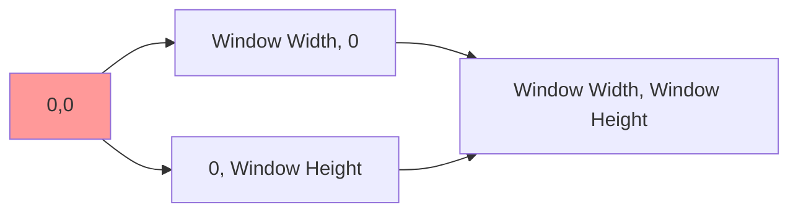

**Level 3 - QML Implementation:**

```qml
// qml/main.qml:34-38
Rectangle {
    id: root
    width: Config.windowWidth
    height: Config.windowHeight
    color: "#7e8c24"
```

### 7.2 World Coordinate System

**Level 2 - Game World Space:**

The game world uses the same coordinate orientation but with zoom and pan transformations:

```cpp
// src/qmlBase/ccfqmlbasescenario.h:70-75
Q_PROPERTY(qreal zoom READ getZoom WRITE setZoom NOTIFY zoomChanged)
Q_PROPERTY(QPoint zoomPoint READ getZoomPoint WRITE setZoomPoint NOTIFY zoomPointChanged)
```

Coordinate transformation chain:


### 7.3 Unit Center Points

**Level 2 - Object Anchoring:**

Since QML's default origin is top-left, units use **center point properties** for accurate positioning:

```cpp
// src/qmlBase/ccfqmlbaseunit.h:178-188
Q_PROPERTY(int centerX READ getCenterX WRITE setCenterX NOTIFY centerXChanged)
Q_PROPERTY(int centerY READ getCenterY WRITE setCenterY NOTIFY centerYChanged)
```

### 7.4 Geometric Helper Functions

**Level 3 - Calculation Utilities:**

```cpp
// src/logic/ccfenginehelpers.cpp:53-85
qreal CcfEngineHelpers::rotationAngle(qreal oldX, qreal oldY,
                                      qreal newX, qreal newY)
{
    qreal result = 0;
    
    // Handle vertical cases
    if (qFuzzyCompare(newX, oldX)) {
        if (newY > oldY)
            result = 0;
        else
            result = 180;
        return result;
    }
    
    // Calculate angle using atan
    qreal angle = (qAtan(qAbs(newX - oldX) / qAbs(newY - oldY)) * 180 / 3.14159);
    
    // Adjust based on quadrant
    if ((newY > oldY) && (newX > oldX))      // 2nd quarter
        result = 180 - angle;
    else if ((newY > oldY) && (newX < oldX)) // 3rd quarter
        result = 180 + angle;
    else if ((newY < oldY) && (newX < oldX)) // 4th quarter
        result = 360 - angle;
    else                                     // 1st quarter
        result = angle;
    
    return result;
}
```

### 7.5 Distance Calculations

```cpp
// src/logic/ccfenginehelpers.cpp:90-106
qreal CcfEngineHelpers::targetDistance(qreal originX, qreal originY,
                                       qreal targetX, qreal targetY)
{
    qreal result = 0;
    
    // Optimized for axis-aligned cases
    if (qFuzzyCompare(targetX, originX)) {
        result = qAbs(originY - targetY);
        return result;
    } else if (qFuzzyCompare(targetY, originY)) {
        result = qAbs(originX - targetX);
        return result;
    }
    
    // Pythagorean distance
    result = qSqrt(qPow((originX - targetX), 2) + qPow((originY - targetY), 2));
    return result;
}
```

---

## 8. Time and Simulation

### 8.1 Real-Time Simulation Model

**Level 2 - Timing Architecture:**

CCF uses a **variable time-step** simulation model with pause capability:

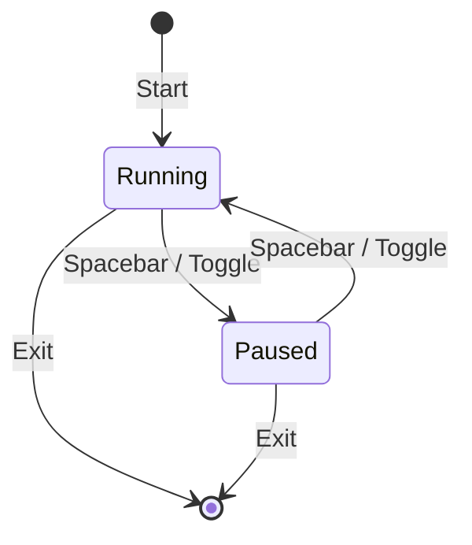

### 8.2 Timer-Based Updates

**Level 3 - Timer Objects:**

```cpp
// src/qmlBase/ccfqmlbasescenario.h:196-203
// Convenience pointers to QML timer objects:
QObject *mEffectsTimer;     // Visual effects updates
QObject *mRotationTimer;    // Unit rotation interpolation
QObject *mFollowingTimer;   // Camera follow behavior
```

### 8.3 Pause System Implementation

**Level 3 - Signal Propagation:**

```cpp
// src/qmlBase/ccfqmlbaseunit.h:234
Q_PROPERTY(bool paused READ getPaused WRITE setPaused NOTIFY pausedChanged)

// src/qmlBase/ccfqmlbaseunit.cpp
void CcfQmlBaseUnit::togglePause()
{
    setPaused(!mPaused);
}
```

**QML Side:**

```qml
// Signals propagate to all units
onTogglePause: {
    // Each unit handles its own pause state
}
```

### 8.4 Animation System

**Level 2 - Qt Animation Framework:**

Units use **QML Animation** types for smooth movement:

```qml
// Typical unit movement animation pattern
Behavior on x {
    NumberAnimation {
        duration: calculatedDuration
        easing.type: Easing.Linear
    }
}
```

**Level 3 - Rotation Duration Calculation:**

```cpp
// src/logic/ccfenginehelpers.cpp:139-160
int CcfEngineHelpers::rotationDuration(qreal oldRotation, qreal newRotation,
                                       qreal rotationSpeed)
{
    qreal tempNewRotation = newRotation;
    qreal tempOldRotation = oldRotation;
    qreal rotationChange = newRotation - oldRotation;
    
    if (qFuzzyCompare(oldRotation, tempNewRotation))
        return 0;
    
    // Handle 360-degree wrap-around
    if (qFuzzyCompare(tempOldRotation, 0))
        tempOldRotation = 360;
    
    if ((newRotation > 180) && (oldRotation < 180)) {
        rotationChange = tempNewRotation - tempOldRotation;
    } else if ((oldRotation > 180) && (newRotation < 180)) {
        rotationChange = tempOldRotation - tempNewRotation;
    }
    
    qreal dur = (rotationSpeed * qAbs(rotationChange));
    return qRound(dur);
}
```

### 8.5 Order Queue System

**Level 2 - Command Pattern:**

Units maintain an **order queue** for sequential action execution:

```cpp
// src/qmlBase/ccfqmlbaseunit.h:254-260
Q_INVOKABLE void queueOrder(const QString &orderName, qreal x, qreal y, QObject *reparent = 0);
Q_INVOKABLE void moveTo(qreal newX, qreal newY, QObject *reparent = 0);
Q_INVOKABLE void moveFastTo(qreal newX, qreal newY, QObject *reparent = 0);
Q_INVOKABLE void sneakTo(qreal newX, qreal newY, QObject *reparent = 0);
Q_INVOKABLE void fireTo(qreal targetX, qreal targetY, QObject *reparent = 0);
Q_INVOKABLE void smokeTo(qreal targetX, qreal targetY, QObject *reparent = 0);
```

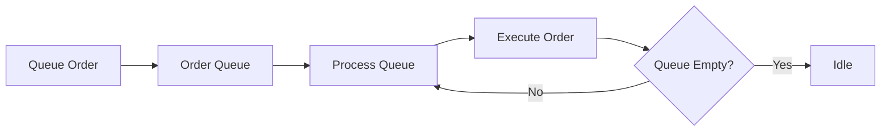

---

## 9. Debug/Development Features

### 9.1 Logging System

**Level 2 - Hierarchical Logging:**

```cpp
// src/config/ccflogger.h
class CcfLogger : public QObject
{
    Q_OBJECT
public:
    explicit CcfLogger(QObject *parent = 0, bool isDebug = false);
    
    Q_INVOKABLE void log(const QString &message);
    Q_INVOKABLE void debug(const QString &message);
    Q_INVOKABLE void error(const QString &message);
};
```

**Usage:**

```cpp
// Macro shortcut
#define clogger CcfMain::instance()->logger()

// In code
clogger->debug("Loading scenario: " + scenarioFile);
```

### 9.2 Command Line Interface

**Level 3 - CLI Parsing:**

```cpp
// src/config/ccfcommandlineparser.h
class CcfCommandLineParser
{
public:
    CcfCommandLineParser(const QStringList &arguments);
    bool wasHelpRequested() const;
    bool isDebug() const;
    QString helpMessage() const;
};
```

**Level 1 - Available Options:**

| Option | Description |
|--------|-------------|
| `--help` | Display help message and exit |
| `--debug` | Enable debug logging mode |

### 9.3 Debug Visualizations

**Level 2 - Visual Debugging:**

```cpp
// src/qmlBase/ccfqmlbaseunit.h:97-106
// Side mark visibility for debugging
Q_PROPERTY(bool sideMarkVisible READ getSideMarkVisible WRITE setSideMarkVisible NOTIFY sideMarkVisibleChanged)

// Defense sphere visualization
Q_PROPERTY(int defenceSphereRotation READ getDefenceSphereRotation WRITE setDefenceSphereRotation NOTIFY defenceSphereRotationChanged)
Q_PROPERTY(QString defenceSphereColor READ getDefenceSphereColor WRITE setDefenceSphereColor NOTIFY defenceSphereColorChanged)
```

### 9.4 Configuration Fallback System

**Level 3 - Error Recovery:**

```cpp
// src/ccfmain.cpp:180-198
bool CcfMain::initConfiguration()
{
    // Try loading user configuration
    mConfiguration = new CcfConfig("config", mLogger, this);
    
    if (mConfiguration->isErrorState()) {
        // Error - notify and load defaults
        printf("Error while reading configuration file! Message: %s\n",
               qPrintable(mConfiguration->errorMessage()));
        printf("Loading default configuration... ");
        
        delete mConfiguration;
        mConfiguration = new CcfConfig("config_default", mLogger, this);
        
        if (mConfiguration->isErrorState()) {
            printf("ERROR: %s\n", qPrintable(mConfiguration->errorMessage()));
            return false;
        } else {
            printf("OK\n");
            return true;
        }
    }
    return true;
}
```

### 9.5 File System Helpers

**Level 3 - Utility Methods:**

```cpp
// src/ccfglobal.cpp:49-60
QString CcfGlobal::getFileContents(const QString &filePath)
{
    QFile file(filePath);
    if (!file.open(QIODevice::ReadOnly | QIODevice::Text)) {
        enterErrorState("Could not open file to read: " + file.fileName());
        qWarning(qPrintable(("Could not open file to read: %1")), 
                qPrintable(file.fileName()));
        return QString();
    }
    
    QString result = file.readAll();
    file.close();
    return result;
}
```

### 9.6 Development Tools

The project includes several development utilities in the `tools/` directory:

| Tool | Purpose |
|------|---------|
| `relative2qrc` | Converts relative paths to Qt Resource Collection paths |
| `archiveProject` | Creates project archives |
| `makedocs` | Documentation generation |
| `updateQmlTo2.0` | QML version migration tool |

---

## Summary

CloseCombatFree demonstrates a well-architected Qt5/QML application following established patterns:

1. **Layered Architecture**: Clear separation between Application, Module, World, and Object layers
2. **Hybrid C++/QML**: Performance-critical code in C++, UI in declarative QML
3. **Qt Object Model**: Parent-child memory management, signals/slots, property system
4. **Modular Design**: Scenario-based content loading enables easy modding
5. **Error Resilience**: Fallback configurations and comprehensive error reporting

The architecture supports real-time tactical gameplay with features like line-of-sight calculations, unit command queues, and dynamic zoom/pan controls, while maintaining clean separation between engine code and content definitions.

---

**Document Information:**
- **Chapter**: 1 - Overview and High-Level Architecture
- **Project**: CloseCombatFree v0.0.5
- **Framework**: Qt5 (QtQuick 2.1)
- **Build System**: qmake
- **License**: GPLv3
