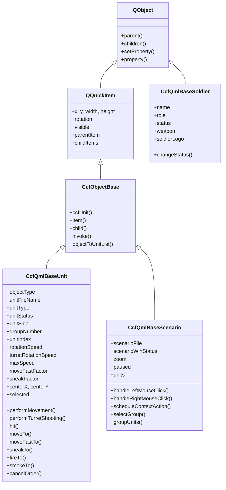
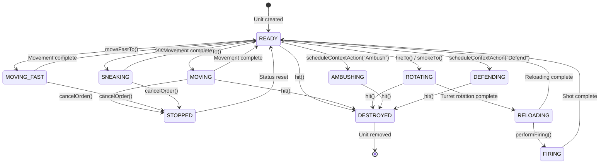
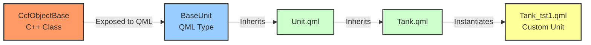

# Chapter 2: Object System

## Table of Contents

1. [Overview of Game Entities](#1-overview-of-game-entities)
2. [Class Hierarchy](#2-class-hierarchy)
3. [Relationships and Ownership](#3-relationships-and-ownership)
4. [State Management](#4-state-management)
5. [Formation System](#5-formation-system)
6. [Object Base Class Implementation](#6-object-base-class-implementation)
7. [Soldier/Vehicle/Squad Class Implementations](#7-soldiervehiclesquad-class-implementations)
8. [Memory Management Deep Dive](#8-memory-management-deep-dive)
9. [Constants and Data Structure Summary](#9-constants-and-data-structure-summary)

---

## 1. Overview of Game Entities

### Level 1: Gameplay Perspective

CloseCombatFree (CCF) implements a hierarchical object system that represents military units in a tactical wargame environment. The system is designed to handle:

- **Tanks** (Currently Implemented): Armored vehicles with turrets, hulls, and crew
- **Soldiers** (Base Class Implemented, UI Planned): Individual infantry units
- **Squads** (Planned): Groups of soldiers operating as a cohesive unit

The game uses a hybrid C++/QML architecture where:
- **C++ classes** handle game logic, state management, and performance-critical operations
- **QML components** provide visual representation and animations

### Level 2: Data Architecture

All game entities share common characteristics:

| Entity Type | C++ Base Class | QML Component | Current Status |
|-------------|---------------|---------------|----------------|
| Base Object | `CcfObjectBase` | N/A | Core infrastructure |
| Unit | `CcfQmlBaseUnit` | `Unit.qml` | Fully implemented |
| Tank | `CcfQmlBaseUnit` | `Tank.qml` | Fully implemented |
| Soldier Info | `CcfQmlBaseSoldier` | `Soldier.qml` | Partial implementation |
| Scenario | `CcfQmlBaseScenario` | `Scenario.qml` | Fully implemented |

### Level 3: Implementation Details

The unit system is instantiated through QML files in the `units/` directory:

```qml
// units/tanks/tests/Tank_tst1.qml:27-46
Tank {
    id: root
    unitFileName: "Tank_tst1"
    unitType: "Test tank 1"
    unitLogo: "../../../img/units/tanks/generic/tank_tst1_logo.png"
    rotationSpeed: 40
    turretRotationSpeed: 35
    maxSpeed: 20
    acceleration: 2
    unitWidth: 62
    unitHeight: 100

    Tank_tst1_hull { id: hull }
    Tank_tst1_turret { id: turret }
    
    Soldier { role: "Commander" }
    Soldier { role: "Gunner" }
    Soldier { role: "Loader" }
    Soldier { role: "Assistant" }
    Soldier { role: "Assistant" }
}
```

---

## 2. Class Hierarchy

### Level 1: Conceptual Hierarchy

From a gameplay perspective, the object hierarchy follows military organization:

```
Scenario (Battlefield)
├── Units (Tanks, Soldiers, Squads)
│   ├── Hull (for tanks)
│   ├── Turret (for tanks)
│   └── Soldiers (crew members)
├── Terrain
└── Game Effects
```

### Level 2: Class Design

The inheritance structure combines Qt's object system with game-specific functionality:

**C++ Class Hierarchy:**
```
QObject
├── CcfQmlBaseSoldier (soldier data)
│
QQuickItem
├── CcfObjectBase (property macros, convenience methods)
│   ├── CcfQmlBaseUnit (unit logic)
│   └── CcfQmlBaseScenario (scenario management)
```

**QML Component Hierarchy:**
```
BaseUnit (C++ registered)
├── Unit.qml (visual selection box, movement animations)
    ├── Tank.qml (armor values, turret rotation)
    │   ├── Hull.qml (hull geometry)
    │   └── Turret.qml (turret geometry, firing effects)
    └── Soldier.qml (planned for infantry)
```

### Level 3: Implementation Code

#### CCFObjectBase Declaration

```cpp
// src/logic/ccfobjectbase.h:95-113
class CcfObjectBase : public QQuickItem
{
    Q_OBJECT

public:
    explicit CcfObjectBase(QQuickItem *parent = 0);
    
    static CcfQmlBaseUnit *ccfUnit(QObject *unitObject);
    QQuickItem *item(const QString &objectName) const;
    QQuickItem *item(QObject *object);
    QObject *child(const QString &objectName) const;
    bool invoke(QObject *obj, const char *member,
                    QGenericArgument val0 = QGenericArgument(0), QGenericArgument val1 = QGenericArgument(),
                    QGenericArgument val2 = QGenericArgument(), QGenericArgument val3 = QGenericArgument(),
                    QGenericArgument val4 = QGenericArgument(), QGenericArgument val5 = QGenericArgument(),
                    QGenericArgument val6 = QGenericArgument(), QGenericArgument val7 = QGenericArgument(),
                    QGenericArgument val8 = QGenericArgument(), QGenericArgument val9 = QGenericArgument());
    QList<CcfQmlBaseUnit *> objectToUnitList(QObjectList list);
};
```

#### CcfQmlBaseUnit Declaration

```cpp
// src/qmlBase/ccfqmlbaseunit.h:33-365
class CcfQmlBaseUnit : public CcfObjectBase
{
    Q_OBJECT

public:
    Q_PROPERTY(QString objectType READ getObjectType WRITE setObjectType NOTIFY objectTypeChanged)
    Q_PROPERTY(QString unitFileName READ getUnitFileName WRITE setUnitFileName NOTIFY unitFileNameChanged)
    Q_PROPERTY(QString unitType READ getUnitType WRITE setUnitType NOTIFY unitTypeChanged)
    Q_PROPERTY(QString unitLogo READ getUnitLogo WRITE setUnitLogo NOTIFY unitLogoChanged)
    Q_PROPERTY(QString unitStatus READ getUnitStatus WRITE setUnitStatus NOTIFY unitStatusChanged)
    Q_PROPERTY(QString unitSide READ getUnitSide WRITE setUnitSide NOTIFY unitSideChanged)
    Q_PROPERTY(int groupNumber READ getGroupNumber WRITE setGroupNumber NOTIFY groupNumberChanged)
    Q_PROPERTY(int unitIndex READ getUnitIndex WRITE setUnitIndex NOTIFY unitIndexChanged)
    Q_PROPERTY(bool sideMarkVisible READ getSideMarkVisible WRITE setSideMarkVisible NOTIFY sideMarkVisibleChanged)
    Q_PROPERTY(QString sideMarkSource READ getSideMarkSource WRITE setSideMarkSource NOTIFY sideMarkSourceChanged)
    Q_PROPERTY(QString sideMarkSet READ getSideMarkSet WRITE setSideMarkSet NOTIFY sideMarkSetChanged)
    Q_PROPERTY(int rotationSpeed READ getRotationSpeed WRITE setRotationSpeed NOTIFY rotationSpeedChanged)
    Q_PROPERTY(int turretRotationSpeed READ getTurretRotationSpeed WRITE setTurretRotationSpeed NOTIFY turretRotationSpeedChanged)
    Q_PROPERTY(int maxSpeed READ getMaxSpeed WRITE setMaxSpeed NOTIFY maxSpeedChanged)
    Q_PROPERTY(int acceleration READ getAcceleration WRITE setAcceleration NOTIFY accelerationChanged)
    Q_PROPERTY(int unitWidth READ getUnitWidth WRITE setUnitWidth NOTIFY unitWidthChanged)
    Q_PROPERTY(int unitHeight READ getUnitHeight WRITE setUnitHeight NOTIFY unitHeightChanged)
    Q_PROPERTY(qreal moveFastFactor READ getMoveFastFactor WRITE setMoveFastFactor NOTIFY moveFastFactorChanged)
    Q_PROPERTY(qreal sneakFactor READ getSneakFactor WRITE setSneakFactor NOTIFY sneakFactorChanged)
    Q_PROPERTY(int centerX READ getCenterX WRITE setCenterX NOTIFY centerXChanged)
    Q_PROPERTY(int centerY READ getCenterY WRITE setCenterY NOTIFY centerYChanged)
    Q_PROPERTY(int currentOrder READ getCurrentOrder WRITE setCurrentOrder NOTIFY currentOrderChanged)
    Q_PROPERTY(bool selected READ getSelected WRITE setSelected NOTIFY selectedChanged)
    Q_PROPERTY(bool firing READ getFiring WRITE setFiring NOTIFY firingChanged)
    Q_PROPERTY(bool smoking READ getSmoking WRITE setSmoking NOTIFY smokingChanged)
    Q_PROPERTY(int defenceSphereRotation READ getDefenceSphereRotation WRITE setDefenceSphereRotation NOTIFY defenceSphereRotationChanged)
    Q_PROPERTY(QString defenceSphereColor READ getDefenceSphereColor WRITE setDefenceSphereColor NOTIFY defenceSphereColorChanged)
    Q_PROPERTY(bool paused READ getPaused WRITE setPaused NOTIFY pausedChanged)
    Q_PROPERTY(bool moving READ getMoving WRITE setMoving NOTIFY movingChanged)

    explicit CcfQmlBaseUnit(QQuickItem *parent = 0);

    Q_INVOKABLE QString operation(int index = -1) const;
    Q_INVOKABLE QPoint orderTarget(int index = -1) const;
    Q_INVOKABLE void changeStatus(const QString &newStatusMessage);
    Q_INVOKABLE void performMovement(qreal newX, qreal newY, qreal factor);
    Q_INVOKABLE void performTurretShooting(qreal targetX, qreal targetY);
    Q_INVOKABLE void hit(QObject *byWhat, qreal xWhere, qreal yWhere);
    Q_INVOKABLE void continueQueue();
    Q_INVOKABLE void cancelOrder();
    Q_INVOKABLE void queueOrder(const QString &orderName, qreal x, qreal y, QObject *reparent = 0);
    Q_INVOKABLE void moveTo(qreal newX, qreal newY, QObject *reparent = 0);
    Q_INVOKABLE void moveFastTo(qreal newX, qreal newY, QObject *reparent = 0);
    Q_INVOKABLE void sneakTo(qreal newX, qreal newY, QObject *reparent = 0);
    Q_INVOKABLE void fireTo(qreal targetX, qreal targetY, QObject *reparent = 0);
    Q_INVOKABLE void smokeTo(qreal targetX, qreal targetY, QObject *reparent = 0);
    Q_INVOKABLE QVariantList soldiers();

public slots:
    void togglePause();

protected:
    QObject *createOrder(QObject *parent);
    void processQueue();
    void clearOrderQueue();
    void deleteOrder(int index);

signals:
    void unitStatusChanged(const QString &newStatus, int unitIndex);
    void movementStateChange(bool movingState, int unitIndex);
    void actionFinished(int index, qreal targetX, qreal targetY);
    void movementBegan();
    // ... property change signals
};
```

#### CcfQmlBaseSoldier Declaration

```cpp
// src/qmlBase/ccfqmlbasesoldier.h:15-115
class CcfQmlBaseSoldier : public QObject
{
    Q_OBJECT

public:
    Q_PROPERTY(QString objectType READ getObjectType WRITE setObjectType NOTIFY objectTypeChanged)
    Q_PROPERTY(QString name READ getName WRITE setName NOTIFY nameChanged)
    Q_PROPERTY(QString role READ getRole WRITE setRole NOTIFY roleChanged)
    Q_PROPERTY(QString status READ getStatus WRITE setStatus NOTIFY statusChanged)
    Q_PROPERTY(QString weapon READ getWeapon WRITE setWeapon NOTIFY weaponChanged)
    Q_PROPERTY(QString soldierLogo READ getSoldierLogo WRITE setSoldierLogo NOTIFY soldierLogoChanged)

    explicit CcfQmlBaseSoldier(QObject *parent = 0);

    Q_INVOKABLE void changeStatus(const QString &newStatus);

    QString getObjectType() const;
    QString getName() const;
    QString getRole() const;
    QString getStatus() const;
    QString getWeapon() const;
    QString getSoldierLogo() const;

    void setObjectType(const QString &objectType);
    void setName(const QString &name);
    void setRole(const QString &role);
    void setStatus(const QString &status);
    void setWeapon(const QString &weapon);
    void setSoldierLogo(const QString &soldierLogo);

signals:
    void unitStatusChanged(const QString &newStatus);
    void objectTypeChanged();
    void nameChanged();
    void roleChanged();
    void statusChanged();
    void weaponChanged();
    void soldierLogoChanged();

private:
    QString mObjectType;
    QString mName;
    QString mRole;
    QString mStatus;
    QString mWeapon;
    QString mSoldierLogo;
};
```

### Class Inheritance Diagram



---

## 3. Relationships and Ownership

### Level 1: Gameplay Relationships

In the game world, objects have logical relationships:

- **Scenario owns Units**: The battlefield contains all units
- **Units contain Soldiers**: Tanks have crew members; squads have soldiers
- **Tank contains Hull and Turret**: Vehicle components are child objects
- **Players control Units**: Through selection and order queues

### Level 2: Ownership Architecture

CCF uses Qt's parent-child ownership model extensively:

1. **QObject Parent-Child Hierarchy**: When a parent is destroyed, all children are automatically deleted
2. **QML Component Trees**: Visual components follow the same pattern
3. **Memory Safety**: No manual deletion needed for child objects

Key ownership relationships:

| Parent | Child | Relationship Type |
|--------|-------|-------------------|
| CcfQmlBaseScenario | CcfQmlBaseUnit | Container (mUnits list) |
| CcfQmlBaseUnit | CcfQmlBaseSoldier | Composition (via soldiers()) |
| Tank.qml | Hull.qml | Visual composition |
| Tank.qml | Turret.qml | Visual composition |
| Scenario | Effect objects | Temporary (mEffects list) |

### Level 3: Implementation Code

#### Unit Creation and Ownership

```cpp
// src/qmlBase/ccfqmlbasescenario.cpp:40-104
void CcfQmlBaseScenario::init()
{
    if (mScenarioFile != "") {
        QStringList unitSideList;
        QObject *unitsLoader = child("unitsLoader");
        QObject *unitItem = unitsLoader->property("unitsItem").value<QObject *>();
        QObject *map = child("map");

        if (unitItem->objectName() != "Campaign") {
            // This is a single scenario
            map->set("source", unitItem->getString("mapFile"));
            QObjectList tempList = unitItem->children();

            for (int i = 0; i < tempList.count(); ++i) {
                CcfQmlBaseUnit *unit = ccfUnit(tempList.at(i));
                if ((unit != 0) && (unit->property("unitIndex").isValid())) {
                    unit->setUnitIndex(i);
                    connect(this, &CcfQmlBaseScenario::togglePause,
                            unit, &CcfQmlBaseUnit::togglePause);
                    connect(unit, &CcfQmlBaseUnit::actionFinished,
                            this, &CcfQmlBaseScenario::actionFinished);
                    connect(unit, &CcfQmlBaseUnit::movementStateChange,
                            this, &CcfQmlBaseScenario::handleUnitMovement);
                    unitSideList.append(unit->getUnitSide());
                    mUnits.append(unit);
                }
            }
            // ...
        }
    }
}
```

#### Order Creation with Parent

```cpp
// src/qmlBase/ccfqmlbaseunit.cpp:176-189
QObject *CcfQmlBaseUnit::createOrder(QObject *parent)
{
    if (parent == 0) {
        parent = this->parent();
    }

    if (mOrdersComponent->isReady()) {
        QObject *object = mOrdersComponent->create();
        object->set("parent", QVariant::fromValue(parent));
        return object;
    } else {
        return 0;
    }
}
```

#### Child Object Access

```cpp
// src/logic/ccfobjectbase.cpp:48-51
QObject *CcfObjectBase::child(const QString &objectName) const
{
    return findChild<QObject *>(objectName);
}
```

### Ownership Diagram

```mermaid
graph TB
    Scenario[CcfQmlBaseScenario] -->|mUnits list| Unit1[CcfQmlBaseUnit #1]
    Scenario -->|mUnits list| Unit2[CcfQmlBaseUnit #2]
    Scenario -->|mUnits list| Unit3[CcfQmlBaseUnit #N]
    
    Unit1 -->|children()| Soldier1[CcfQmlBaseSoldier #1]
    Unit1 -->|children()| Soldier2[CcfQmlBaseSoldier #2]
    Unit1 -->|child("hull")| Hull[Hull.qml]
    Unit1 -->|child("turret")| Turret[Turret.qml]
    
    Unit1 -->|mOrders| Order1[OrderMarker #1]
    Unit1 -->|mOrders| Order2[OrderMarker #2]
    
    Scenario -->|mEffects| Effect1[Effect.qml]
    Scenario -->|mEffects| Effect2[Effect.qml]
    
    style Scenario fill:#f9f,stroke:#333,stroke-width:2px
    style Unit1 fill:#bbf,stroke:#333,stroke-width:2px
    style Unit2 fill:#bbf,stroke:#333,stroke-width:2px
    style Unit3 fill:#bbf,stroke:#333,stroke-width:2px
```

---

## 4. State Management

### Level 1: Gameplay States

Units in CCF can be in various states that affect gameplay:

| State | Description | Player Interaction |
|-------|-------------|-------------------|
| READY | Unit is idle and awaiting orders | Can receive any order |
| MOVING | Unit is moving at normal speed | Can be stopped |
| MOVING FAST | Unit is moving at increased speed | Less accurate, can be stopped |
| SNEAKING | Unit is moving slowly to avoid detection | Can be stopped |
| AMBUSHING | Unit is waiting in ambush position | Will attack enemies in range |
| DEFENDING | Unit is in defensive position | Will return fire |
| ROTATING | Unit is rotating toward target | Transitional state |
| RELOADING | Weapon is reloading | Cannot fire |
| STOPPED | Order was cancelled | Returns to READY |
| KIA/destroyed | Unit is destroyed | Cannot be selected |

### Level 2: State Architecture

The state system uses multiple mechanisms:

1. **String-based Status**: `unitStatus` property for UI display
2. **Boolean Flags**: `moving`, `firing`, `smoking`, `paused` for logic
3. **QML States**: Visual state changes (healthy, damaged, destroyed)
4. **Order Queue**: Orders track their own state (`performed` flag)

### Level 3: Implementation Code

#### Status Change Method

```cpp
// src/qmlBase/ccfqmlbaseunit.cpp:89-93
void CcfQmlBaseUnit::changeStatus(const QString &newStatusMessage)
{
    mUnitStatus = newStatusMessage;
    emit unitStatusChanged(newStatusMessage, mUnitIndex);
}
```

#### Order Processing and State Transitions

```cpp
// src/qmlBase/ccfqmlbaseunit.cpp:242-283
void CcfQmlBaseUnit::continueQueue()
{
    bool noOrdersLeft = true;

    for (int i = 0; i < mOrders.length(); ++i) {
        QObject *order = mOrders.value(i);
        if (order->getBool("performed") == true) {
            continue;
        } else {
            mCurrentOrder = i;

            qreal targetX = order->getReal("targetX");
            qreal targetY = order->getReal("targetY");
            QString operation = order->getString("operation");
            if (operation == "Move") {
                changeStatus("MOVING");
                performMovement(targetX, targetY, 1);
            } else if (operation == "Move fast") {
                changeStatus("MOVING FAST");
                performMovement(targetX, targetY, mMoveFastFactor);
            } else if (operation == "Sneak") {
                changeStatus("SNEAKING");
                performMovement(targetX, targetY, mSneakFactor);
            } else if (operation == "Smoke") {
                performTurretShooting(targetX, targetY);
                mSmoking = true;
            } else if (operation == "Attack") {
                performTurretShooting(targetX, targetY);
                mFiring = true;
            }

            order->set("performed", true);
            noOrdersLeft = false;
            break;
        }
    }

    if (noOrdersLeft == true) {
        clearOrderQueue();
    }
}
```

#### Cancel Order with State Cleanup

```cpp
// src/qmlBase/ccfqmlbaseunit.cpp:194-217
void CcfQmlBaseUnit::cancelOrder()
{
    changeStatus("STOPPED");
    clearOrderQueue();
    mMoving = false;

    if ((mFiring == false) && (mSmoking == false))  {
        QObject *xma = child("xMoveAnimation");
        if (xma) invoke(xma, "stop");
        QObject *yma = child("yMoveAnimation");
        if (yma) invoke(yma, "stop");
        QObject *ram = child("rotationAnimation");
        if (ram) invoke(ram, "stop");
        changeStatus("READY");
    }

    if ((mFiring == true) || (mSmoking == true))  {
        QObject *tra = child("turretRotationAnimation");
        if (tra) invoke(tra, "stop");
        mSmoking = false;
        mFiring = false;
        changeStatus("READY");
    }
}
```

#### QML State Definitions

```qml
// qml/units/tanks/Tank.qml:142-153
states: [
    State { name: "healthy_base" },
    State { name: "damaged_base" },
    State { name: "abandonned_base" },
    State { name: "destroyed_base"
        StateChangeScript {
            name: "destroyed_baseScript"
            script: { explode.run(); }
        }
    },
    State { name: "long destroyed_base" }
]
```

#### Movement Animation State Handling

```qml
// qml/units/Unit.qml:157-178
NumberAnimation on x {
    objectName: "xMoveAnimation"
    id: xMoveAnimation
    duration: 2500
    easing.type: Easing.InOutQuad
    paused: running? root.paused : false

    onRunningChanged: {            
        if (!xMoveAnimation.running) {
            moving = false;
        }

        if ((!xMoveAnimation.running) && (unitStatus != "STOPPED")) {
            // Warning! This order is important for order markers!
            changeStatus("READY");
            actionFinished(unitIndex, orderTarget().x, orderTarget().y);
            continueQueue();
        } else if (unitStatus == "STOPPED") {
            changeStatus("READY");
        }
    }
}
```

### State Transition Diagram



---

## 5. Formation System

### Level 1: Gameplay Concept

**Status: PLANNED / NOT IMPLEMENTED**

The formation system would allow players to organize multiple units into tactical formations:

- **Column**: Units follow one behind another (good for roads)
- **Line**: Units form a horizontal line (good for defense)
- **Wedge**: V-shaped formation (good for assault)
- **Echelon**: Diagonal formation (good for flanking)

### Level 2: Design Considerations

Planned implementation approach:

1. **Formation Leader**: One unit designated as formation anchor
2. **Relative Positions**: Other units maintain offset from leader
3. **Rotation Handling**: Formation rotates as a whole
4. **Order Distribution**: Orders given to leader propagate to formation

### Level 3: Implementation Notes

Current code has placeholder considerations for formations in unit group management:

```cpp
// src/qmlBase/ccfqmlbasescenario.h:153-154
void groupUnits(int groupNumber);
void selectGroup(int groupNumber);
```

The group system (`mUnitGroups` map) provides the foundation for future formation implementation:

```cpp
// src/qmlBase/ccfqmlbasescenario.h:207
QMap<int, QObjectList > mUnitGroups;
```

---

## 6. Object Base Class Implementation

### Level 1: Concept

`CcfObjectBase` serves as the foundation for all CCF objects, providing:

- Property access macros for clean syntax
- Child object lookup utilities
- Method invocation helpers
- Type casting for CCF-specific classes

### Level 2: Design

The base class extends `QQuickItem` to enable:
- Visual representation in QML scenes
- Qt's property system integration
- Parent-child hierarchy support

Key design decisions:

| Feature | Rationale |
|---------|-----------|
| Macros (`set`, `get`, `getReal`, etc.) | Reduce boilerplate for property access |
| `ccfUnit()` static method | Safe casting from QObject to CcfQmlBaseUnit |
| `item()` and `child()` methods | Convenient access to QML child objects |
| `invoke()` method | Simplified QMetaObject::invokeMethod calls |

### Level 3: Implementation

#### Property Macros

```cpp
// src/logic/ccfobjectbase.h:33-85
#define set setProperty
#define get property
#define getReal(arg) property(arg).toReal()
#define getInt(arg) property(arg).toInt()
#define getString(arg) property(arg).toString()
#define getBool(arg) property(arg).toBool()
```

#### CcfUnit Casting

```cpp
// src/logic/ccfobjectbase.cpp:18-21
CcfQmlBaseUnit *CcfObjectBase::ccfUnit(QObject *unitObject)
{
    return qobject_cast<CcfQmlBaseUnit *>(unitObject);
}
```

#### Child Object Lookup

```cpp
// src/logic/ccfobjectbase.cpp:28-31
QQuickItem *CcfObjectBase::item(const QString &objectName) const
{
    return findChild<QQuickItem *>(objectName);
}
```

#### Method Invocation

```cpp
// src/logic/ccfobjectbase.cpp:56-63
bool CcfObjectBase::invoke(QObject *obj, const char *member, QGenericArgument val0, QGenericArgument val1,
                                QGenericArgument val2, QGenericArgument val3, QGenericArgument val4,
                                QGenericArgument val5, QGenericArgument val6, QGenericArgument val7,
                                QGenericArgument val8, QGenericArgument val9)
{
    return obj->metaObject()->invokeMethod(obj, member, val0, val1, val2, val3, val4, val5,
                                           val6, val7, val8, val9);
}
```

#### Object List Conversion

```cpp
// src/logic/ccfobjectbase.cpp:68-75
QList<CcfQmlBaseUnit *> CcfObjectBase::objectToUnitList(QObjectList list)
{
    QList<CcfQmlBaseUnit *> result;
    foreach (QObject *entry, list) {
        result.append(ccfUnit(entry));
    }
    return result;
}
```

### CCFObjectBase to QML Component Relationship



---

## 7. Soldier/Vehicle/Squad Class Implementations

### Level 1: Gameplay Entities

**Vehicles (Tanks) - IMPLEMENTED:**
- Tanks are the primary unit type currently in the game
- They consist of hull, turret, and crew
- Support movement, rotation, and firing

**Soldiers - PARTIALLY IMPLEMENTED:**
- Base class exists (`CcfQmlBaseSoldier`)
- Currently used as tank crew members
- Full infantry implementation planned

**Squads - PLANNED:**
- Groups of soldiers operating together
- Would inherit from CcfQmlBaseUnit
- Formation system integration

### Level 2: Class Architecture

#### CcfQmlBaseUnit Property System

The unit class uses Qt's property system extensively:

```cpp
// Property declaration pattern
Q_PROPERTY(QString unitStatus READ getUnitStatus WRITE setUnitStatus NOTIFY unitStatusChanged)
```

Each property has:
- Member variable (e.g., `mUnitStatus`)
- Getter method (e.g., `getUnitStatus()`)
- Setter method (e.g., `setUnitStatus()`)
- Change signal (e.g., `unitStatusChanged()`)

### Level 3: Implementation Details

#### CcfQmlBaseUnit Constructor

```cpp
// src/qmlBase/ccfqmlbaseunit.cpp:11-43
CcfQmlBaseUnit::CcfQmlBaseUnit(QQuickItem *parent) : CcfObjectBase(parent)
{
    mObjectType = QStringLiteral("unit");
    mUnitFileName = QStringLiteral("Unit");
    mUnitType = QStringLiteral("Generic unit");
    mUnitLogo = QStringLiteral("../../img/units/generic_unit_logo.png");
    mUnitStatus = QStringLiteral("READY");
    mUnitSide = QStringLiteral("neutral");
    mGroupNumber = 0;
    mUnitIndex = -1;
    mSideMarkVisible = true;
    mSideMarkSource = QStringLiteral("../../img/units/sideMarks/sideMark_side_1.png");
    mSideMarkSet = QStringLiteral("side");
    mRotationSpeed = 1;
    mTurretRotationSpeed = 1;
    mMaxSpeed = 1;
    mAcceleration = 1;
    mUnitWidth = 1;
    mUnitHeight = 1;
    mMoveFastFactor = 1.5;
    mSneakFactor = 0.4;
    mCurrentOrder = -1;
    mSelected = false;
    mFiring = false;
    mSmoking = false;
    mDefenceSphereRotation = 0;
    mPaused = false;
    mMoving = false;

    mMainInstance = CcfMain::instance();
    mOrdersComponent = new QQmlComponent(mMainInstance->engine(),
                                          QUrl::fromLocalFile("qml/gui/OrderMarker.qml"));
}
```

#### Tank Implementation (Tank.qml)

```qml
// qml/units/tanks/Tank.qml:28-91
Unit {
    // Tank properties.
    property int frontArmour: 100 // mm
    property int sideArmour: 80 // mm
    property int backArmour: 60 // mm
    property int turretArmour: 80 // mm

    property int mainGunReloadingTime: 5000

    // Additional properties
    property int turretRotation: 0
    property int turretSize: 60
    property color hullColor: "#7b8259"

    onMovementBegan: exhaust.pulse(2000);
    onTurretRotationChanged: turret.turretRotation = turretRotation;

    Component.onCompleted: {
        turret.turretSize = turretSize;
        hull.hullHeight = unitHeight;
        hull.hullWidth = unitWidth;
        hull.hullColor = hullColor;

        turret.x = centerX - turret.centerX;
        turret.y = centerY - turret.centerY;
    }

    function performFiring() {
        changeStatus("READY");
        if (firing == true) {
            turret.firing = true;
            firing = false;
            actionFinished(unitIndex, orderTarget().x, orderTarget().y);
            continueQueue();
        } else if (smoking == true) {
            turret.smoking = true;
            smoking = false;
            actionFinished(unitIndex, orderTarget().x, orderTarget().y);
            continueQueue();
        }
    }

    id: root
    objectType: "unit/tank"
    unitFileName: "Tank"
    unitType: "Generic tank"
    unitLogo: "../../../img/units/generic_unit_logo.png"
    rotationSpeed: 1
    turretRotationSpeed: 1
    maxSpeed: 1
    acceleration: 1
    unitWidth: 1
    unitHeight: 1
    // ... animations and timers
}
```

#### Turret Implementation

```qml
// qml/units/tanks/Turret.qml:24-82
Item {
    property int centerX: turretSize/2
    property int centerY: turretSize/2
    property string bodyTexture: ""
    property bool firing: false
    property bool smoking: false
    property color turretColor: "#7b8259"
    property int turretSize: 60
    property int turretRotation: 0

    id: root
    width: turretSize
    height: turretSize

    transform: Rotation {
        origin.x: root.centerX; origin.y: root.centerY; angle: turretRotation
    }

    Image {
        id: body
        width: turretSize
        height: turretSize
        source: bodyTexture
        sourceSize.height: turretSize
        sourceSize.width: turretSize
        anchors.bottom: parent.bottom
        anchors.left: parent.left
    }

    Rectangle {
        id: barrelBase
        width: 5
        height: 30
        color: turretColor
        border.width: 1
        border.color: "#4f5e1f"
        anchors.bottom: body.top
        anchors.bottomMargin: -1
        anchors.horizontalCenter: body.horizontalCenter

        Rectangle {
            id: barrelSegment1
            width: 3
            height: 42
            color: turretColor
            border.width: 1
            border.color: "#4f5e1f"
            anchors.bottom: barrelBase.top
            anchors.horizontalCenter: barrelBase.horizontalCenter
            z: barrelBase.z - 1

            GunFireEffect {
                id: gunFire
                anchors.bottom: barrelSegment1.top
                anchors.horizontalCenter: barrelSegment1.horizontalCenter
            }
        }
    }
    // ... states and transitions
}
```

#### Hull Implementation

```qml
// qml/units/tanks/Hull.qml:23-33
Item {
    property int centerX: hullWidth/2
    property int centerY: hullHeight/2
    property color hullColor: "#7b8259"
    property int hullWidth: 62 // mm
    property int hullHeight: 100 // mm

    id: root
    width: hullWidth
    height: hullHeight
}
```

#### CcfQmlBaseSoldier Implementation

```cpp
// src/qmlBase/ccfqmlbasesoldier.cpp:6-14
CcfQmlBaseSoldier::CcfQmlBaseSoldier(QObject *parent) : QObject(parent)
{    
    mObjectType = "soldierInfo";
    mName = "John Smith";
    mRole = "Infantryman";
    mStatus = "READY";
    mWeapon = "";
    mSoldierLogo = "../../../img/units/generic_soldier_logo.png";
}
```

#### Soldier Discovery in Unit

```cpp
// src/qmlBase/ccfqmlbaseunit.cpp:376-389
QVariantList CcfQmlBaseUnit::soldiers()
{
    if (mSoldiers.isEmpty()) {
        // Get soldiers up front:
        QObjectList kids = children();

        for (int i = 0; i < kids.length(); ++i) {
            if (kids.at(i)->metaObject()->className() == QString("CcfQmlBaseSoldier"))
                mSoldiers.append(QVariant::fromValue(kids.at(i)));
        }
    }

    return mSoldiers;
}
```

---

## 8. Memory Management Deep Dive

### Level 1: Qt Memory Model

CCF leverages Qt's parent-child object ownership system:

- **Automatic Cleanup**: When a parent is deleted, all children are automatically deleted
- **No Manual Delete**: Child objects should not be manually deleted
- **RAII Pattern**: Resource Acquisition Is Initialization

### Level 2: Memory Management Strategy

CCF uses several memory management patterns:

1. **QObject Parent-Child**: For most objects (units, soldiers, effects)
2. **Smart Pointers**: Implicit via QObject ownership
3. **Manual Management**: For some dynamic objects (orders, effects)
4. **QML Garbage Collection**: For QML-created objects

### Level 3: Implementation Patterns

#### Order Cleanup

```cpp
// src/qmlBase/ccfqmlbaseunit.cpp:301-309
void CcfQmlBaseUnit::clearOrderQueue()
{
    for (int i = 0; i < mOrders.length(); ++i) {
        deleteOrder(i);
    }

    mCurrentOrder = -1;
    mOrders.clear();
}

// src/qmlBase/ccfqmlbaseunit.cpp:314-319
void CcfQmlBaseUnit::deleteOrder(int index)
{
    if (index < mOrders.length()) {
        delete mOrders.takeAt(index);
    }
}
```

#### Effect Cleanup

```cpp
// src/qmlBase/ccfqmlbasescenario.cpp:621-642
void CcfQmlBaseScenario::updateEffects() {
    bool haveAllEffectsFinished = true;
    for (int i = 0; i < mEffects.length(); i++) {
        if (mEffects.at(i)->getBool("running") == true) {
            invoke(mEffects.at(i), "nextFrame");
            haveAllEffectsFinished = false;
        }
    }

    if (haveAllEffectsFinished == true) {
        invoke(mEffectsTimer, "stop");

        for (int i = 0; i < mEffects.length(); i++) {
            QObject *effect = mEffects.at(i);
            delete effect;
        }

        mEffects.clear();
    }
}
```

#### Component with Parent

```cpp
// src/qmlBase/ccfqmlbaseunit.cpp:176-189
QObject *CcfQmlBaseUnit::createOrder(QObject *parent)
{
    if (parent == 0) {
        parent = this->parent();
    }

    if (mOrdersComponent->isReady()) {
        QObject *object = mOrdersComponent->create();
        object->set("parent", QVariant::fromValue(parent));
        return object;
    } else {
        return 0;
    }
}
```

#### Scenario Initialization with Ownership

```cpp
// src/qmlBase/ccfqmlbasescenario.cpp:18-34
CcfQmlBaseScenario::CcfQmlBaseScenario(QQuickItem *parent) : CcfObjectBase(parent)
{
    mZoom = 1.0;
    mPaused = false;
    mMenuBackgroundColor = QColor("#7e8c24");
    mAimLineRotation = 0;
    mIsCampaign = false;

    mMainInstance = CcfMain::instance();
    mScenarioState = new CcfScenarioState(this);  // 'this' is parent
    mMapItem = NULL;

    mEffectsComponent = new QQmlComponent(mMainInstance->engine(),
                                          QUrl::fromLocalFile("qml/effects/Effect.qml"));

    connect(this, &CcfQmlBaseScenario::togglePause, this, &CcfQmlBaseScenario::onTogglePause);
}
```

### Memory Safety Guidelines

1. **Always set parent**: When creating QObjects, always specify a parent
2. **Use deleteLater()**: For delayed deletion (safer in event-driven code)
3. **Avoid manual delete**: Let Qt handle child objects
4. **Check pointers**: Always check for null before dereferencing
5. **Clear containers**: After deleting objects, clear the container

---

## 9. Constants and Data Structure Summary

### Default Property Values

| Property | Type | Default Value | File |
|----------|------|---------------|------|
| mObjectType | QString | "unit" | ccfqmlbaseunit.cpp:13 |
| mUnitFileName | QString | "Unit" | ccfqmlbaseunit.cpp:14 |
| mUnitType | QString | "Generic unit" | ccfqmlbaseunit.cpp:15 |
| mUnitLogo | QString | "../../img/units/generic_unit_logo.png" | ccfqmlbaseunit.cpp:16 |
| mUnitStatus | QString | "READY" | ccfqmlbaseunit.cpp:17 |
| mUnitSide | QString | "neutral" | ccfqmlbaseunit.cpp:18 |
| mGroupNumber | int | 0 | ccfqmlbaseunit.cpp:19 |
| mUnitIndex | int | -1 | ccfqmlbaseunit.cpp:20 |
| mSideMarkVisible | bool | true | ccfqmlbaseunit.cpp:21 |
| mRotationSpeed | int | 1 | ccfqmlbaseunit.cpp:24 |
| mTurretRotationSpeed | int | 1 | ccfqmlbaseunit.cpp:25 |
| mMaxSpeed | int | 1 | ccfqmlbaseunit.cpp:26 |
| mAcceleration | int | 1 | ccfqmlbaseunit.cpp:27 |
| mMoveFastFactor | qreal | 1.5 | ccfqmlbaseunit.cpp:30 |
| mSneakFactor | qreal | 0.4 | ccfqmlbaseunit.cpp:31 |
| mCurrentOrder | int | -1 | ccfqmlbaseunit.cpp:32 |

### Soldier Defaults

| Property | Type | Default Value | File |
|----------|------|---------------|------|
| mObjectType | QString | "soldierInfo" | ccfqmlbasesoldier.cpp:8 |
| mName | QString | "John Smith" | ccfqmlbasesoldier.cpp:9 |
| mRole | QString | "Infantryman" | ccfqmlbasesoldier.cpp:10 |
| mStatus | QString | "READY" | ccfqmlbasesoldier.cpp:11 |
| mSoldierLogo | QString | "../../../img/units/generic_soldier_logo.png" | ccfqmlbasesoldier.cpp:13 |

### Tank Defaults

| Property | Type | Default Value | File |
|----------|------|---------------|------|
| frontArmour | int | 100 (mm) | Tank.qml:30 |
| sideArmour | int | 80 (mm) | Tank.qml:31 |
| backArmour | int | 60 (mm) | Tank.qml:32 |
| turretArmour | int | 80 (mm) | Tank.qml:33 |
| mainGunReloadingTime | int | 5000 (ms) | Tank.qml:35 |
| turretSize | int | 60 | Tank.qml:39 |
| hullColor | color | "#7b8259" | Tank.qml:40 |

### Hull Defaults

| Property | Type | Default Value | File |
|----------|------|---------------|------|
| hullColor | color | "#7b8259" | Hull.qml:26 |
| hullWidth | int | 62 (mm) | Hull.qml:27 |
| hullHeight | int | 100 (mm) | Hull.qml:28 |

### Turret Defaults

| Property | Type | Default Value | File |
|----------|------|---------------|------|
| turretColor | color | "#7b8259" | Turret.qml:30 |
| turretSize | int | 60 | Turret.qml:31 |

### Data Structures Summary

#### CcfUnitList Typedef

```cpp
// src/qmlBase/ccfqmlbaseunit.h:26
typedef QList<CcfQmlBaseUnit *> CcfUnitList;
```

#### Order Queue (mOrders)

```cpp
// src/qmlBase/ccfqmlbaseunit.h:299
QObjectList mOrders;
```

Properties of each order object:
- `index` (int): Order position in queue
- `number` (int): Display number
- `operation` (QString): Order type ("Move", "Attack", etc.)
- `orderColor` (QString): Visual color
- `x`, `y` (qreal): Position
- `targetX`, `targetY` (qreal): Target coordinates
- `visible` (bool): Visibility
- `performed` (bool): Completion status

#### Unit Groups Map

```cpp
// src/qmlBase/ccfqmlbasescenario.h:207
QMap<int, QObjectList > mUnitGroups;
```

Key: Group number (0-9)
Value: List of units in that group

#### Effects List

```cpp
// src/qmlBase/ccfqmlbasescenario.h:193
QObjectList mEffects;
```

Temporary visual effects (explosions, smoke) that are cleaned up after animation.

### Status String Constants

| Status | Description |
|--------|-------------|
| "READY" | Unit idle, awaiting orders |
| "MOVING" | Normal movement |
| "MOVING FAST" | Fast movement |
| "SNEAKING" | Slow stealth movement |
| "ROTATING" | Rotating turret |
| "RELOADING" | Weapon reloading |
| "AMBUSHING" | In ambush position |
| "DEFENDING" | In defensive position |
| "STOPPED" | Order cancelled |
| "KIA" | Killed in action |
| "destroyed" | Vehicle destroyed |

### Operation Constants

| Operation | Description |
|-----------|-------------|
| "Move" | Normal movement order |
| "Move fast" | Fast movement order |
| "Sneak" | Stealth movement order |
| "Attack" | Fire at target |
| "Smoke" | Deploy smoke screen |
| "Ambush" | Set ambush position |
| "Defend" | Set defensive position |
| "Stop" | Cancel current orders |
| "Follow" | Follow another unit |

---

## Appendix: File Reference

### C++ Header Files

| File | Description | Lines |
|------|-------------|-------|
| `src/logic/ccfobjectbase.h` | Base class with macros and utilities | 117 |
| `src/qmlBase/ccfqmlbaseunit.h` | Unit base class declaration | 547 |
| `src/qmlBase/ccfqmlbasesoldier.h` | Soldier base class declaration | 119 |
| `src/qmlBase/ccfqmlbasescenario.h` | Scenario base class declaration | 301 |

### C++ Implementation Files

| File | Description | Lines |
|------|-------------|-------|
| `src/logic/ccfobjectbase.cpp` | Base class implementation | 75 |
| `src/qmlBase/ccfqmlbaseunit.cpp` | Unit base implementation | 1080 |
| `src/qmlBase/ccfqmlbasesoldier.cpp` | Soldier base implementation | 161 |
| `src/qmlBase/ccfqmlbasescenario.cpp` | Scenario base implementation | 1606 |

### QML Files

| File | Description | Lines |
|------|-------------|-------|
| `qml/units/Unit.qml` | Visual unit component | 200 |
| `qml/units/tanks/Tank.qml` | Tank implementation | 154 |
| `qml/units/tanks/Hull.qml` | Tank hull component | 33 |
| `qml/units/tanks/Turret.qml` | Tank turret component | 127 |

### Unit Definitions

| File | Description |
|------|-------------|
| `units/tanks/tests/Tank_tst1.qml` | Test tank 1 definition |
| `units/tanks/tests/Tank_tst1_hull.qml` | Test tank 1 hull |
| `units/tanks/tests/Tank_tst1_turret.qml` | Test tank 1 turret |
| `units/tanks/tests/Tank_tst2.qml` | Test tank 2 definition |
| `units/tanks/tests/Tank_tst3.qml` | Test tank 3 definition |

---

*End of Chapter 2: Object System*
