# Chapter 3: State Machine and Action System

## Overview

This chapter documents the state machine and action system in CloseCombatFree (CCF), a Qt5/QML-based tactical wargame. The state system manages unit behavior, animations, and gameplay flow while the action system handles orders and transitions between states.

---

## 1. Concept: What Are States?

### 1.1 Definition

In CCF, **states** represent the current condition or activity of a unit. Unlike traditional finite state machines that use numeric enums, CCF uses **string-based state identifiers** stored in the `unitStatus` property. This approach provides flexibility and human-readable debugging.

### 1.2 Unit States Overview

CCF defines the following unit states:

| State | Description | Visual Indicator | Interruptible |
|-------|-------------|------------------|---------------|
| **READY** | Unit is idle and awaiting orders | Green status text | Yes |
| **MOVING** | Unit is moving at normal speed | Green status text | Yes |
| **MOVING FAST** | Unit is sprinting | Green status text | Yes |
| **SNEAKING** | Unit is moving stealthily | Green status text | Yes |
| **AMBUSHING** | Unit is in ambush mode | Gray status text | Yes |
| **DEFENDING** | Unit is in defensive stance | Gray status text | Yes |
| **KIA** | Unit is killed in action | Black status text | No |
| **DAMAGED** | Unit is damaged | Dark red status text | Context-dependent |
| **WOUNDED** | Unit has wounded personnel | Yellow-brown status text | Context-dependent |
| **INCAPACITATED** | Unit is unable to act | Brown status text | No |
| **AIMING** | Unit is preparing to fire | Not directly used | - |
| **FIRING** | Unit is actively firing | Red status text | No |
| **RELOADING** | Unit is reloading weapons | Green status text | No |
| **ROTATING** | Unit is rotating (tanks) | Green status text | Yes |
| **COVERING** | Unit is providing cover fire | Not fully implemented | - |
| **BROKEN** | Unit morale is broken | Not fully implemented | - |
| **BERSERK** | Unit is out of control | Not fully implemented | - |

### 1.3 State Visualization

States are displayed to the player through:

1. **Status Text**: Shown in the RosterMenu with color coding
2. **Animation States**: QML visual state changes
3. **Defence Spheres**: Visual indicators for AMBUSH and DEFEND states
4. **Order Markers**: Visual representation of queued orders

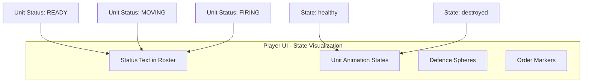

---

## 2. Concept: The State Machine

### 2.1 Architecture Overview

The CCF state machine operates on two levels:

1. **Runtime Status (`unitStatus`)**: The current operational state of the unit (MOVING, FIRING, etc.)
2. **Health State (`state`)**: The unit's physical condition (healthy, damaged, destroyed)

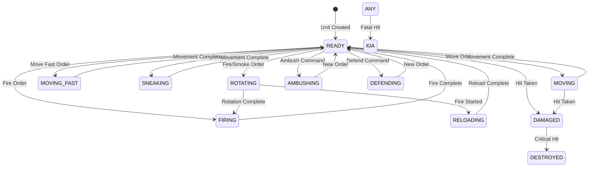

### 2.2 State Transitions

State transitions are triggered by:

1. **Player Commands**: Orders issued through UI or keyboard shortcuts
2. **Order Completion**: Automatic transitions when actions finish
3. **External Events**: Combat hits, terrain effects, etc.
4. **Internal Logic**: AI decisions, morale checks

### 2.3 State Properties

Each state has associated properties:

- **Animation**: What visual animation plays
- **Speed Factor**: Movement speed multiplier (moveFastFactor, sneakFactor)
- **Interruptibility**: Can the unit receive new orders?
- **Visibility**: Does the unit appear on enemy spotting?

---

## 3. Concept: Commands vs Actions

### 3.1 Definitions

**Commands** (also called "Orders"):
- High-level player intentions ("Move to this location")
- Queued in the unit's order queue
- Persist until completed or cancelled
- Examples: Move, Move Fast, Sneak, Attack, Smoke, Ambush, Defend

**Actions**:
- Low-level state changes ("Start moving", "Stop moving")
- Immediate execution
- Represent the actual implementation of commands
- Examples: changeStatus(), performMovement(), performTurretShooting()

### 3.2 Relationship Diagram

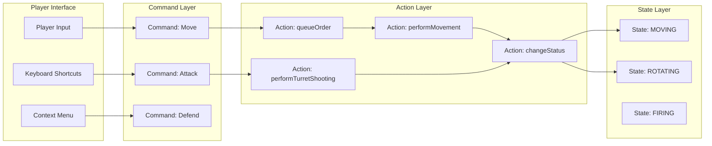

### 3.3 Order Queue System

Commands are stored in an order queue (`mOrders` in `CcfQmlBaseUnit`):

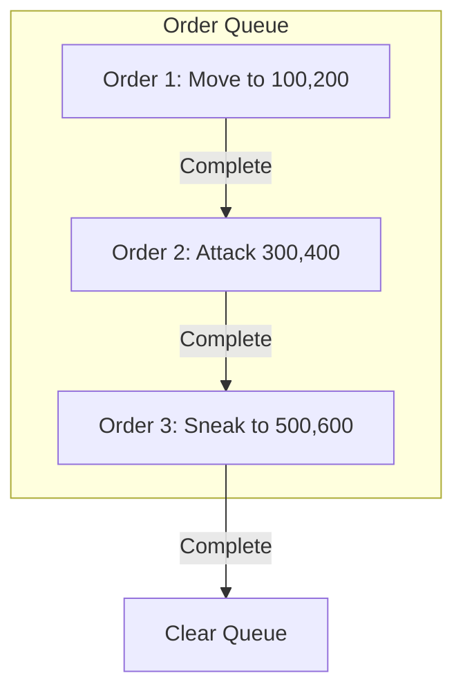

---

## 4. Concept: Action Prerequisites

### 4.1 Valid State Transitions

Not all states can transition to all other states. The following table shows valid transitions:

| From State | To States | Trigger |
|------------|-----------|---------|
| READY | MOVING, MOVING FAST, SNEAKING, ROTATING, AMBUSHING, DEFENDING | Player order |
| MOVING | READY, STOPPED, DAMAGED | Animation complete, Stop command, Hit |
| ROTATING | FIRING, RELOADING, READY | Rotation complete |
| FIRING | READY, RELOADING | Fire complete |
| AMBUSHING | READY | New order |
| DAMAGED | DESTROYED, READY | Further damage, Repair |

### 4.2 Prerequisites by Command

Each command has specific prerequisites:

**Move Commands (Move, Move Fast, Sneak)**:
- Unit must be in READY, STOPPED, or compatible moving state
- Target location must be valid
- Unit must not be KIA or DESTROYED

**Fire Commands (Attack, Smoke)**:
- Line of sight must be clear
- Unit must have ammunition (tanks: reloadingTimer)
- Unit must complete rotation before firing

**Defensive Commands (Ambush, Defend)**:
- Unit must be stationary
- No ongoing animations

### 4.3 Line of Sight (LOS) Checks

Before executing fire commands, the system validates:

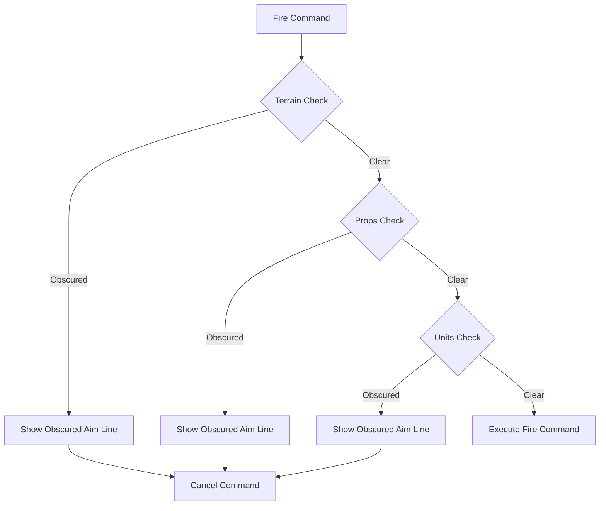

---

## 5. Algorithm: State Representation

### 5.1 State Storage Architecture

States are stored in multiple complementary systems:

#### 5.1.1 C++ Property System (`CcfQmlBaseUnit`)

```cpp
// src/qmlBase/ccfqmlbaseunit.h:72
/*!
  Current unit's status.

  TODO: should it be combined with state?
  */
Q_PROPERTY(QString unitStatus READ getUnitStatus WRITE setUnitStatus NOTIFY unitStatusChanged)
```

The `unitStatus` property is a QString that holds values like "READY", "MOVING", "FIRING", etc.

#### 5.1.2 QML State System (`Unit.qml`, `Tank.qml`)

```qml
// qml/units/tanks/Tank.qml:142-153
states: [
    State { name: "healthy_base" },
    State { name: "damaged_base" },
    State { name: "abandonned_base" },
    State { name: "destroyed_base"
        StateChangeScript {
            name: "destroyed_baseScript"
            script: { explode.run(); }
        }
    },
    State { name: "long destroyed_base" }
]
```

QML states handle visual changes and animations.

#### 5.1.3 Animation State Properties

```cpp
// src/qmlBase/ccfqmlbaseunit.h:241
/*!
  Is true when unit is moving.

  TODO: hide or remove.
  */
Q_PROPERTY(bool moving READ getMoving WRITE setMoving NOTIFY movingChanged)

// src/qmlBase/ccfqmlbaseunit.h:207
/*!
  Is true when unit is firing. This is mostly for internal use.

  TODO: rethink, try to remove.
  */
Q_PROPERTY(bool firing READ getFiring WRITE setFiring NOTIFY firingChanged)
```

### 5.2 State Property Hierarchy

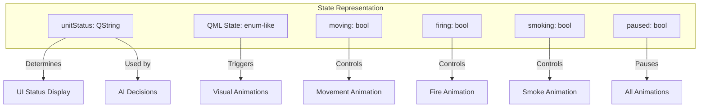

### 5.3 State Initialization

When a unit is created, default states are set in the constructor:

```cpp
// src/qmlBase/ccfqmlbaseunit.cpp:11-43
CcfQmlBaseUnit::CcfQmlBaseUnit(QQuickItem *parent) : CcfObjectBase(parent)
{
    mObjectType = QStringLiteral("unit");
    mUnitFileName = QStringLiteral("Unit");
    mUnitType = QStringLiteral("Generic unit");
    mUnitLogo = QStringLiteral("../../img/units/generic_unit_logo.png");
    mUnitStatus = QStringLiteral("READY");  // <-- Default status
    mUnitSide = QStringLiteral("neutral");
    // ... other initializations
    mCurrentOrder = -1;  // <-- No orders queued
    mSelected = false;
    mFiring = false;
    mSmoking = false;
    mDefenceSphereRotation = 0;
    mPaused = false;
    mMoving = false;
    // ...
}
```

### 5.4 State Change Notification

State changes emit signals for reactive UI updates:

```cpp
// src/qmlBase/ccfqmlbaseunit.cpp:89-93
void CcfQmlBaseUnit::changeStatus(const QString &newStatusMessage)
{
    mUnitStatus = newStatusMessage;
    emit unitStatusChanged(newStatusMessage, mUnitIndex);
}
```

---

## 6. Algorithm: Action Definitions

### 6.1 Action Types

Actions are categorized by their effect:

#### 6.1.1 Movement Actions

```cpp
// src/qmlBase/ccfqmlbaseunit.h:256-258
Q_INVOKABLE void moveTo(qreal newX, qreal newY, QObject *reparent = 0);
Q_INVOKABLE void moveFastTo(qreal newX, qreal newY, QObject *reparent = 0);
Q_INVOKABLE void sneakTo(qreal newX, qreal newY, QObject *reparent = 0);
```

Each movement action:
1. Emits `movementBegan()` signal
2. Queues the order with appropriate operation name
3. Starts queue processing

**Implementation** (`src/qmlBase/ccfqmlbaseunit.cpp:324-353`):

```cpp
void CcfQmlBaseUnit::moveTo(qreal newX, qreal newY, QObject *reparent)
{
    emit movementBegan();
    queueOrder("Move", newX, newY, reparent);
    processQueue();
}

void CcfQmlBaseUnit::moveFastTo(qreal newX, qreal newY, QObject *reparent)
{
    emit movementBegan();
    queueOrder("Move fast", newX, newY, reparent);
    processQueue();
}

void CcfQmlBaseUnit::sneakTo(qreal newX, qreal newY, QObject *reparent)
{
    emit movementBegan();
    queueOrder("Sneak", newX, newY, reparent);
    processQueue();
}
```

#### 6.1.2 Combat Actions

```cpp
// src/qmlBase/ccfqmlbaseunit.h:259-260
Q_INVOKABLE void fireTo(qreal targetX, qreal targetY, QObject *reparent = 0);
Q_INVOKABLE void smokeTo(qreal targetX, qreal targetY, QObject *reparent = 0);
```

**Implementation** (`src/qmlBase/ccfqmlbaseunit.cpp:355-371`):

```cpp
void CcfQmlBaseUnit::fireTo(qreal targetX, qreal targetY, QObject *reparent)
{
    queueOrder("Attack", targetX, targetY, reparent);
    processQueue();
}

void CcfQmlBaseUnit::smokeTo(qreal targetX, qreal targetY, QObject *reparent)
{
    queueOrder("Smoke", targetX, targetY, reparent);
    processQueue();
}
```

#### 6.1.3 Utility Actions

```cpp
// src/qmlBase/ccfqmlbaseunit.h:252-253
Q_INVOKABLE void continueQueue();
Q_INVOKABLE void cancelOrder();
```

### 6.2 Action Execution Algorithm

The core action execution follows this algorithm:

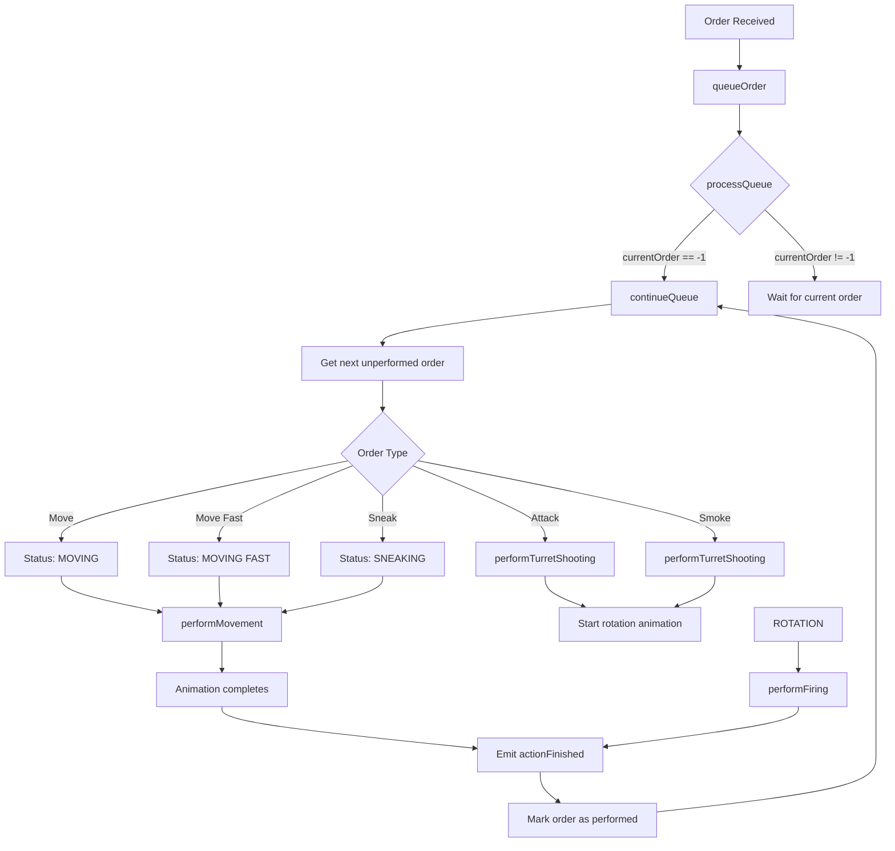

### 6.3 Action Parameters

Each action has specific parameters:

**performMovement** (`src/qmlBase/ccfqmlbaseunit.cpp:100-128`):
- `newX`, `newY`: Target coordinates
- `factor`: Speed multiplier (1.0 for Move, mMoveFastFactor for Move Fast, mSneakFactor for Sneak)

Calculations performed:
1. Rotation angle calculation using `CcfEngineHelpers::rotationAngle()`
2. Rotation duration using `CcfEngineHelpers::rotationDuration()`
3. Movement duration based on distance and speed

**performTurretShooting** (`src/qmlBase/ccfqmlbaseunit.cpp:135-154`):
- `targetX`, `targetY`: Target coordinates
- Sets status to "ROTATING"
- Initiates turret rotation animation

---

## 7. Implementation: State Class/Property System

### 7.1 CcfQmlBaseUnit Class Structure

The `CcfQmlBaseUnit` class is the C++ backend for all units:

```cpp
// src/qmlBase/ccfqmlbaseunit.h:33-543
class CcfQmlBaseUnit : public CcfObjectBase
{
    Q_OBJECT
    
    // Status property
    Q_PROPERTY(QString unitStatus READ getUnitStatus WRITE setUnitStatus NOTIFY unitStatusChanged)
    
    // Animation state properties
    Q_PROPERTY(bool moving READ getMoving WRITE setMoving NOTIFY movingChanged)
    Q_PROPERTY(bool firing READ getFiring WRITE setFiring NOTIFY firingChanged)
    Q_PROPERTY(bool smoking READ getSmoking WRITE setSmoking NOTIFY smokingChanged)
    Q_PROPERTY(bool paused READ getPaused WRITE setPaused NOTIFY pausedChanged)
    
    // ... other properties
    
public:
    Q_INVOKABLE void changeStatus(const QString &newStatusMessage);
    Q_INVOKABLE void performMovement(qreal newX, qreal newY, qreal factor);
    Q_INVOKABLE void performTurretShooting(qreal targetX, qreal targetY);
    Q_INVOKABLE void cancelOrder();
    
signals:
    void unitStatusChanged(const QString &newStatus, int unitIndex);
    void movementStateChange(bool movingState, int unitIndex);
    void actionFinished(int index, qreal targetX, qreal targetY);
    void movementBegan();
    
private:
    QString mUnitStatus;
    bool mMoving;
    bool mFiring;
    bool mSmoking;
    bool mPaused;
    QObjectList mOrders;
    int mCurrentOrder;
};
```

### 7.2 Property Getter/Setter Pattern

Each property follows the same pattern:

```cpp
// src/qmlBase/ccfqmlbaseunit.cpp:433-439
QString CcfQmlBaseUnit::getUnitStatus() const
{
    return mUnitStatus;
}

// src/qmlBase/ccfqmlbaseunit.cpp:697-707
void CcfQmlBaseUnit::setUnitStatus(const QString &unitStatus)
{
    bool wasChaged = false;
    if (unitStatus != mUnitStatus)
        wasChaged = true;

    mUnitStatus = unitStatus;

    if (wasChaged)
        emit unitStatusChanged();
}
```

### 7.3 Order Queue Data Structure

Orders are stored as QObject instances created from `OrderMarker.qml`:

```cpp
// src/qmlBase/ccfqmlbaseunit.h:299
QQmlComponent *mOrdersComponent;
QObjectList mOrders;
int mCurrentOrder;
```

**Order Creation** (`src/qmlBase/ccfqmlbaseunit.cpp:176-189`):

```cpp
QObject *CcfQmlBaseUnit::createOrder(QObject *parent)
{
    if (parent == 0) {
        parent = this->parent();
    }

    if (mOrdersComponent->isReady()) {
        QObject *object = mOrdersComponent->create();
        object->set("parent", QVariant::fromValue(parent));
        return object;
    } else {
        return 0;
    }
}
```

### 7.4 Order Properties

Each order has these properties (defined in `OrderMarker.qml`):

```qml
// qml/gui/OrderMarker.qml:24-33
property int centerX: width/2
property int centerY: height/2
property real targetX: x + centerX
property real targetY: y + centerY
property color orderColor: "#bb3333"
property int index: -1
property int number: -1
property string operation: ""
property bool performed: false
```

---

## 8. Implementation: Action System

### 8.1 Queue Management

**queueOrder** (`src/qmlBase/ccfqmlbaseunit.cpp:222-237`):

```cpp
void CcfQmlBaseUnit::queueOrder(const QString &orderName, qreal x, qreal y, QObject *reparent)
{
    QObject *order = createOrder(reparent);

    if (order != 0) {
        order->set("index", mOrders.length());
        order->set("number", mOrders.length());
        order->set("operation", orderName);
        order->set("orderColor", CcfEngineHelpers::colorForOrder(orderName));

        order->set("x", (x - order->getReal("centerX")));
        order->set("y", (y - order->getReal("centerY")));
        order->set("visible", true);
        mOrders.append(order);
    }
}
```

**processQueue** (`src/qmlBase/ccfqmlbaseunit.cpp:289-294`):

```cpp
void CcfQmlBaseUnit::processQueue()
{
    if (mCurrentOrder == -1) {
        continueQueue();
    }
}
```

**continueQueue** (`src/qmlBase/ccfqmlbaseunit.cpp:242-283`):

```cpp
void CcfQmlBaseUnit::continueQueue()
{
    bool noOrdersLeft = true;

    for (int i = 0; i < mOrders.length(); ++i) {
        QObject *order = mOrders.value(i);
        if (order->getBool("performed") == true) {
            continue;
        } else {
            mCurrentOrder = i;

            qreal targetX = order->getReal("targetX");
            qreal targetY = order->getReal("targetY");
            QString operation = order->getString("operation");
            if (operation == "Move") {
                changeStatus("MOVING");
                performMovement(targetX, targetY, 1);
            } else if (operation == "Move fast") {
                changeStatus("MOVING FAST");
                performMovement(targetX, targetY, mMoveFastFactor);
            } else if (operation == "Sneak") {
                changeStatus("SNEAKING");
                performMovement(targetX, targetY, mSneakFactor);
            } else if (operation == "Smoke") {
                performTurretShooting(targetX, targetY);
                mSmoking = true;
            } else if (operation == "Attack") {
                performTurretShooting(targetX, targetY);
                mFiring = true;
            }

            order->set("performed", true);
            noOrdersLeft = false;
            break;  // Ensures that unit performs one order at a time
        }
    }

    if (noOrdersLeft == true) {
        clearOrderQueue();
    }
}
```

### 8.2 Order Cancellation

**cancelOrder** (`src/qmlBase/ccfqmlbaseunit.cpp:194-217`):

```cpp
void CcfQmlBaseUnit::cancelOrder()
{
    changeStatus("STOPPED");
    clearOrderQueue();
    mMoving = false;

    if ((mFiring == false) && (mSmoking == false))  {
        QObject *xma = child("xMoveAnimation");
        if (xma) invoke(xma, "stop");
        QObject *yma = child("yMoveAnimation");
        if (yma) invoke(yma, "stop");
        QObject *ram = child("rotationAnimation");
        if (ram) invoke(ram, "stop");
        changeStatus("READY");
    }

    if ((mFiring == true) || (mSmoking == true))  {
        QObject *tra = child("turretRotationAnimation");
        if (tra) invoke(tra, "stop");
        mSmoking = false;
        mFiring = false;
        changeStatus("READY");
    }
}
```

### 8.3 Animation Integration

The action system integrates with QML animations through object name lookups:

**Rotation Animation** (`qml/units/Unit.qml:139-155`):

```qml
RotationAnimation on rotation {
    objectName: "rotationAnimation"
    id: rotationAnimation
    duration: 2000
    direction: RotationAnimation.Shortest
    easing.type: Easing.InOutQuad
    paused: running? root.paused : false

    onRunningChanged: {
        if ((!rotationAnimation.running) && (unitStatus != "STOPPED")) {
            xMoveAnimation.to = orderTarget().x - centerX;
            xMoveAnimation.running = true;
            yMoveAnimation.to = orderTarget().y - centerY;
            yMoveAnimation.running = true;
        }
    }
}
```

**Movement Animation** (`qml/units/Unit.qml:157-178`):

```qml
NumberAnimation on x {
    objectName: "xMoveAnimation"
    id: xMoveAnimation
    duration: 2500
    easing.type: Easing.InOutQuad
    paused: running? root.paused : false

    onRunningChanged: {            
        if (!xMoveAnimation.running) {
            moving = false;
        }

        if ((!xMoveAnimation.running) && (unitStatus != "STOPPED")) {
            changeStatus("READY");
            actionFinished(unitIndex, orderTarget().x, orderTarget().y);
            continueQueue();
        } else if (unitStatus == "STOPPED") {
            changeStatus("READY");
        }
    }
}
```

### 8.4 Color Coding for Orders and Status

The `CcfEngineHelpers` class provides color schemes:

**Order Colors** (`src/logic/ccfenginehelpers.cpp:167-184`):

```cpp
QString CcfEngineHelpers::colorForOrder(const QString &orderName)
{
    QString result = "ERROR";

    if (orderName == "Move") {
        result = "#22ff22";        // Green
    } else if (orderName == "Move fast") {
        result = "#b75bd1";        // Purple
    } else if (orderName == "Sneak") {
        result = "#f0dd0c";        // Yellow
    } else if (orderName == "Smoke") {
        result = "#ffa000";        // Orange
    } else if (orderName == "Attack") {
        result = "#ff2222";        // Red
    }

    return result;
}
```

**Status Colors** (`src/logic/ccfenginehelpers.cpp:191-226`):

```cpp
QString CcfEngineHelpers::colorForStatus(const QString &statusMessage)
{
    QString result = "ERROR";

    if (statusMessage == "READY") {
        result = "#115511";        // Dark green
    } else if (statusMessage == "STOPPED") {
        result = "#ee5511";        // Orange
    } else if (statusMessage == "MOVING") {
        result = "#11aa11";        // Green
    } else if (statusMessage == "MOVING FAST") {
        result = "#11aa11";        // Green
    } else if (statusMessage == "SNEAKING") {
        result = "#11aa11";        // Green
    } else if (statusMessage == "AMBUSHING") {
        result = "#aaaaaa";        // Gray
    } else if (statusMessage == "DEFENDING") {
        result = "#aaaaaa";        // Gray
    } else if (statusMessage == "KIA") {
        result = "#000000";        // Black
    } else if (statusMessage == "DAMAGED") {
        result = "#aa1111";        // Dark red
    }
    // ... more states

    return result;
}
```

---

## 9. Complete Example Walkthrough

### 9.1 Scenario: Unit Receiving Move Order

Let's trace through what happens when a player orders a unit to move:

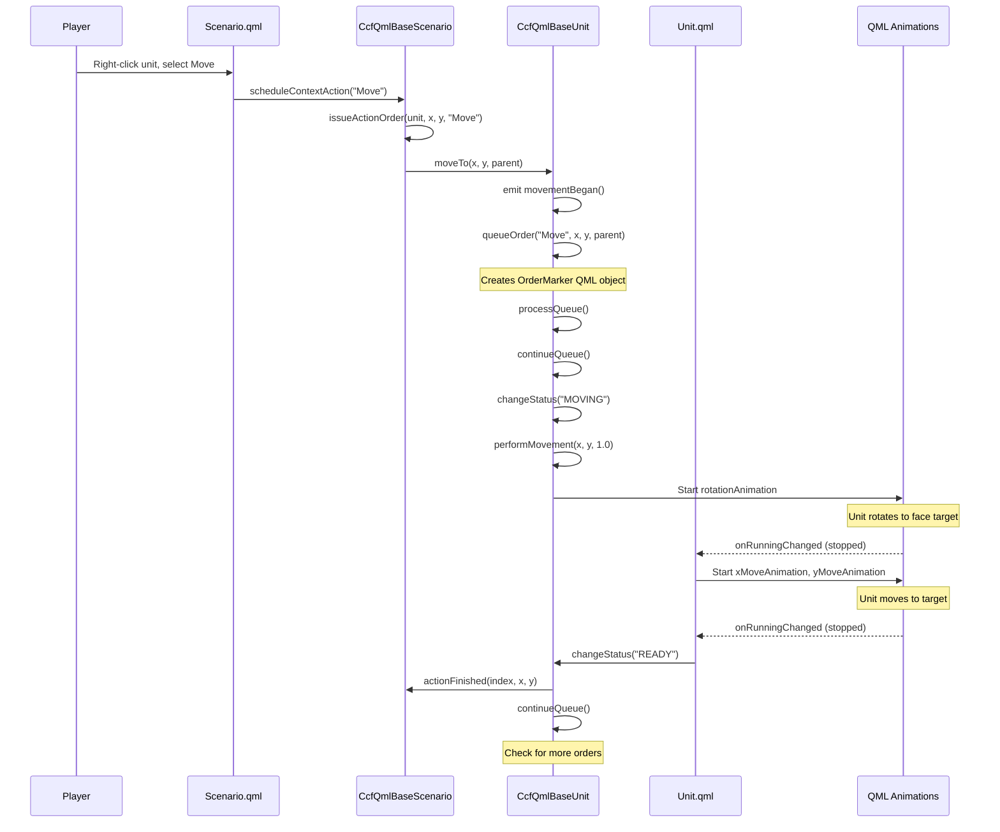

### 9.2 Code Walkthrough

**Step 1: Player Issues Order**

Player clicks on the map after selecting "Move" from the context menu or pressing the Move hotkey.

**Step 2: Scenario Processes Input**

`CcfQmlBaseScenario::performContextAction()` is called:

```cpp
// src/qmlBase/ccfqmlbasescenario.cpp:216-250
void CcfQmlBaseScenario::performContextAction(int index, qreal targetX, qreal targetY)
{
    QList<QObject *> selectedGroup = selectedUnits();
    CcfQmlBaseUnit *unit = ccfUnit(mUnits.at(index));
    QString scheduledOperation = mAimLine->getString("scheduledOperation");

    // ... validation checks ...
    
    // Set up the unit to which the aimLine is anchored.
    issueActionOrder(unit, targetX, targetY, scheduledOperation);

    // Issue orders to all selected units
    for (int i = 0; i < selectedGroup.length(); ++i) {
        unit = ccfUnit(selectedGroup.at(i));
        if (unit->getUnitIndex() == index)
            continue;

        qreal tempX = targetX + (unit->x() - mUnits.at(index)->getReal("x"));
        qreal tempY = targetY + (unit->y() - mUnits.at(index)->getReal("y"));

        issueActionOrder(unit, tempX, tempY, scheduledOperation);
    }

    cleanContextAction();
}
```

**Step 3: Issue Action Order**

```cpp
// src/qmlBase/ccfqmlbasescenario.cpp:305-322
void CcfQmlBaseScenario::issueActionOrder(CcfQmlBaseUnit *unit, qreal x, qreal y, const QString &operation)
{
    // Clear defence, if it is on.
    unit->setDefenceSphereColor("");
    unit->changeStatus("READY");

    if (operation == "Move") {
        unit->moveTo(x, y, mZoomArea);
    } else if (operation == "Move fast") {
        unit->moveFastTo(x, y, mZoomArea);
    } else if (operation == "Sneak") {
        unit->sneakTo(x, y, mZoomArea);
    } else if (operation == "Attack") {
        unit->fireTo(x, y, mZoomArea);
    } else if (operation == "Smoke") {
        unit->smokeTo(x, y, mZoomArea);
    }
}
```

**Step 4: Unit Processes Move Order**

```cpp
// src/qmlBase/ccfqmlbaseunit.cpp:324-329
void CcfQmlBaseUnit::moveTo(qreal newX, qreal newY, QObject *reparent)
{
    emit movementBegan();
    queueOrder("Move", newX, newY, reparent);
    processQueue();
}
```

**Step 5: Queue Processing**

```cpp
// src/qmlBase/ccfqmlbaseunit.cpp:242-283
void CcfQmlBaseUnit::continueQueue()
{
    bool noOrdersLeft = true;

    for (int i = 0; i < mOrders.length(); ++i) {
        QObject *order = mOrders.value(i);
        if (order->getBool("performed") == true) {
            continue;
        } else {
            mCurrentOrder = i;

            qreal targetX = order->getReal("targetX");
            qreal targetY = order->getReal("targetY");
            QString operation = order->getString("operation");
            if (operation == "Move") {
                changeStatus("MOVING");  // <-- State change
                performMovement(targetX, targetY, 1);
            }
            // ... other operations

            order->set("performed", true);
            noOrdersLeft = false;
            break;
        }
    }

    if (noOrdersLeft == true) {
        clearOrderQueue();
    }
}
```

**Step 6: Movement Calculation**

```cpp
// src/qmlBase/ccfqmlbaseunit.cpp:100-128
void CcfQmlBaseUnit::performMovement(qreal newX, qreal newY, qreal factor)
{
    qreal tempX = newX - (mCenterX);
    qreal tempY = newY - (mCenterY);

    qreal newRotation = CcfEngineHelpers::rotationAngle(x(), y(), tempX, tempY);
    QObject *rotationAnimation = child("rotationAnimation");
    if (rotationAnimation) {
        rotationAnimation->set("duration",
                               CcfEngineHelpers::rotationDuration(rotation(),
                                                                  newRotation, mRotationSpeed));
        rotationAnimation->set("to", newRotation);
        rotationAnimation->set("running", true);
    }
    mMoving = true;

    // Calculate movement duration based on distance
    QObject *xMoveAnimation = child("xMoveAnimation");
    QObject *yMoveAnimation = child("yMoveAnimation");
    if (xMoveAnimation && yMoveAnimation) {
        qreal moveDuration = CcfEngineHelpers::targetDistance(x(), y(), tempX,
                                                              tempY) * 800 / (mMaxSpeed * factor);
        set("duration", moveDuration);
        set("duration", moveDuration);
    }
}
```

**Step 7: QML Animation Completion**

When animations complete, the QML side triggers the next steps:

```qml
// qml/units/Unit.qml:164-177
onRunningChanged: {            
    if (!xMoveAnimation.running) {
        moving = false;
    }

    if ((!xMoveAnimation.running) && (unitStatus != "STOPPED")) {
        changeStatus("READY");
        actionFinished(unitIndex, orderTarget().x, orderTarget().y);
        continueQueue();
    } else if (unitStatus == "STOPPED") {
        changeStatus("READY");
    }
}
```

**Step 8: Scenario Receives Completion**

```cpp
// src/qmlBase/ccfqmlbasescenario.cpp:327-341
void CcfQmlBaseScenario::actionFinished(int index, qreal targetX, qreal targetY)
{
    CcfQmlBaseUnit *unit = ccfUnit(mUnits.at(index));

    if (unit->getCurrentOrder() != -1) {
        QString scheduledOperation = unit->operation(unit->getCurrentOrder());
        if ((scheduledOperation != "Move")
                && (scheduledOperation != "Move fast")
                && (scheduledOperation != "Sneak")
                && (scheduledOperation != "Follow")) {
            firingActionFinished(index, targetX, targetY);
            checkScenarioFinished();
        }
    }
}
```

---

## 10. Key Handler Implementations

### 10.1 Keyboard Input Processing

Keyboard input is handled in `CcfQmlBaseScenario::handleKeyPress()`:

```cpp
// src/qmlBase/ccfqmlbasescenario.cpp:1261-1340
void CcfQmlBaseScenario::handleKeyPress(QObject *event)
{
    int digit = digitPressed(event);
    int modifiers = event->getInt("modifiers");
    int key = event->getInt("key");
    CcfConfig *config = mmain->config();

    if (modifiers == Qt::ControlModifier) {
        if (digit != -1)
            groupUnits(digit);  // Ctrl+Number creates a group
    } else {
        // Development key bindings
        if (key == Qt::Key_BracketRight) {
            mMapItem->toggleBackgroundImage();
        } else if (key == Qt::Key_BracketLeft) {
            togglePlayer();
        } else
            // end of dev key bindings
            if (key == config->keyForFunction("zoom in")) {
                zoomIn();
            } else if (key == config->keyForFunction("zoom out")) {
                zoomOut();
            } else if (key == config->keyForFunction("quit")) {
                mmain->quit();
            } else if (key == config->keyForFunction("toggle top menu")) {
                invoke(child("topMenu"), "toggleMenu");
            } else if (key == config->keyForFunction("toggle bottom menu")) {
                invoke(child("bottomMenu"), "toggleMenu");
            } else if (key == config->keyForFunction("follow")) {
                // ... follow logic
            } else if (selectedUnitsCount() > 0) {
                if (key == config->keyForFunction("Stop")) {
                    QObjectList selectedOnes = selectedUnits();
                    for (int i = 0; i < selectedOnes.length(); ++i) {
                        invoke(selectedOnes.at(i), "cancelOrder");
                    }
                } else if (key == config->keyForFunction("Move fast")) {
                    scheduleContextAction("Move fast");
                } else if (key == config->keyForFunction("Move")) {
                    scheduleContextAction("Move");
                } else if (key == config->keyForFunction("Sneak")) {
                    scheduleContextAction("Sneak");
                } else if (key == config->keyForFunction("Attack")) {
                    scheduleContextAction("Attack");
                } else if (key == config->keyForFunction("Smoke")) {
                    scheduleContextAction("Smoke");
                } else if (key == config->keyForFunction("Defend")) {
                    scheduleContextAction("Defend");
                } else if (key == config->keyForFunction("Ambush")) {
                    scheduleContextAction("Ambush");
                }
            }

        if (key == config->keyForFunction("pause")) {
            togglePause();
        }

        // Digit reading.
        if (digit != -1)
            selectGroup(digit);  // Number selects a group
    }
}
```

### 10.2 Key Binding Configuration

Key bindings are stored in `CcfConfig` and retrieved using:

```cpp
keyForFunction("Move");
keyForFunction("Attack");
keyForFunction("Stop");
// etc.
```

### 10.3 State-Aware Input Handling

The system checks unit states before processing commands:

```cpp
else if (selectedUnitsCount() > 0) {
    // Only process these commands if units are selected
    if (key == config->keyForFunction("Stop")) {
        // ...
    } else if (key == config->keyForFunction("Move")) {
        scheduleContextAction("Move");
    }
    // ...
}
```

---

## 11. Limitations and Unimplemented Features

### 11.1 Current Limitations

#### 11.1.1 State System Limitations

1. **String-Based States**: Using QString for states is flexible but:
   - No compile-time type safety
   - Potential for typos causing bugs
   - Less efficient than enums
   
   ```cpp
   // src/qmlBase/ccfqmlbaseunit.h:70
   // TODO: should it be combined with state?
   Q_PROPERTY(QString unitStatus ...)
   ```

2. **No Hierarchical State Machine**: States are flat; there's no inheritance or composition

3. **Limited State Validation**: No centralized validation of state transitions

#### 11.1.2 Animation System Limitations

1. **Hardcoded Animation Names**: Animation objects are referenced by string names:
   ```cpp
   QObject *rotationAnimation = child("rotationAnimation");
   ```
   This is brittle and can fail if QML structure changes.

2. **Animation Duration Calculations**: Movement duration is calculated but stored in QML:
   ```cpp
   set("duration", moveDuration);  // Unclear which animation this sets
   ```

#### 11.1.3 Action System Limitations

1. **No Action Interruption**: Once an action starts, it cannot be smoothly interrupted

2. **Limited Order Types**: Only Move, Move Fast, Sneak, Attack, Smoke are implemented

3. **No Order Priority**: All orders have equal priority in the queue

### 11.2 Unimplemented Features

#### 11.2.1 States Not Fully Implemented

Based on code analysis, these states exist in documentation but are not fully functional:

- **COVERING**: Referenced but not implemented
- **BROKEN**: Morale system not implemented
- **BERSERK**: Morale system not implemented
- **AIMING**: Only exists as transition state for tanks
- **FIXING**: Not implemented (likely for jammed weapons)

#### 11.2.2 Missing State Functionality

1. **Ambush Mechanics**: The ambush state exists but:
   ```cpp
   if (operation == "Ambush") {
       for (int i = 0; i < units.length(); ++i) {
           units.at(i)->setDefenceSphereColor("green");
           ccfUnit(units.at(i))->changeStatus("AMBUSHING");
       }
   }
   ```
   No actual combat mechanics for ambush are implemented.

2. **Defense Mechanics**: Similar to ambush, only visual indicator exists

3. **Morale System**: States like BROKEN and BERSERK require a morale system that doesn't exist

#### 11.2.3 Action System Gaps

1. **No Action Costs**: No ammunition, stamina, or time costs for actions

2. **No Action Failure**: Actions always succeed (no jamming, no misses due to terrain)

3. **No Action Modifiers**: Terrain, weather, unit experience don't affect actions

#### 11.2.4 Queue System Limitations

1. **No Order Editing**: Cannot modify queued orders, only cancel all

2. **No Conditional Orders**: Cannot set "if-then" order logic

3. **No Order Timeouts**: Orders wait indefinitely for completion

### 11.3 Technical Debt

Several TODO comments indicate areas needing attention:

```cpp
// src/qmlBase/ccfqmlbaseunit.h:70
// TODO: should it be combined with state?

// src/qmlBase/ccfqmlbaseunit.h:91
// TODO: consider dropping this in favor of BaseScenario's index.

// src/qmlBase/ccfqmlbaseunit.h:239
// TODO: hide or remove.
Q_PROPERTY(bool moving READ getMoving ...)

// src/qmlBase/ccfqmlbaseunit.h:204-205
// TODO: rethink, try to remove.
Q_PROPERTY(bool firing READ getFiring ...)
```

### 11.4 Recommended Improvements

1. **Convert to Enum-Based States**:
   ```cpp
   enum class UnitState {
       Ready,
       Moving,
       MovingFast,
       Sneaking,
       Firing,
       // ...
   };
   Q_PROPERTY(UnitState unitState ...)
   ```

2. **Implement State Machine Framework**:
   - Use Qt's QStateMachine
   - Define valid transitions explicitly
   - Add entry/exit actions for states

3. **Add Action Preconditions**:
   ```cpp
   bool canPerformAction(ActionType action) {
       return checkPrerequisites(action, currentState);
   }
   ```

4. **Implement Order Queue Management**:
   - Individual order cancellation
   - Order reordering
   - Order priorities

5. **Add State Persistence**:
   - Save/restore unit states
   - State history for replay/debugging

---

## Appendix A: State Property Reference

### A.1 CcfQmlBaseUnit Properties

| Property | Type | Default | Description |
|----------|------|---------|-------------|
| unitStatus | QString | "READY" | Current operational state |
| moving | bool | false | True when unit is moving |
| firing | bool | false | True when unit is firing |
| smoking | bool | false | True when unit is deploying smoke |
| paused | bool | false | True when game is paused |
| currentOrder | int | -1 | Index of current order in queue |
| selected | bool | false | True when unit is selected |

### A.2 State Transitions Matrix

| Current State | Valid Next States | Trigger |
|---------------|-------------------|---------|
| READY | MOVING, MOVING FAST, SNEAKING, ROTATING, AMBUSHING, DEFENDING | Player command |
| MOVING | READY, STOPPED | Animation complete, Stop command |
| ROTATING | FIRING, READY | Rotation complete |
| FIRING | READY, RELOADING | Fire complete |
| RELOADING | READY | Reload complete |
| AMBUSHING | READY | New command |
| DEFENDING | READY | New command |

### A.3 Order Types and Parameters

| Order | Speed Factor | Status Set | Animation |
|-------|--------------|------------|-----------|
| Move | 1.0 | MOVING | rotation + movement |
| Move fast | mMoveFastFactor (default 1.5) | MOVING FAST | rotation + movement |
| Sneak | mSneakFactor (default 0.4) | SNEAKING | rotation + movement |
| Attack | N/A | ROTATING -> FIRING | turret rotation + fire |
| Smoke | N/A | ROTATING -> FIRING | turret rotation + smoke |

---

## Appendix B: Mermaid Diagrams

### B.1 Complete State Machine

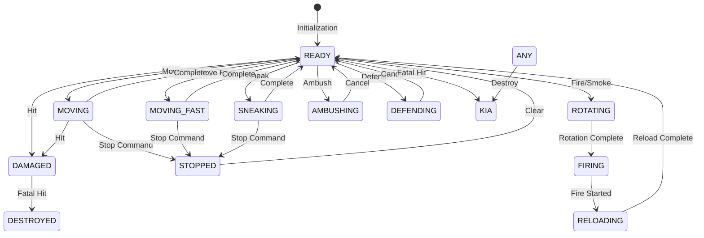

### B.2 Action Execution Flow

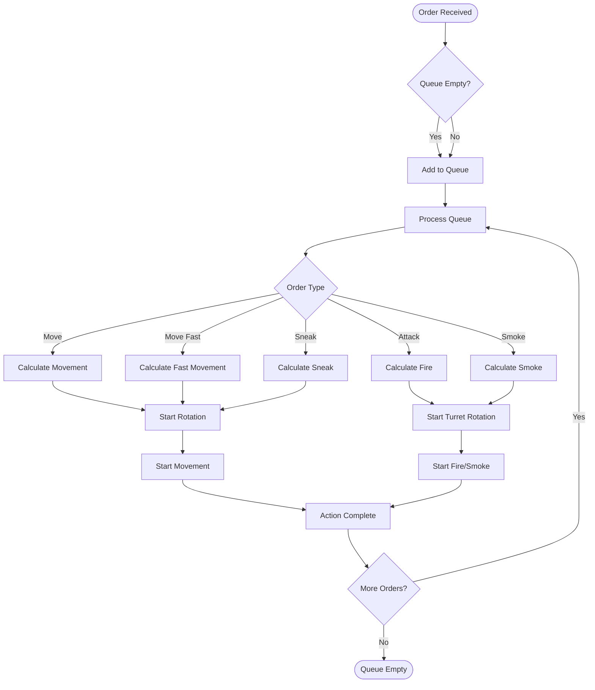

### B.3 State Property Visualization

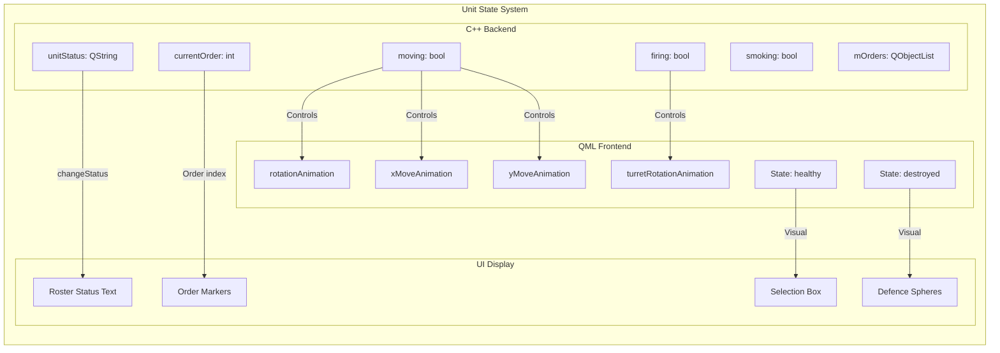

---

## Summary

The CCF state machine and action system provides a flexible foundation for tactical gameplay:

- **String-based states** offer readability at the cost of type safety
- **Order queue system** allows complex command sequences
- **QML animation integration** provides smooth visual feedback
- **Modular design** separates command input, state management, and visual representation

The system successfully implements the core Close Combat gameplay loop while leaving room for expansion of more advanced features like morale, suppression, and complex state transitions.
