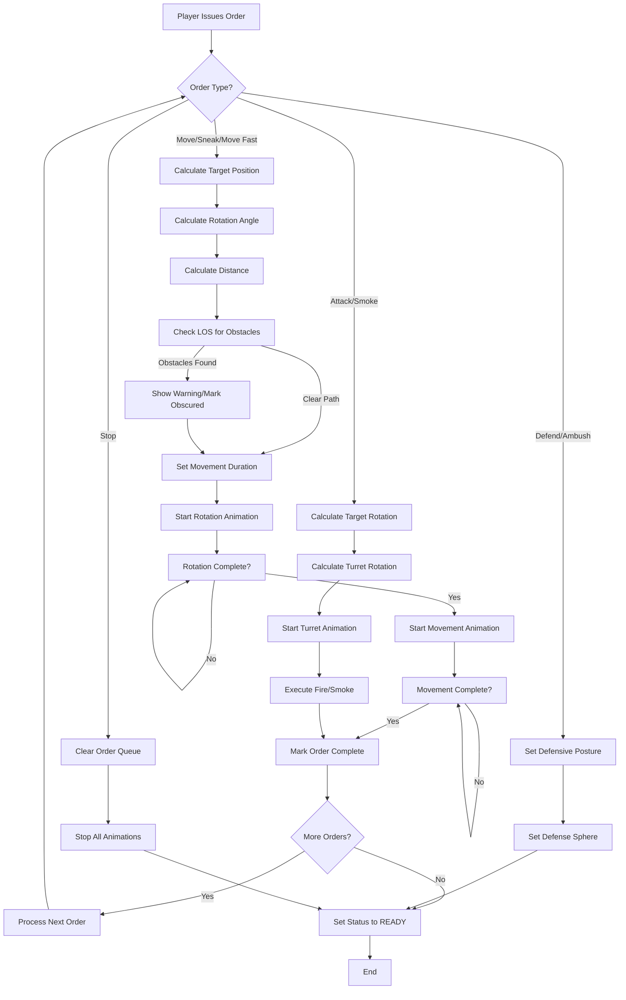
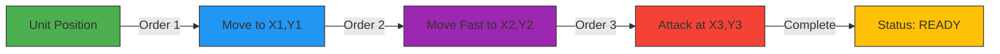
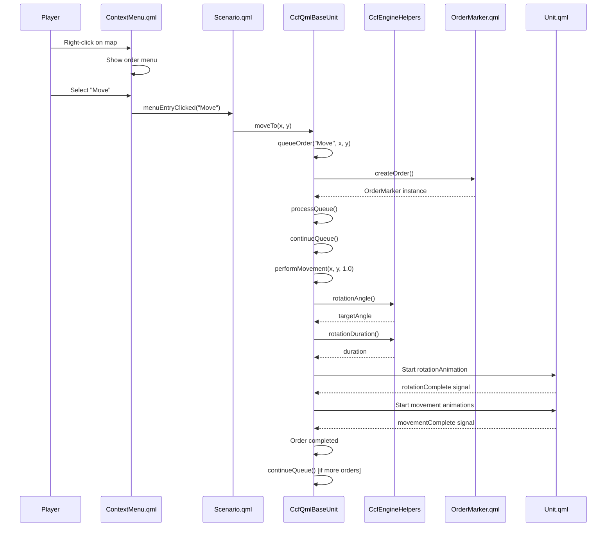
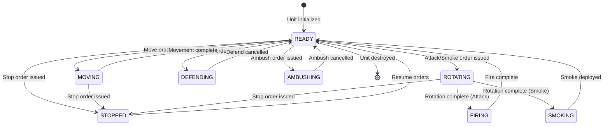

# Chapter 4: Order System and AI Pathfinding

## Overview

This chapter documents the order system and pathfinding implementation in CloseCombatFree (CCF), a Qt5/QML-based tactical wargame. The order system enables players to command units through various actions such as movement, combat, and defensive postures, while the pathfinding system calculates optimal routes and handles unit rotation and positioning.

---

## 1. Concept: Commands and Movement

### 1.1 Gameplay-Level Understanding

At its core, CCF is a real-time tactical wargame where players control military units through a command system inspired by the classic Close Combat series. The command system allows players to issue orders that direct units to move, attack, defend, or perform special actions.

**Available Orders:**

| Order | Description | Use Case |
|-------|-------------|----------|
| **Move** | Standard movement at normal speed | General repositioning |
| **Move Fast** | Rapid movement with speed multiplier | Urgent repositioning |
| **Sneak** | Slow, stealthy movement | Avoiding detection |
| **Attack** | Fire at specified target | Engaging enemies |
| **Smoke** | Deploy smoke grenades | Covering advances |
| **Defend** | Hold position with defensive posture | Area denial |
| **Ambush** | Wait in concealment for targets | Setting traps |
| **Stop** | Cancel all current orders | Emergency halt |
| **Follow** | Track a friendly unit | Formation movement |

### 1.2 Movement Mechanics

Movement in CCF follows a realistic model where units must:

1. **Rotate to face the target direction** before moving
2. **Move along the calculated path** at the appropriate speed
3. **Complete the order** and proceed to the next queued command

The movement system factors in:
- **Rotation speed**: How quickly a unit can turn (`rotationSpeed` property)
- **Maximum speed**: Base movement capability (`maxSpeed` property)
- **Speed multipliers**: Modifiers for different movement types (`moveFastFactor`, `sneakFactor`)
- **Acceleration**: Rate of speed change (`acceleration` property)

### 1.3 Player Interaction Model

Players interact with the command system through:

- **Right-click context menu**: Opens the order selection menu
- **Keyboard shortcuts**: Quick access to common commands
- **Shift+click**: Queue multiple orders (waypoint system)
- **Direct map interaction**: Click on terrain to specify destinations

```
┌─────────────────────────────────────────────────────────────┐
│                    PLAYER INPUT FLOW                        │
├─────────────────────────────────────────────────────────────┤
│                                                             │
│  ┌──────────────┐    ┌──────────────┐    ┌──────────────┐  │
│  │ Right Click  │    │  Key Press   │    │ Shift+Click  │  │
│  │ on Map/Unit  │ or │   (Hotkey)   │ or │  (Waypoint)  │  │
│  └──────┬───────┘    └──────┬───────┘    └──────┬───────┘  │
│         │                   │                   │          │
│         └───────────────────┼───────────────────┘          │
│                             ▼                              │
│                    ┌─────────────────┐                     │
│                    │ Order Selection │                     │
│                    └────────┬────────┘                     │
│                             ▼                              │
│                    ┌─────────────────┐                     │
│                    │  Target Picking │                     │
│                    └────────┬────────┘                     │
│                             ▼                              │
│                    ┌─────────────────┐                     │
│                    │ Order Execution │                     │
│                    └─────────────────┘                     │
│                                                             │
└─────────────────────────────────────────────────────────────┘
```

---

## 2. Order System: How Commands Work

### 2.1 System Architecture

The order system in CCF is implemented through a hybrid C++/QML architecture:

- **C++ Backend (`CcfQmlBaseUnit`)**: Handles order queue management, state tracking, and calculations
- **QML Frontend (`ContextMenu.qml`, `OrderMarker.qml`)**: Provides visual feedback and user interaction
- **Engine Helpers (`CcfEngineHelpers`)**: Performs geometric calculations and LOS checks

### 2.2 Context Menu System

The context menu is the primary interface for issuing orders. It appears when the player right-clicks on the map or a unit.

**Menu Structure (`qml/gui/menus/ContextMenu.qml:24-142`):**

```qml
Rectangle {    
    property int buttonWidth: moveFastButton.width
    property int buttonHeight: 19
    property color backgroundColor: "#5e2c24"
    signal menuEntryClicked(string menuEntry)

    Grid {
        id: entries
        rows: 9
        flow: Grid.TopToBottom

        ContextMenuEntry {
            id: moveFastButton
            buttonText: qsTr("Move fast")
        }
        ContextMenuEntry {
            id: moveButton
            buttonText: qsTr("Move")
        }
        ContextMenuEntry {
            id: sneakButton
            buttonText: qsTr("Sneak")
        }
        // ... additional entries
    }
}
```

The menu emits a `menuEntryClicked` signal with the selected order name, which is then processed by the scenario handler.

### 2.3 Order Queue Management

CCF supports **order queuing**, allowing players to chain multiple commands. This is implemented through the `mOrders` list in `CcfQmlBaseUnit`.

**Queue Processing Flow:**

```
┌─────────────────────────────────────────────────────────────┐
│                  ORDER QUEUE SYSTEM                         │
├─────────────────────────────────────────────────────────────┤
│                                                             │
│  Order 1: Move to (100, 200)                                │
│  ┌─────────────────────────────────────────────────────┐   │
│  │ ● Move    [completed]                               │   │
│  └─────────────────────────────────────────────────────┘   │
│                          ↓                                  │
│  Order 2: Attack target at (150, 250)                       │
│  ┌─────────────────────────────────────────────────────┐   │
│  │ ● Attack  [in progress]                             │   │
│  └─────────────────────────────────────────────────────┘   │
│                          ↓                                  │
│  Order 3: Move Fast to (300, 400)                           │
│  ┌─────────────────────────────────────────────────────┐   │
│  │ ● Move Fast  [pending]                              │   │
│  └─────────────────────────────────────────────────────┘   │
│                                                             │
│  Current Order Index: 1 (points to Attack)                  │
│                                                             │
└─────────────────────────────────────────────────────────────┘
```

### 2.4 Keyboard Shortcuts

While the context menu provides visual order selection, keyboard shortcuts offer rapid command issuance. The `Keys.onPressed` handler in `qml/scenarios/Scenario.qml:39-41` processes keyboard input:

```qml
Keys.onPressed: {
    handleKeyPress(event);
}
```

Common shortcuts include:
- **S**: Stop current orders
- **M**: Move order mode
- **F**: Move Fast order mode
- **K**: Sneak order mode
- **A**: Attack order mode
- **D**: Defend order mode

---

## 3. Pathfinding Concept: Grid-Based Movement

### 3.1 Movement Calculation Overview

CCF uses a **direct path approach** rather than traditional grid-based A* pathfinding. The system calculates:

1. **Rotation angle**: The direction the unit must face
2. **Travel distance**: Euclidean distance between points
3. **Travel duration**: Based on distance and speed factors
4. **Obstacle detection**: Line-of-sight (LOS) checks along the path

### 3.2 Geometric Calculations

The `CcfEngineHelpers` class provides the mathematical foundation for movement calculations.

**Rotation Angle Calculation (`src/logic/ccfenginehelpers.cpp:53-85`):**

```cpp
qreal CcfEngineHelpers::rotationAngle(qreal oldX, qreal oldY,
                                      qreal newX, qreal newY)
{
    qreal result = 0;

    if (qFuzzyCompare(newX, oldX)) {
        if (newY > oldY)
            result = 0;
        else
            result = 180;
        return result;
    }
    else if (qFuzzyCompare(newY, oldY)) {
        if (newX > oldX)
            result = 90;
        else
            result = 270;
        return result;
    }

    qreal angle = (qAtan(qAbs(newX - oldX) / qAbs(newY - oldY)) * 180 / 3.14159);

    if ((newY > oldY) && (newX > oldX)) // 2. quarter
        result = 180 - angle;
    else if ((newY > oldY) && (newX < oldX)) // 3. quarter
        result = 180 + angle;
    else if ((newY < oldY) && (newX < oldX)) // 4. quarter
        result = 360 - angle;
    else // 1. quarter
        result = angle;

    return result;
}
```

**Target Distance Calculation (`src/logic/ccfenginehelpers.cpp:90-106`):**

```cpp
qreal CcfEngineHelpers::targetDistance(qreal originX, qreal originY,
                                       qreal targetX, qreal targetY)
{
    qreal result = 0;

    if (qFuzzyCompare(targetX, originX)) {
        result = qAbs(originY - targetY);
        return result;
    } else if (qFuzzyCompare(targetY, originY)) {
        result = qAbs(originX - targetX);
        return result;
    }

    result = qSqrt(qPow((originX - targetX), 2) + qPow((originY - targetY), 2));

    return result;
}
```

### 3.3 Obstacle Detection

The LOS system samples points along the movement path to detect obstacles:

**Line-of-Sight Check (`src/logic/ccfenginehelpers.cpp:280-318`):**

```cpp
bool CcfEngineHelpers::isObstacleInLOS(QList<QObject *> items, qreal x1, qreal y1,
                                       qreal x2, qreal y2, QObject *currentUnit)
{
    qreal distance = targetDistance(x1, y1, x2, y2);
    qreal a = (y2 - y1) / (x2 - x1);
    qreal b = y1 - (a * x1);
    qreal x = x2;
    qreal y = y2;

    for (int i = 0; i < distance; ++i) {
        if (x2 >= x1) {
            if (x > x2)
                break;
            x = x1 + i;
        } else {
            if (x < x2)
                break;
            x = x1 - i;
        }

        y = (a * x) + b;

        for (int j = 0; j < items.length(); ++j) {
            QObject *item = items.at(j);
            if ((item == currentUnit) || (item == NULL)) {
                continue;
            }

            if (((x <= item->property("x").toReal() + item->property("width").toReal())
                 && (x >= item->property("x").toReal()))
                    && ((y <= item->property("y").toReal() + item->property("height").toReal())
                        && (y >= item->property("y").toReal()))) {
                return true;
            }
        }
    }
    return false;
}
```

---

## 4. The A* Algorithm (Alternative Implementation)

### 4.1 Why Direct Path Instead of A*

CCF uses a **direct path calculation** approach rather than traditional A* pathfinding for several reasons:

1. **Real-time tactical gameplay**: Units respond immediately without complex path computation
2. **Simplified terrain**: The current implementation doesn't use grid-based terrain costs
3. **Player-driven waypoints**: Players manually specify paths through multiple orders
4. **LOS-based obstacles**: Obstacles are detected during movement, not pre-calculated

### 4.2 Pathfinding Flowchart



### 4.3 Rotation Duration Calculation

Before moving, units must rotate to face their destination. The rotation duration is calculated in `src/logic/ccfenginehelpers.cpp:139-160`:

```cpp
int CcfEngineHelpers::rotationDuration(qreal oldRotation, qreal newRotation,
                                       qreal rotationSpeed)
{
    qreal tempNewRotation = newRotation;
    qreal tempOldRotation = oldRotation;
    qreal rotationChange = newRotation - oldRotation;

    if (qFuzzyCompare(oldRotation, tempNewRotation))
        return 0;

    if (qFuzzyCompare(tempOldRotation, 0))
        tempOldRotation = 360;

    if ((newRotation > 180) && (oldRotation < 180)) {
        rotationChange = tempNewRotation - tempOldRotation;
    } else if ((oldRotation > 180) && (newRotation < 180)) {
        rotationChange = tempOldRotation - tempNewRotation;
    }

    qreal dur = (rotationSpeed * qAbs(rotationChange));
    return qRound(dur);
}
```

---

## 5. Concrete Example: Player Commands Unit

### 5.1 Complete Order Flow Example

Let's trace through a complete example: **Player orders a tank to move to a position, then attack an enemy.**

```
┌─────────────────────────────────────────────────────────────────────────────┐
│                    COMPLETE ORDER FLOW EXAMPLE                              │
│              Move Unit → Queue Attack → Execute Sequence                    │
├─────────────────────────────────────────────────────────────────────────────┤
│                                                                             │
│  STEP 1: PLAYER INPUT                                                       │
│  ═══════════════════                                                        │
│  • Player selects tank unit (left-click)                                    │
│  • Player right-clicks on destination (100, 200)                            │
│  • Context menu appears                                                     │
│  • Player selects "Move"                                                    │
│                                                                             │
│  STEP 2: ORDER CREATION                                                     │
│  ═════════════════════                                                      │
│  • Scenario.qml calls unit.moveTo(100, 200)                                 │
│  • CcfQmlBaseUnit::moveTo() invoked                                         │
│  • queueOrder("Move", 100, 200) creates OrderMarker                         │
│  • OrderMarker appears on map at (100, 200)                                 │
│                                                                             │
│  STEP 3: FIRST ORDER EXECUTION                                              │
│  ═══════════════════════════                                                │
│  • processQueue() starts execution                                          │
│  • continueQueue() processes Move order                                     │
│  • performMovement(100, 200, 1.0) called                                    │
│  • Rotation calculated: 45 degrees                                          │
│  • Rotation animation starts (500ms)                                        │
│  • Unit rotates to face destination                                         │
│  • Rotation completes → Movement starts                                     │
│  • Unit moves to (100, 200) over 2 seconds                                  │
│                                                                             │
│  STEP 4: QUEUEING SECOND ORDER                                              │
│  ═══════════════════════════════                                            │
│  • Player holds Shift + clicks enemy at (150, 250)                          │
│  • Player selects "Attack" from context menu                                │
│  • queueOrder("Attack", 150, 250) called                                    │
│  • Second OrderMarker created (shows "2")                                   │
│                                                                             │
│  STEP 5: SECOND ORDER EXECUTION                                             │
│  ══════════════════════════════                                             │
│  • First order completes → continueQueue() called                           │
│  • performTurretShooting(150, 250) invoked                                  │
│  • Turret rotates toward target (300ms)                                     │
│  • Tank fires at enemy                                                      │
│  • Order marked as performed                                                │
│                                                                             │
│  STEP 6: COMPLETION                                                         │
│  ════════════════                                                           │
│  • No more orders in queue                                                  │
│  • clearOrderQueue() removes OrderMarkers                                   │
│  • Unit status set to "READY"                                               │
│                                                                             │
└─────────────────────────────────────────────────────────────────────────────┘
```

### 5.2 Code Flow Through the System

**Player Action → Order Creation:**

```cpp
// In CcfQmlBaseUnit (src/qmlBase/ccfqmlbaseunit.cpp:324-329)
void CcfQmlBaseUnit::moveTo(qreal newX, qreal newY, QObject *reparent)
{
    emit movementBegan();
    queueOrder("Move", newX, newY, reparent);  // Add to queue
    processQueue();  // Start execution
}
```

**Order Queue Processing:**

```cpp
// In CcfQmlBaseUnit (src/qmlBase/ccfqmlbaseunit.cpp:222-237)
void CcfQmlBaseUnit::queueOrder(const QString &orderName, qreal x, qreal y, QObject *reparent)
{
    QObject *order = createOrder(reparent);

    if (order != 0) {
        order->set("index", mOrders.length());
        order->set("number", mOrders.length());
        order->set("operation", orderName);
        order->set("orderColor", CcfEngineHelpers::colorForOrder(orderName));
        order->set("x", (x - order->getReal("centerX")));
        order->set("y", (y - order->getReal("centerY")));
        order->set("visible", true);
        mOrders.append(order);
    }
}
```

**Order Execution:**

```cpp
// In CcfQmlBaseUnit (src/qmlBase/ccfqmlbaseunit.cpp:242-283)
void CcfQmlBaseUnit::continueQueue()
{
    bool noOrdersLeft = true;

    for (int i = 0; i < mOrders.length(); ++i) {
        QObject *order = mOrders.value(i);
        if (order->getBool("performed") == true) {
            continue;
        } else {
            mCurrentOrder = i;
            qreal targetX = order->getReal("targetX");
            qreal targetY = order->getReal("targetY");
            QString operation = order->getString("operation");
            
            if (operation == "Move") {
                changeStatus("MOVING");
                performMovement(targetX, targetY, 1);
            } else if (operation == "Attack") {
                performTurretShooting(targetX, targetY);
                mFiring = true;
            }
            
            order->set("performed", true);
            noOrdersLeft = false;
            break;  // Execute one order at a time
        }
    }

    if (noOrdersLeft == true) {
        clearOrderQueue();
    }
}
```

---

## 6. Target Selection Mechanics

### 6.1 Aim Line Visualization

When targeting an attack or smoke order, CCF displays an **aim line** that shows:
- **Clear portion**: Visible path to target
- **Obscured portion**: Path blocked by obstacles (shown in darker color)
- **Invisible portion**: Path completely blocked (shown in black)

**Aim Line Implementation (`qml/scenarios/Scenario.qml:174-216`):**

```qml
Rectangle {
    property real obscureBeginning: height
    property real invisibleBeginning: height
    property string scheduledOperation: ""
    property int unitIndex: -1

    objectName: "aimLine"
    id: aimLine
    z: root.z + 1
    visible: false
    width: 3
    height: 150

    Rectangle {
        id: aimLineObscured
        z: aimLine.z + 1
        width: parent.width
        anchors.horizontalCenter: parent.horizontalCenter
        anchors.bottom: parent.bottom
        visible: parent.visible
        color: Qt.darker(parent.color, 1.5)
        height: parent.height - parent.obscureBeginning
    }

    Rectangle {
        id: aimLineInvisible
        z: aimLineObscured.z + 1
        width: parent.width
        anchors.horizontalCenter: parent.horizontalCenter
        anchors.bottom: parent.bottom
        visible: parent.visible
        color: Qt.darker(parent.color, 2.0)
        height: parent.height - parent.invisibleBeginning
    }

    transform: Rotation {
        origin.x: 1
        origin.y: 0
        angle: aimLineRotation
    }
}
```

### 6.2 Line-of-Sight (LOS) Calculations

The engine provides two LOS functions:

1. **`checkForObstaclesInLOS`**: Returns distance to first obstacle (0 = no obstacles)
2. **`isObstacleInLOS`**: Returns boolean indicating if path is blocked

These are used to:
- Color the aim line appropriately
- Determine if a shot is possible
- Provide feedback to the player about visibility

### 6.3 Rubber Band Selection

For area-based orders (Defend, Ambush), CCF uses a **rubber band** selection interface:

```qml
RubberBand {
    property int rubberBandRotation: 0
    objectName: "rubberBand"
    id: rubberBand
    visible: false
    z: root.z + 1

    transform: Rotation {
        origin.x: 0
        origin.y: 0
        angle: rubberBand.rubberBandRotation
    }
}
```

The rubber band allows players to:
- Define the area of effect for defensive orders
- Set the facing direction for ambush zones
- Visualize coverage areas

---

## 7. Implementation: Order Base Class/Property

### 7.1 CcfQmlBaseUnit: The Order Container

The `CcfQmlBaseUnit` class serves as the base for all units and contains the complete order system implementation.

**Key Order-Related Properties (`src/qmlBase/ccfqmlbaseunit.h:192-241`):**

```cpp
class CcfQmlBaseUnit : public CcfObjectBase
{
    Q_OBJECT

    // Current order tracking
    Q_PROPERTY(int currentOrder READ getCurrentOrder WRITE setCurrentOrder 
               NOTIFY currentOrderChanged)
    
    // Unit status
    Q_PROPERTY(QString unitStatus READ getUnitStatus WRITE setUnitStatus 
               NOTIFY unitStatusChanged)
    
    // Movement state
    Q_PROPERTY(bool moving READ getMoving WRITE setMoving 
               NOTIFY movingChanged)
    
    // Combat states
    Q_PROPERTY(bool firing READ getFiring WRITE setFiring 
               NOTIFY firingChanged)
    Q_PROPERTY(bool smoking READ getSmoking WRITE setSmoking 
               NOTIFY smokingChanged)
    
    // Speed modifiers
    Q_PROPERTY(qreal moveFastFactor READ getMoveFastFactor WRITE setMoveFastFactor 
               NOTIFY moveFastFactorChanged)
    Q_PROPERTY(qreal sneakFactor READ getSneakFactor WRITE setSneakFactor 
               NOTIFY sneakFactorChanged)
    
    // Defense/ambush sphere
    Q_PROPERTY(int defenceSphereRotation READ getDefenceSphereRotation 
               WRITE setDefenceSphereRotation NOTIFY defenceSphereRotationChanged)
    Q_PROPERTY(QString defenceSphereColor READ getDefenceSphereColor 
               WRITE setDefenceSphereColor NOTIFY defenceSphereColorChanged)

    // ... additional properties
};
```

### 7.2 Order Queue Storage

Orders are stored in a `QObjectList` with each order being a dynamically created `OrderMarker` QML component:

```cpp
// In CcfQmlBaseUnit (src/qmlBase/ccfqmlbaseunit.h:298-299)
private:
    QObjectList mOrders;           // List of all orders
    int mCurrentOrder;             // Index of currently executing order
```

### 7.3 Order Creation Factory

The `createOrder` method instantiates OrderMarker components:

```cpp
// In CcfQmlBaseUnit (src/qmlBase/ccfqmlbaseunit.cpp:176-189)
QObject *CcfQmlBaseUnit::createOrder(QObject *parent)
{
    if (parent == 0) {
        parent = this->parent();
    }

    if (mOrdersComponent->isReady()) {
        QObject *object = mOrdersComponent->create();
        object->set("parent", QVariant::fromValue(parent));
        return object;
    } else {
        return 0;
    }
}
```

The component is pre-loaded in the constructor:

```cpp
// In CcfQmlBaseUnit (src/qmlBase/ccfqmlbaseunit.cpp:40-42)
mMainInstance = CcfMain::instance();
mOrdersComponent = new QQmlComponent(mMainInstance->engine(),
                                      QUrl::fromLocalFile("qml/gui/OrderMarker.qml"));
```

---

## 8. Implementation: Order Types

### 8.1 Order Type Dispatch

The `continueQueue` method dispatches to specific handlers based on order type:

```cpp
// In CcfQmlBaseUnit (src/qmlBase/ccfqmlbaseunit.cpp:255-271)
QString operation = order->getString("operation");
if (operation == "Move") {
    changeStatus("MOVING");
    performMovement(targetX, targetY, 1);
} else if (operation == "Move fast") {
    changeStatus("MOVING FAST");
    performMovement(targetX, targetY, mMoveFastFactor);
} else if (operation == "Sneak") {
    changeStatus("SNEAKING");
    performMovement(targetX, targetY, mSneakFactor);
} else if (operation == "Smoke") {
    performTurretShooting(targetX, targetY);
    mSmoking = true;
} else if (operation == "Attack") {
    performTurretShooting(targetX, targetY);
    mFiring = true;
}
```

### 8.2 Movement Orders

**Movement Implementation (`src/qmlBase/ccfqmlbaseunit.cpp:100-128`):**

```cpp
void CcfQmlBaseUnit::performMovement(qreal newX, qreal newY, qreal factor)
{
    qreal tempX = newX - (mCenterX);
    qreal tempY = newY - (mCenterY);

    // Calculate target rotation
    qreal newRotation = CcfEngineHelpers::rotationAngle(x(), y(), tempX, tempY);
    
    // Configure and start rotation animation
    QObject *rotationAnimation = child("rotationAnimation");
    if (rotationAnimation) {
        rotationAnimation->set("duration",
                               CcfEngineHelpers::rotationDuration(rotation(),
                                                                  newRotation, mRotationSpeed));
        rotationAnimation->set("to", newRotation);
        rotationAnimation->set("running", true);
    }
    mMoving = true;

    // Configure movement animations
    QObject *xMoveAnimation = child("xMoveAnimation");
    QObject *yMoveAnimation = child("yMoveAnimation");
    if (xMoveAnimation && yMoveAnimation) {
        qreal moveDuration = CcfEngineHelpers::targetDistance(x(), y(), tempX,
                                                              tempY) * 800 / (mMaxSpeed * factor);
        set("duration", moveDuration);
        set("duration", moveDuration);
    }
}
```

**Speed Factors:**
- Move: `factor = 1.0` (normal speed)
- Move Fast: `factor = mMoveFastFactor` (default 1.5x)
- Sneak: `factor = mSneakFactor` (default 0.4x)

### 8.3 Combat Orders

**Turret-Based Combat (`src/qmlBase/ccfqmlbaseunit.cpp:135-154`):**

```cpp
void CcfQmlBaseUnit::performTurretShooting(qreal targetX, qreal targetY)
{
    QObject *tra = child("turretRotationAnimation");
    if (tra) {
        qreal newRotation = CcfEngineHelpers::rotationAngle(
                    x(), y(),
                    targetX - mCenterX,
                    targetY - mCenterY) - rotation();
        tra->set("duration", CcfEngineHelpers::rotationDuration(
                     getReal("turretRotation"),
                     newRotation,
                     getReal("turretRotationSpeed")));
        tra->set("to", newRotation);
        tra->set("running", true);
    } else {
        mmain->logger()->log("Could not instantiate turretRotationAnimation in CcfQmlBase.");
    }

    changeStatus("ROTATING");
}
```

### 8.4 Defensive Orders

Defend and Ambush orders set up defensive postures with coverage spheres:

```cpp
// 8-step angle conversion for defense spheres
qreal CcfEngineHelpers::angleTo8Step(qreal angle)
{
    if ((angle <= 22) || (angle > 337)) {
        return 270;
    } else if (angle <= 67) {
        return 315;
    } else if (angle <= 112) {
        return 0;
    } else if (angle <= 157) {
        return 45;
    } else if (angle <= 202) {
        return 90;
    } else if (angle <= 247) {
        return 135;
    } else if (angle <= 292) {
        return 180;
    } else if (angle <= 337) {
        return 225;
    }
    return 0;
}
```

---

## 9. Implementation: Pathfinding Algorithm

### 9.1 Geometric Pathfinding

The pathfinding in CCF is implemented through geometric calculations in `CcfEngineHelpers`:

**Header Definition (`src/logic/ccfenginehelpers.h:48-57`):**

```cpp
class CcfEngineHelpers : public QObject
{
    Q_OBJECT
public:
    // Geometric calculations
    Q_INVOKABLE static qreal rotationAngle(qreal oldX, qreal oldY, 
                                           qreal newX, qreal newY);
    Q_INVOKABLE static qreal targetDistance(qreal originX, qreal originY, 
                                            qreal targetX, qreal targetY);
    Q_INVOKABLE static int rotationDuration(qreal oldRotation, qreal newRotation, 
                                            qreal rotationSpeed);
    
    // LOS detection
    Q_INVOKABLE static qreal checkForObstaclesInLOS(QList<QObject *> items, 
                                                     qreal x1, qreal y1,
                                                     qreal x2, qreal y2, 
                                                     QObject *currentUnit);
    Q_INVOKABLE static bool isObstacleInLOS(QList<QObject *> items, 
                                            qreal x1, qreal y1,
                                            qreal x2, qreal y2, 
                                            QObject *currentUnit);
};
```

### 9.2 Movement Duration Calculation

The movement duration formula (`src/qmlBase/ccfqmlbaseunit.cpp:121-122`):

```cpp
qreal moveDuration = CcfEngineHelpers::targetDistance(x(), y(), tempX, tempY) 
                     * 800 / (mMaxSpeed * factor);
```

**Formula Breakdown:**
- `targetDistance()`: Euclidean distance in pixels
- `800`: Base duration multiplier (milliseconds per unit distance)
- `mMaxSpeed`: Unit's maximum speed property
- `factor`: Speed multiplier (1.0 for Move, 1.5 for Move Fast, 0.4 for Sneak)

### 9.3 Obstacle Detection Algorithm

The LOS system uses **linear sampling** along the path:

```cpp
qreal CcfEngineHelpers::checkForObstaclesInLOS(QList<QObject *> items, 
                                               qreal x1, qreal y1,
                                               qreal x2, qreal y2, 
                                               QObject *currentUnit)
{
    qreal result = 0.0;
    qreal distance = targetDistance(x1, y1, x2, y2);
    
    // Linear equation: y = ax + b
    qreal a = (y2 - y1) / (x2 - x1);
    qreal b = y1 - (a * x1);
    qreal x = x2;
    qreal y = y2;

    // Sample points along the line
    for (int i = 0; i < distance; ++i) {
        if (x2 >= x1) {
            if (x > x2) break;
            x = x1 + i;
        } else {
            if (x < x2) break;
            x = x1 - i;
        }
        y = (a * x) + b;

        // Check collision with all items
        for (int j = 0; j < items.length(); ++j) {
            QObject *item = items.at(j);
            if ((item == currentUnit) || (item == NULL)) continue;

            // AABB collision detection
            if (((x <= item->property("x").toReal() + item->property("width").toReal())
                 && (x >= item->property("x").toReal()))
                && ((y <= item->property("y").toReal() + item->property("height").toReal())
                    && (y >= item->property("y").toReal()))) {
                result = targetDistance(x1, y1, x, y);
                return result;  // Return distance to obstacle
            }
        }
    }
    return result;  // 0 = no obstacles
}
```

---

## 10. Implementation: Path Structure (Waypoints)

### 10.1 OrderMarker Component

The visual representation of orders is handled by the `OrderMarker` QML component:

**OrderMarker Properties (`qml/gui/OrderMarker.qml:23-34`):**

```qml
Rectangle {
    property int centerX: width/2
    property int centerY: height/2
    property real targetX: x + centerX
    property real targetY: y + centerY
    property color orderColor: "#bb3333"
    property int index: -1           // Position in queue
    property int number: -1          // Display number (0-based)
    property string operation: ""    // Order type
    property bool performed: false   // Completion status

    id: root
    width: 21
    height: width
    radius: width/2
    color: "#345634"
    border.color: "#111111"
    border.width: 1
}
```

### 10.2 Visual Design

The OrderMarker provides:
- **Numbered indicators**: Shows order sequence (1, 2, 3...)
- **Color coding**: Different colors for different order types
- **Drag capability**: Players can reposition waypoints
- **Completion tracking**: Visual feedback when orders complete

### 10.3 Order Colors

Colors are assigned in `CcfEngineHelpers` (`src/logic/ccfenginehelpers.cpp:167-184`):

```cpp
QString CcfEngineHelpers::colorForOrder(const QString &orderName)
{
    QString result = "ERROR";

    if (orderName == "Move") {
        result = "#22ff22";        // Bright green
    } else if (orderName == "Move fast") {
        result = "#b75bd1";        // Purple
    } else if (orderName == "Sneak") {
        result = "#f0dd0c";        // Yellow
    } else if (orderName == "Smoke") {
        result = "#ffa000";        // Orange
    } else if (orderName == "Attack") {
        result = "#ff2222";        // Red
    }

    return result;
}
```

### 10.4 Waypoint System Diagram



---

## 11. Complete Order-to-Movement Flow

### 11.1 Sequence Diagram



### 11.2 State Machine



### 11.3 Data Flow

```
┌─────────────────────────────────────────────────────────────────────────────┐
│                     ORDER DATA FLOW                                         │
├─────────────────────────────────────────────────────────────────────────────┤
│                                                                             │
│  INPUT LAYER                                                                │
│  ═══════════                                                                │
│  • Mouse clicks on map                                                      │
│  • Keyboard shortcuts                                                       │
│  • Menu selections                                                          │
│                                                                             │
│       ↓                                                                     │
│                                                                             │
│  SCENARIO CONTROLLER (qml/scenarios/Scenario.qml)                           │
│  ═══════════════════════════════════════════════════                        │
│  • handleRightMouseClick()                                                  │
│  • handleKeyPress()                                                         │
│  • scheduleContextAction()                                                  │
│                                                                             │
│       ↓                                                                     │
│                                                                             │
│  UNIT BASE CLASS (src/qmlBase/ccfqmlbaseunit.cpp)                           │
│  ═══════════════════════════════════════════════════                        │
│  • queueOrder()        → Adds to mOrders list                               │
│  • processQueue()      → Starts execution                                   │
│  • continueQueue()     → Processes next order                               │
│  • performMovement()   → Executes move order                                │
│  • performTurretShooting() → Executes fire order                            │
│                                                                             │
│       ↓                                                                     │
│                                                                             │
│  ENGINE HELPERS (src/logic/ccfenginehelpers.cpp)                            │
│  ═══════════════════════════════════════════════════                        │
│  • rotationAngle()     → Calculate facing direction                         │
│  • targetDistance()    → Calculate travel distance                          │
│  • rotationDuration()  → Calculate rotation time                            │
│  • checkForObstaclesInLOS() → Check path visibility                         │
│                                                                             │
│       ↓                                                                     │
│                                                                             │
│  VISUALIZATION (QML)                                                        │
│  ═══════════════════                                                        │
│  • OrderMarker.qml     → Show waypoints                                     │
│  • ContextMenu.qml     → Order selection                                    │
│  • Unit.qml            → Animations                                         │
│  • Aim Line            → Targeting feedback                                 │
│                                                                             │
└─────────────────────────────────────────────────────────────────────────────┘
```

---

## 12. Key Design Insights

### 12.1 Hybrid C++/QML Architecture

CCF's order system demonstrates effective separation of concerns:

**C++ Responsibilities:**
- Order queue management (thread-safe, performant)
- Complex geometric calculations (fast math)
- State tracking (robust data management)

**QML Responsibilities:**
- Visual feedback (animations, markers)
- User interaction (menus, input handling)
- Layout and positioning (responsive UI)

### 12.2 Order Queuing Benefits

The order queue system provides several advantages:

1. **Non-blocking gameplay**: Players can queue commands while units execute
2. **Strategic planning**: Complex sequences can be planned in advance
3. **Visual feedback**: Order markers show the planned path
4. **Flexibility**: Orders can be cancelled or reordered

### 12.3 Performance Considerations

**Optimizations implemented:**

- **Pre-loaded components**: `OrderMarker.qml` component loaded once in constructor
- **Lazy evaluation**: LOS checks only when needed
- **Animation-driven movement**: QML animations handle interpolation
- **Single-order execution**: Only one order processed per unit at a time

### 12.4 Extensibility

The order system is designed for easy extension:

**Adding new order types:**
1. Add entry to `ContextMenu.qml`
2. Add handler in `continueQueue()`
3. Add color in `colorForOrder()`
4. Implement execution method if needed

**Example - Adding "Patrol" order:**

```cpp
// In continueQueue():
else if (operation == "Patrol") {
    changeStatus("PATROLLING");
    performMovement(targetX, targetY, 1.0);
    // Queue return to start position
    queueOrder("Patrol Return", startX, startY);
}
```

### 12.5 Design Trade-offs

**Direct Path vs. A* Pathfinding:**

| Aspect | Direct Path (CCF) | A* Pathfinding |
|--------|-------------------|----------------|
| **CPU Cost** | Low | Higher |
| **Complexity** | Simple | Complex |
| **Terrain Awareness** | Limited | Full |
| **Player Control** | High (waypoints) | Medium |
| **Real-time Feel** | Immediate | Slight delay |

CCF chose direct path with waypoints because:
- Real-time tactical feel is prioritized
- Players can manually route around obstacles
- Simpler implementation with fewer bugs
- Better performance for many units

### 12.6 Lessons Learned

1. **Separation of animation and logic**: QML handles visuals, C++ handles state
2. **Queue-based architecture**: Prevents command spam and enables planning
3. **Visual feedback is crucial**: Order markers and aim lines improve UX
4. **Flexibility through properties**: Speed factors allow unit customization
5. **LOS as gameplay mechanic**: Visibility affects both movement and combat

---

## Appendix A: Complete Order Type Reference

### A.1 Order Type Summary

| Order | C++ Method | Status | Speed Factor | Duration Formula |
|-------|------------|--------|--------------|------------------|
| Move | `moveTo()` | MOVING | 1.0 | distance × 800 / maxSpeed |
| Move Fast | `moveFastTo()` | MOVING FAST | moveFastFactor (1.5) | distance × 800 / (maxSpeed × 1.5) |
| Sneak | `sneakTo()` | SNEAKING | sneakFactor (0.4) | distance × 800 / (maxSpeed × 0.4) |
| Attack | `fireTo()` | ROTATING → FIRING | N/A | rotationDuration + fireAnimation |
| Smoke | `smokeTo()` | ROTATING → SMOKING | N/A | rotationDuration + smokeAnimation |
| Defend | (immediate) | DEFENDING | N/A | Instant |
| Ambush | (immediate) | AMBUSHING | N/A | Instant |
| Stop | `cancelOrder()` | STOPPED | N/A | Stops all animations |
| Follow | (tracking) | (varies) | Varies | Continuous update |

### A.2 Order Queue State Transitions

```
Empty Queue:
    mOrders.isEmpty() == true
    mCurrentOrder == -1

Queue with Pending Orders:
    mOrders.length() > 0
    mCurrentOrder == -1 (not started)

Queue Executing:
    mOrders.length() > 0
    mCurrentOrder >= 0
    mOrders[mCurrentOrder]->performed == false

Queue Completing:
    All orders have performed == true
    clearOrderQueue() will be called
```

### A.3 Key Files Reference

| File | Lines | Purpose |
|------|-------|---------|
| `src/qmlBase/ccfqmlbaseunit.h` | 547 | Order properties and public interface |
| `src/qmlBase/ccfqmlbaseunit.cpp` | 1080 | Order implementation and queue management |
| `src/logic/ccfenginehelpers.h` | 62 | Geometric calculation interface |
| `src/logic/ccfenginehelpers.cpp` | 319 | Rotation, distance, LOS calculations |
| `qml/gui/OrderMarker.qml` | 75 | Visual order marker component |
| `qml/gui/menus/ContextMenu.qml` | 142 | Order selection menu |
| `qml/scenarios/Scenario.qml` | 493 | Main scenario with input handling |

---

## Appendix B: Code Examples

### B.1 Issuing Orders from QML

```qml
// From Scenario.qml or unit component
function issueMoveOrder(unit, targetX, targetY) {
    unit.moveTo(targetX, targetY, gameArea);
}

function issueAttackOrder(unit, targetX, targetY) {
    unit.fireTo(targetX, targetY, gameArea);
}

function queueMultipleOrders(unit, waypoints) {
    for (var i = 0; i < waypoints.length; i++) {
        unit.queueOrder("Move", waypoints[i].x, waypoints[i].y, gameArea);
    }
    unit.processQueue();
}
```

### B.2 Checking Order Status

```cpp
// Get current operation name
QString currentOp = unit->operation();  // Returns "Move", "Attack", etc.

// Get current target
QPoint target = unit->orderTarget();  // Returns target coordinates

// Check if moving
bool isMoving = unit->getMoving();

// Check unit status
QString status = unit->getUnitStatus();  // "READY", "MOVING", "FIRING", etc.
```

### B.3 Custom Order Handler

```cpp
void CcfQmlBaseUnit::executeCustomOrder(const QString &orderType, 
                                        qreal targetX, qreal targetY)
{
    queueOrder(orderType, targetX, targetY);
    processQueue();
}

// In continueQueue(), add:
else if (operation == "CustomOrder") {
    changeStatus("EXECUTING CUSTOM");
    performCustomAction(targetX, targetY);
}
```

---

*Documentation generated for CloseCombatFree v1.0*
*Last updated: Chapter 4 - Order System and AI Pathfinding*
