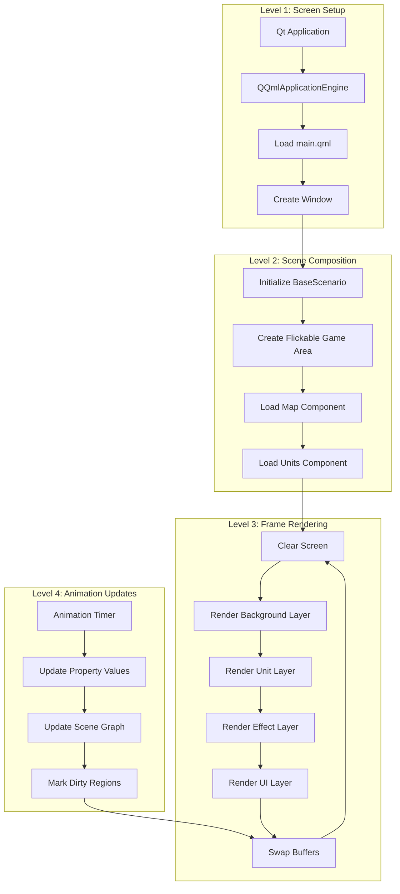
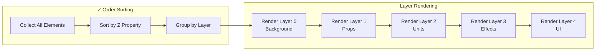
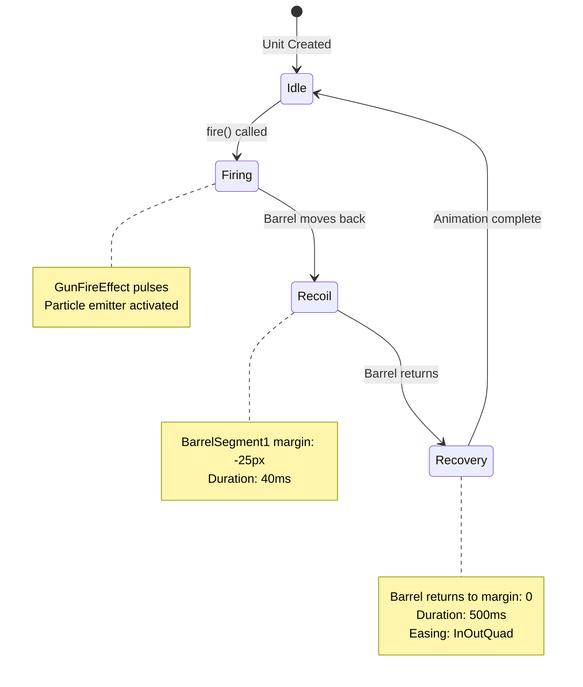
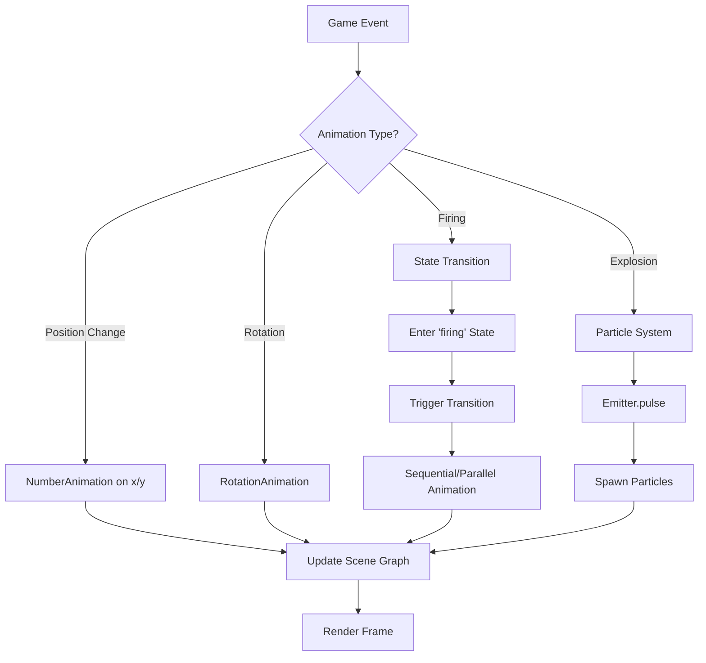
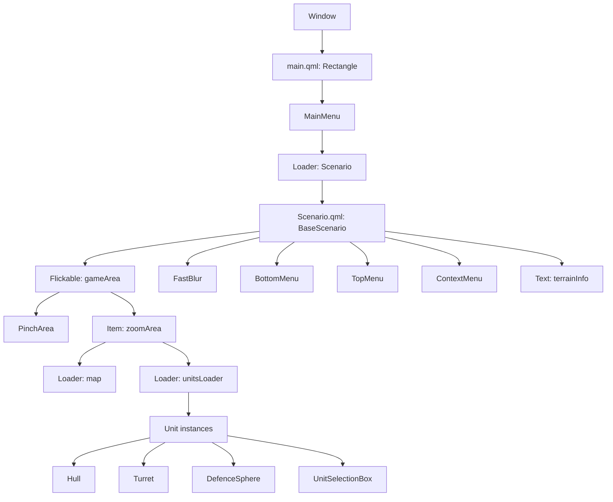
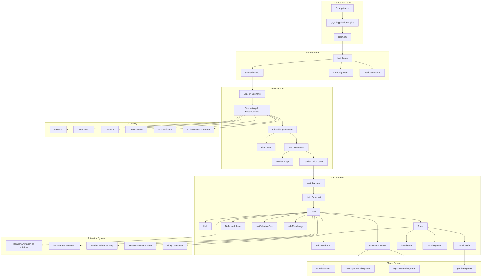

# Chapter 5: Graphics and Rendering System

This chapter provides a comprehensive technical overview of the graphics and rendering system in CloseCombatFree (CCF), a Qt5/QML-based tactical wargame. The documentation covers the rendering pipeline, animation system, visual effects, and implementation details across three distinct levels: concept/gameplay, algorithm/data, and code/implementation.

---

## 1. Concept: How the Game Displays Things

### 1.1 Player Perspective

From a player's perspective, CCF presents a rich visual battlefield with the following elements:

**Visual Layers (from bottom to top):**

1. **Map/Background Layer**: The terrain map showing roads, forests, buildings, and elevation
2. **Unit Layer**: Military units (tanks, infantry) rendered with proper orientation and team colors
3. **Effect Layer**: Visual effects including explosions, gunfire, smoke, and vehicle exhaust
4. **Interface Layer**: Selection boxes, order markers, menus, and informational displays

**Key Visual Features:**

- **Top-down/isometric view**: Units and terrain are viewed from above with slight perspective
- **Team identification**: Units display colored side markers indicating faction
- **Selection indicators**: Yellow bordered boxes highlight selected units
- **Status indicators**: Defense spheres show unit cover status (green, yellow, red)
- **Order visualization**: Circular markers show queued commands with sequence numbers
- **Aiming lines**: Visual lines indicate targeting with range and obstruction information

### 1.2 The QML Scene Graph Concept

CCF leverages Qt Quick 2.1's scene graph architecture, which represents the entire UI as a tree of nodes. Each visual element (Image, Rectangle, Text, ParticleSystem) is a node in this graph.

**Scene Graph Benefits for CCF:**

- **Hardware acceleration**: The scene graph uses OpenGL for rendering, enabling smooth animations even with many units
- **Declarative design**: Visual structure is defined in QML files, separate from game logic
- **Property bindings**: Visual properties automatically update when underlying data changes
- **Z-ordering**: The `z` property controls draw order, ensuring UI elements appear above/below game elements appropriately

**Example Scene Graph Flow:**

```
Window
└── Rectangle (Main Container)
    ├── Flickable (Game Area - scrollable map viewport)
    │   └── Item (Zoom Area - scales with zoom level)
    │       ├── Loader (Map)
    │       └── Loader (Units)
    │           └── Repeater
    │               └── Unit (Tank, Infantry, etc.)
    │                   ├── Hull
    │                   ├── Turret
    │                   ├── DefenceSphere
    │                   └── UnitSelectionBox
    ├── FastBlur (Transition effect)
    ├── BottomMenu (UI panel)
    └── TopMenu (UI panel)
```

---

## 2. Rendering Pipeline

### 2.1 Rendering Order and Layers

CCF uses a layered rendering approach where each layer has a specific `z` value determining its draw order. Higher z-values render on top of lower z-values.

**Layer Hierarchy (z-values):**

| Layer | Z-Range | Content |
|-------|---------|---------|
| Background | 0-1 | Map tiles, terrain props |
| Units | 2-4 | Unit sprites, turrets, hulls |
| Effects | 4-5 | Explosions, gunfire, exhaust |
| UI Base | 5-10 | Selection boxes, markers |
| UI Overlay | 10+ | Menus, text, info panels |

### 2.2 Rendering Pipeline Diagram



### 2.3 Frame Lifecycle

Each frame follows this lifecycle:

1. **Input Processing**: Mouse/keyboard events are processed
2. **Logic Update**: C++ backend updates unit positions, status, etc.
3. **Property Sync**: Bound properties update QML element values
4. **Scene Graph Update**: QML engine recalculates transformed geometry
5. **Rendering**: OpenGL renders the scene graph
6. **Display**: Framebuffer is swapped to display

---

## 3. Algorithm: How Rendering Works

### 3.1 QML Scene Graph Architecture

The Qt Quick scene graph is a retained-mode rendering system. Instead of drawing commands each frame, CCF builds a tree of nodes that the scene graph engine renders.

**Key Node Types:**

- **Transform Nodes**: Handle rotation, translation, scaling
- **Geometry Nodes**: Contain actual vertex data (triangles, rectangles)
- **Clip Nodes**: Define clipping regions
- **Opacity Nodes**: Handle transparency blending

### 3.2 Property Binding System

QML uses a declarative binding system where properties automatically update when their dependencies change.

**Binding Examples from CCF:**

```qml
// Position binding - unit moves when C++ updates x, y
Unit {
    x: unitX  // Bound to C++ property
    y: unitY
}

// Visibility binding - selection box shows only when selected
UnitSelectionBox {
    visible: selected  // Bound to selection state
}

// Color binding - defense sphere color changes with cover
DefenceSphere {
    imageSource: (defenceSphereColor == "") ? "" : 
                 "../../img/gui/defenceSphere_" + defenceSphereColor + ".png"
}
```

### 3.3 Dirty Region Tracking

The scene graph tracks "dirty" regions - areas that need redrawing:

1. When a property changes (e.g., `x` position), the element marks its region dirty
2. The scene graph accumulates all dirty regions
3. Only dirty regions are redrawn, optimizing performance
4. Static elements (unchanged background) are not re-rendered

### 3.4 Z-Order and Layering Algorithm



---

## 4. Animation System

### 4.1 State-Based Animations

CCF uses QML's state machine system for complex animations. States define property configurations, and transitions define how to animate between states.

**Tank Firing Animation State Machine:**



### 4.2 Animation Types Used in CCF

**NumberAnimation**: Animates numeric properties (x, y, rotation, scale)

```qml
// From qml/units/Unit.qml:157-178
NumberAnimation on x {
    id: xMoveAnimation
    duration: 2500
    easing.type: Easing.InOutQuad
    paused: running ? root.paused : false
}
```

**RotationAnimation**: Animates rotation with direction control

```qml
// From qml/units/Unit.qml:139-155
RotationAnimation on rotation {
    id: rotationAnimation
    duration: 2000
    direction: RotationAnimation.Shortest
    easing.type: Easing.InOutQuad
}
```

**SequentialAnimation**: Runs animations in sequence

```qml
// From qml/units/tanks/Turret.qml:104-123
SequentialAnimation {
    NumberAnimation {
        target: barrelSegment1
        property: "anchors.bottomMargin"
        duration: 40
    }
    NumberAnimation {
        target: barrelSegment1
        property: "anchors.bottomMargin"
        to: 0
        duration: 500
        easing.type: Easing.InOutQuad
    }
    ScriptAction {
        script: { firing = false; smoking = false; }
    }
}
```

**ParallelAnimation**: Runs animations simultaneously

```qml
// From qml/units/tanks/Turret.qml:97-125
ParallelAnimation {
    ScriptAction { script: gunFire.pulse(400) }
    SequentialAnimation { /* ... */ }
}
```

### 4.3 Easing Functions

CCF primarily uses `Easing.InOutQuad` for natural-looking motion:

- **InOutQuad**: Slow start, fast middle, slow end
- Used for: Unit movement, turret rotation, UI transitions

### 4.4 Animation Flow Diagram



---

## 5. Masks and Color Modification

### 5.1 QtGraphicalEffects Module

CCF uses the `QtGraphicalEffects` module for advanced visual effects. While the current implementation has minimal usage, the framework supports:

**FastBlur**: Gaussian blur effect used for transitions

```qml
// From qml/scenarios/Scenario.qml:235-247
import QtGraphicalEffects 1.0

FastBlur {
    anchors.fill: gameArea
    source: gameArea
    radius: 50
    
    NumberAnimation on radius {
        duration: 2000
        from: 50
        to: 0
        id: blurAnimation
    }
}
```

This creates a blur-to-focus effect when the scenario loads, starting with a heavy blur (radius: 50) and animating to sharp focus (radius: 0) over 2 seconds.

### 5.2 Color Manipulation

**Property-Based Color Changes:**

```qml
// Dynamic color based on state
Rectangle {
    color: Qt.darker(parent.color, 1.5)  // Darken parent color
}

// Conditional coloring
Text {
    color: (unitStatus == "RELOADING") ? "#ff0000" : "#00ff00"
}
```

### 5.3 Opacity and Transparency

```qml
// Fade effects using opacity
Behavior on opacity { 
    NumberAnimation { duration: 200 } 
}

// Transparent selection box
UnitSelectionBox {
    color: "#00000000"  // Fully transparent fill
    border.color: "#eeee11"  // Yellow border
}
```

---

## 6. Implementation: Screen/Renderer

### 6.1 Main Menu Implementation

**File**: `qml/menus/MainMenu.qml`

The main menu serves as the entry point, using a Loader to dynamically load scenarios:

```qml
// From qml/menus/MainMenu.qml:7-45
Rectangle {
    id: root
    color: "#aa228844"  // Semi-transparent green
    
    // Menu entry buttons
    Row {
        anchors.fill: parent
        anchors.margins: 45
        spacing: 45
        
        CardMenuEntry {
            text: "Scenarios:"
            onClicked: {
                scenarioMenu.visible = !scenarioMenu.visible
                closeButton.visible = true
            }
        }
        // ... more entries
    }
    
    // Dynamic game loader
    Loader {
        id: gameLoader
        anchors.fill: parent
        visible: false
        
        onLoaded: {
            item.scenarioFile = gameFile
            item.closeScenario.connect(close)
            item.loadScenario.connect(loadSaveGame)
            focus = true
            visible = true
        }
        
        function load(whatToLoad, isSave) {
            gameFile = isSave ? "saves/" + whatToLoad 
                              : "scenarios/" + whatToLoad
            source = "../../qml/scenarios/Scenario.qml"
        }
    }
}
```

### 6.2 Scenario Component Implementation

**File**: `qml/scenarios/Scenario.qml`

The Scenario component is the main game renderer, handling:

- Map display with zoom/pan
- Unit rendering and interaction
- UI overlays (menus, markers)
- Input handling

```qml
// From qml/scenarios/Scenario.qml:32-493
BaseScenario {
    id: root
    
    // Main game viewport
    Flickable {
        id: gameArea
        objectName: "gameArea"
        
        // Content scales with zoom
        contentWidth: map.width
        contentHeight: map.height
        boundsBehavior: Flickable.StopAtBounds
        clip: true  // Clip content outside viewport
        
        // Pinch zoom for mobile
        PinchArea {
            anchors.fill: parent
            onPinchUpdated: {
                zoom += pinch.scale - pinch.previousScale
            }
        }
        
        // Zoomable container
        Item {
            id: zoomArea
            scale: zoom  // Bound to zoom property
            
            // Map loader
            Loader {
                id: map
                objectName: "map"
                // Map loaded dynamically
            }
            
            // Units loader - overlays map
            Loader {
                id: unitsLoader
                objectName: "unitsLoader"
                anchors.fill: parent
                z: map.z + 1  // Render above map
                source: scenarioFile
                
                onLoaded: { 
                    init()
                    blurAnimation.start()  // Start blur transition
                }
            }
        }
    }
    
    // Blur effect overlay
    FastBlur {
        anchors.fill: gameArea
        source: gameArea
        radius: 50
        // Animates from 50 to 0 over 2 seconds
    }
    
    // UI overlay elements
    BottomMenu { id: bottomMenu }
    TopMenu { id: topMenu }
    ContextMenu { id: contextMenu }
}
```

### 6.3 Component Hierarchy Diagram



---

## 7. Implementation: Image Loading

### 7.1 Image Element Usage

The `Image` QML element is the primary method for displaying sprites in CCF.

**Basic Image Loading:**

```qml
// From qml/units/tanks/Turret.qml:42-51
Image {
    id: body
    width: turretSize
    height: turretSize
    source: bodyTexture  // Property-bound source
    sourceSize.height: turretSize  // Optimize texture size
    sourceSize.width: turretSize
    anchors.bottom: parent.bottom
    anchors.left: parent.left
}
```

**Image with Dynamic Source:**

```qml
// From qml/units/Unit.qml:127-137
Image {
    id: sideMarkImage
    x: 0
    y: 0
    z: 5
    width: 10
    height: 10
    rotation: -root.rotation  // Counter-rotate to stay upright
    source: sideMarkSource  // Team color marker
    visible: sideMarkVisible
}
```

### 7.2 Defense Sphere Image

```qml
// From qml/gui/DefenceSphere.qml:23-34
Item {
    property string imageSource: "../../img/gui/defenceSphere_blue.png"
    
    Image {
        anchors.right: parent.right
        source: imageSource  // Dynamic based on cover level
    }
}
```

**Dynamic Source Binding:**

```qml
// From qml/units/Unit.qml:106-111
imageSource: {
    if (defenceSphereColor == "")
        return ""
    else
        return "../../img/gui/defenceSphere_" + defenceSphereColor + ".png"
}
```

### 7.3 Image Directory Structure

```
img/
├── campaigns/       # Campaign map images
├── effects/         # Particle textures
│   ├── gun_fire_particle1.png
│   ├── vehicle_smoke.png
│   ├── vehicle_fire.png
│   └── shadow_base.png
├── gui/             # UI elements
│   ├── defenceSphere_blue.png
│   ├── defenceSphere_green.png
│   ├── defenceSphere_red.png
│   └── defenceSphere_yellow.png
├── maps/            # Terrain tiles and backgrounds
├── menus/           # Menu backgrounds and icons
└── units/           # Unit sprites
    ├── generic_unit_logo.png
    └── tanks/
```

### 7.4 Asynchronous Loading

QML's Image element loads images asynchronously by default, preventing UI blocking:

```qml
Image {
    source: "../../img/effects/vehicle_fire.png"
    // Asynchronous loading is automatic
    // Image appears when loaded without blocking
    
    // Optional: Show placeholder while loading
    onStatusChanged: {
        if (status === Image.Loading) {
            placeholder.visible = true
        } else if (status === Image.Ready) {
            placeholder.visible = false
        }
    }
}
```

---

## 8. Implementation: Animation Classes

### 8.1 NumberAnimation

**Purpose**: Animates numeric properties (position, opacity, scale)

**File**: `qml/units/Unit.qml:157-186`

```qml
NumberAnimation on x {
    objectName: "xMoveAnimation"
    id: xMoveAnimation
    duration: 2500
    easing.type: Easing.InOutQuad
    paused: running ? root.paused : false
    
    onRunningChanged: {            
        if (!xMoveAnimation.running) {
            moving = false
        }
        if ((!xMoveAnimation.running) && (unitStatus != "STOPPED")) {
            changeStatus("READY")
            actionFinished(unitIndex, orderTarget().x, orderTarget().y)
            continueQueue()
        } else if (unitStatus == "STOPPED") {
            changeStatus("READY")
        }
    }
}

NumberAnimation on y {
    objectName: "yMoveAnimation"
    id: yMoveAnimation
    duration: 2500
    easing.type: Easing.InOutQuad
    paused: running ? root.paused : false
}
```

**Key Features:**
- `duration`: Animation length in milliseconds
- `easing.type`: Acceleration curve
- `paused`: Can pause when game is paused
- `onRunningChanged`: Callback when animation starts/stops

### 8.2 RotationAnimation

**Purpose**: Animates rotation with direction optimization

**File**: `qml/units/Unit.qml:139-155`

```qml
RotationAnimation on rotation {
    objectName: "rotationAnimation"
    id: rotationAnimation
    duration: 2000
    direction: RotationAnimation.Shortest  // Always rotate < 180°
    easing.type: Easing.InOutQuad
    paused: running ? root.paused : false
    
    onRunningChanged: {
        if ((!rotationAnimation.running) && (unitStatus != "STOPPED")) {
            xMoveAnimation.to = orderTarget().x - centerX
            xMoveAnimation.running = true
            yMoveAnimation.to = orderTarget().y - centerY
            yMoveAnimation.running = true
        }
    }
}
```

**Direction Modes:**
- `Shortest`: Rotate the smallest angle (e.g., 350° to 10° goes forward 20°, not back 340°)
- `Clockwise`: Always rotate clockwise
- `Counterclockwise`: Always rotate counter-clockwise

### 8.3 Turret Rotation Animation

**File**: `qml/units/tanks/Tank.qml:92-110`

```qml
RotationAnimation on turretRotation {
    objectName: "turretRotationAnimation"
    id: turretRotationAnimation
    paused: running ? root.paused : false
    duration: 3000
    direction: RotationAnimation.Shortest
    easing.type: Easing.InOutQuad
    
    onRunningChanged: {
        if (!running) {
            if (unitStatus != "STOPPED") {
                if (reloadingTimer.running == false) {
                    performFiring()
                    reloadingTimer.start()
                }
            }
        }
    }
}
```

### 8.4 Animation with Behavior

**File**: `qml/scenarios/Scenario.qml:271-277`

```qml
Row {
    move: Transition {
        NumberAnimation {
            properties: "x"  // Animate x property changes
        }
    }
}
```

**Opacity Behavior Example:**

```qml
// From qml/scenarios/Scenario.qml:292,321,337,347,391,400
Behavior on opacity { NumberAnimation {} }
```

This creates smooth opacity transitions whenever the opacity property changes.

---

## 9. Implementation: Particle Effects

### 9.1 Vehicle Exhaust System

**File**: `qml/effects/VehicleExhaust.qml`

The exhaust system uses QtQuick.Particles 2.0 to create realistic smoke effects:

```qml
import QtQuick 2.1
import QtQuick.Particles 2.0

Item {
    id: root
    
    // Public API
    function burst(amount) {
        exhaust.burst(amount)
    }
    
    function pulse(duration, verbose) {
        if (verbose === true) {
            exhaust.lifeSpan = 1500
            angle.angleVariation = 30
        }
        exhaust.pulse(duration)
    }
    
    ParticleSystem {
        anchors.fill: parent
        
        // Smoke emitter
        Emitter {
            id: exhaust
            enabled: false
            width: 3
            height: 3
            anchors.centerIn: parent
            
            lifeSpan: 600
            lifeSpanVariation: 800
            
            velocity: AngleDirection {
                id: angle
                magnitude: 20
                angle: 90  // Emit upward
                angleVariation: 10
            }
            
            acceleration: PointDirection {
                xVariation: 10
                yVariation: 10
            }
            velocityFromMovement: 12  // Particles inherit emitter velocity
            size: 20
        }
        
        // Turbulence for realistic smoke dispersion
        Turbulence {
            anchors.fill: parent
            strength: 5
        }
        
        // Smoke particle texture
        ImageParticle {
            source: "../../img/effects/vehicle_smoke.png"
            alphaVariation: 0.5
        }
    }
}
```

**Usage in Tank:**

```qml
// From qml/units/tanks/Tank.qml:126-133
VehicleExhaust {
    id: exhaust
    z: root.z + 4
    anchors.top: root.top
    anchors.left: root.left
    anchors.topMargin: (2 * centerY) - 3
    anchors.leftMargin: (2 * centerX) - 3
}

// Trigger on movement
onMovementBegan: exhaust.pulse(2000)
```

### 9.2 Vehicle Explosion System

**File**: `qml/effects/VehicleExplosion.qml`

Complex multi-stage explosion with fire, debris, and smoke:

```qml
import QtQuick 2.1
import QtQuick.Particles 2.0

Item {
    id: root
    
    function run() {
        fireEmitter.pulse(800)
        afterEffect()
    }
    
    function afterEffect() {
        fireballImage.makeFireball()
        explodeEmitter.pulse(800)
        smoke.pulse(20000, true)  // 20 seconds of smoke
    }
    
    // Fire particle group with friction
    ParticleSystem {
        id: destroyedParticleSystem
        anchors.fill: parent
        
        ParticleGroup {
            name: "fire"
            duration: 1000
            
            Friction {
                anchors.fill: parent
                groups: ["fire"]
                factor: 4.4
            }
            
            // Smoke trails following fire particles
            TrailEmitter {
                id: smokeTrails
                group: "smokeTrails"
                emitRatePerParticle: 12
                lifeSpan: 300
                maximumEmitted: 20
                size: 15
            }
        }
        
        // Main fire burst emitter
        Emitter {
            id: fireEmitter
            group: "fire"
            enabled: false
            z: smokeTrails.z + 1
            width: 10
            height: 10
            anchors.centerIn: parent
            
            emitRate: 10
            maximumEmitted: 30
            lifeSpan: 1200
            lifeSpanVariation: 300
            
            velocity: AngleDirection {
                magnitude: 300  // Fast explosion velocity
                angleVariation: 360  // All directions
            }
            
            acceleration: PointDirection {
                xVariation: 20
                yVariation: 20
            }
            size: 10
        }
        
        ImageParticle {
            z: smokeParticle.z + 1
            source: "../../img/effects/gun_fire_particle1.png"
            groups: ["fire"]
        }
        
        ImageParticle {
            id: smokeParticle
            source: "../../img/effects/vehicle_smoke.png"
            groups: ["smokeTrails"]
            entryEffect: ImageParticle.Scale
        }
    }
    
    // Expanding fireball image
    Image {
        id: fireballImage
        width: 2
        height: 2
        scale: 1
        visible: false
        anchors.centerIn: parent
        source: "../../img/effects/vehicle_fire.png"
        
        NumberAnimation {
            id: fireballAnimation
            from: 1
            to: 60
            target: fireballImage
            properties: "scale"
            duration: 300
            
            onRunningChanged: {
                if (running == false)
                    fireballImage.visible = false
            }
        }
        
        function makeFireball() {
            fireballImage.visible = true
            fireballAnimation.start()
        }
    }
    
    // Secondary explosion particle system
    ParticleSystem {
        id: explodeParticleSystem
        anchors.fill: parent
        
        Emitter {
            id: explodeEmitter
            enabled: false
            anchors.centerIn: parent
            width: 200
            height: 200
            
            emitRate: 120
            shape: EllipseShape{}
            lifeSpan: 150
            lifeSpanVariation: 100
            size: 7
        }
        
        ImageParticle {
            source: "../../img/effects/vehicle_smoke_flash2.png"
            color: "#ffffffff"
            colorVariation: 0.2
            entryEffect: ImageParticle.Scale
        }
    }
    
    // Long-term smoke
    VehicleExhaust {
        id: smoke
        anchors.fill: parent
    }
}
```

**Trigger in Tank State:**

```qml
// From qml/units/tanks/Tank.qml:142-153
states: [
    State { name: "healthy_base" },
    State { name: "damaged_base" },
    State { name: "abandonned_base" },
    State { name: "destroyed_base"
        StateChangeScript {
            name: "destroyed_baseScript"
            script: { explode.run(); }
        }
    }
]
```

### 9.3 Gun Fire Effect

**File**: `qml/effects/GunFireEffect.qml`

Muzzle flash and smoke for tank cannons:

```qml
import QtQuick 2.1
import QtQuick.Particles 2.0

Item {
    id: root
    
    function pulse(duration, verbose) {
        if (verbose === true) {
            fire.lifeSpan = 1500
            angle.angleVariation = 30
        }
        fire.pulse(duration)
        trailEmitter.pulse(1500)
    }
    
    // Smoke trail particles
    ImageParticle {
        source: "../../img/effects/vehicle_smoke_flash.png"
        width: 30
        height: 30
        groups: "B"
        system: particleSystem
        entryEffect: ImageParticle.Fade
    }
    
    Emitter {
        id: trailEmitter
        enabled: false
        group: "B"
        system: particleSystem
        lifeSpan: 600
        lifeSpanVariation: 800
        velocity: AngleDirection {
            magnitude: 15
            angle: 270
            angleVariation: 30
        }
    }
    
    ParticleSystem {
        id: particleSystem
        anchors.fill: parent
        
        // Main muzzle flash
        Emitter {
            id: fire
            enabled: false
            width: 3
            height: 3
            anchors.centerIn: parent
            group: "A"
            
            lifeSpan: 80
            lifeSpanVariation: 20
            velocity: AngleDirection {
                id: angle
                magnitude: 2
                angle: 270
                angleVariation: 10
            }
            acceleration: PointDirection {
                xVariation: 10
                yVariation: 10
            }
            velocityFromMovement: -22
            size: 30
        }
        
        ImageParticle {
            source: "../../img/effects/gun_fire_particle1.png"
            width: 30
            height: 30
            groups: "A"
            entryEffect: ImageParticle.Fade
            alpha: 0.4
        }
    }
}
```

**Usage in Turret:**

```qml
// From qml/units/tanks/Turret.qml:76-80
GunFireEffect {
    id: gunFire
    anchors.bottom: barrelSegment1.top
    anchors.horizontalCenter: barrelSegment1.horizontalCenter
}

// Trigger during firing transition
ScriptAction {
    script: { gunFire.pulse(400) }
}
```

### 9.4 Particle Effect Flow Diagram

```mermaid
flowchart TD
    subgraph "Vehicle Exhaust"
        A1[Movement Event] --> B1[pulse called]
        B1 --> C1[Emitter.enabled = true]
        C1 --> D1[Spawn Particles]
        D1 --> E1[Apply Turbulence]
        E1 --> F1[Render ImageParticles]
    end
    
    subgraph "Gun Fire"
        A2[Firing State] --> B2[ScriptAction]
        B2 --> C2[gunFire.pulse]
        C2 --> D2[Short Burst Emitter]
        D2 --> E2[Smoke Trail Emitter]
    end
    
    subgraph "Explosion"
        A3[Destroy Event] --> B3[explode.run]
        B3 --> C3[Fire Emitter Pulse]
        C3 --> D3[Fireball Animation]
        D3 --> E3[Debris Emitter]
        E3 --> F3[Long Smoke Pulse]
    end
```



### 9.5 Particle System Components Reference

| Component | Purpose | Example Usage |
|-----------|---------|---------------|
| `ParticleSystem` | Container for all particle elements | Root of effect |
| `Emitter` | Spawns particles | Exhaust smoke, explosions |
| `ImageParticle` | Renders textured particles | Smoke puffs, fire |
| `TrailEmitter` | Emits from moving particles | Smoke trails from fire |
| `ParticleGroup` | Logical grouping with shared behavior | Fire group with friction |
| `Friction` | Slows particles over time | Fire particle slowdown |
| `Turbulence` | Adds random movement | Natural smoke dispersion |
| `AngleDirection` | Velocity with angle | Smoke rising upward |
| `PointDirection` | Cartesian velocity | Explosion debris |

---

## 10. Implementation: Text and Font Rendering

### 10.1 Text Elements

CCF uses QML's `Text` element for all text rendering, configured with custom fonts.

**Group Number Display:**

```qml
// From qml/units/Unit.qml:66-85
Text {
    id: groupMembership
    anchors.right: parent.right
    anchors.rightMargin: 5
    anchors.bottom: parent.bottom
    anchors.bottomMargin: 5
    z: 5
    
    height: 10
    width: 10
    color: "#ffffff"
    text: (groupNumber == 0) ? "" : groupNumber
    font.pointSize: 10
    style: Text.Raised  // Shadow effect
    font.bold: true
    font.family: "Ubuntu Condensed"
    verticalAlignment: Text.Bottom
    horizontalAlignment: Text.AlignRight
    rotation: -root.rotation  // Keep text upright
}
```

**Menu Notice Text:**

```qml
// From qml/menus/MainMenu.qml:12-20
Text {
    id: notice
    anchors.horizontalCenter: parent.horizontalCenter
    anchors.top: parent.top
    text: "For now, player is assumed to be on \"neutral\" side.\nSide choosing will be added later."
    font.pointSize: 10
    verticalAlignment: Text.AlignVCenter
    horizontalAlignment: Text.AlignHCenter
}
```

### 10.2 Order Marker Text

```qml
// From qml/gui/OrderMarker.qml:52-62
Text {
    text: (number == -1) ? "" : number + 1
    verticalAlignment: Text.AlignVCenter
    horizontalAlignment: Text.AlignHCenter
    style: Text.Outline
    anchors.fill: parent
    anchors.topMargin: 1
    anchors.leftMargin: 1
    font.pointSize: 7
    color: "#dddddd"
}
```

### 10.3 Terrain Info Text

```qml
// From qml/scenarios/Scenario.qml:362-379
Text {
    objectName: "terrainInfoText"
    id: terrainInfoText
    text: ""
    visible: (text == "") ? false : true
    
    height: paintedHeight
    width: paintedWidth
    anchors.left: gameArea.left
    anchors.top: topMenu.bottom
    color: "#ddeeee00"  // Yellow with transparency
    font.pointSize: 14
    style: Text.Raised
    font.bold: true
    font.family: "Ubuntu Condensed"
    verticalAlignment: Text.Center
    horizontalAlignment: Text.AlignLeft
}
```

### 10.4 Text Styling Options

| Property | Description | Example |
|----------|-------------|---------|
| `style` | Text effect | `Text.Raised`, `Text.Outline` |
| `font.pointSize` | Font size | 10, 14 |
| `font.bold` | Bold text | true, false |
| `font.family` | Font family | "Ubuntu Condensed" |
| `color` | Text color | "#ffffff", "#ddeeee00" |
| `verticalAlignment` | Vertical alignment | `Text.AlignVCenter` |
| `horizontalAlignment` | Horizontal alignment | `Text.AlignHCenter` |

### 10.5 Font Rendering Considerations

**Font Loading:**
- CCF uses "Ubuntu Condensed" as the primary font
- Fonts are rendered using the system's font rendering
- Text elements with `style: Text.Raised` get automatic drop shadows

**Performance:**
- Text elements are cached as textures
- Frequent text updates should be minimized
- Consider using `paintedWidth`/`paintedHeight` for dynamic sizing

**Localization:**
- Text elements support Unicode for international characters
- Layout should account for longer translations
- Use `horizontalAlignment` for proper text positioning

---

## 11. UI Rendering Components

### 11.1 Unit Selection Box

**File**: `qml/gui/UnitSelectionBox.qml`

Visual indicator for selected units with crosshair center:

```qml
// From qml/gui/UnitSelectionBox.qml:23-51
Rectangle {
    property int unitWidth: 60
    property int unitHeight: 60
    property int centerX: width/2
    property int centerY: height/2
    property int borderMargin: 16
    
    width: unitWidth + borderMargin
    height: unitHeight + borderMargin
    x: -(borderMargin/2)
    y: -(borderMargin/2)
    
    color: "#00000000"  // Transparent fill
    border.width: 2
    border.color: "#eeee11"  // Yellow border
    
    // Center crosshair
    Rectangle {
        width: 10
        height: 10
        anchors.top: parent.top
        anchors.left: parent.left
        anchors.topMargin: parent.centerY - (height/2)
        anchors.leftMargin: parent.centerX - (width/2)
        color: "#00000000"
        border.width: 2
        border.color: "#eeee11"
    }
}
```

### 11.2 Order Marker

**File**: `qml/gui/OrderMarker.qml`

Circular markers showing queued commands:

```qml
// From qml/gui/OrderMarker.qml:23-75
Rectangle {
    property int centerX: width/2
    property int centerY: height/2
    property real targetX: x + centerX
    property real targetY: y + centerY
    property color orderColor: "#bb3333"
    property int number: -1
    property string operation: ""
    
    id: root
    width: 21
    height: width
    radius: width/2  // Circular shape
    color: "#345634"
    border.color: "#111111"
    border.width: 1
    
    // Inner colored circle
    Rectangle {
        width: parent.width/2
        height: width
        radius: width/2
        color: orderColor
        anchors.horizontalCenter: parent.horizontalCenter
        anchors.verticalCenter: parent.verticalCenter
        
        // Order sequence number
        Text {
            text: (number == -1) ? "" : number + 1
            verticalAlignment: Text.AlignVCenter
            horizontalAlignment: Text.AlignHCenter
            style: Text.Outline
            anchors.fill: parent
            font.pointSize: 7
            color: "#dddddd"
        }
    }
    
    // Draggable
    MouseArea {
        anchors.fill: parent
        drag {
            target: root
            axis: Drag.XandYAxis
            minimumX: 5
            minimumY: 5
        }
    }
}
```

### 11.3 Shadow Effect

**File**: `qml/effects/Shadow.qml`

Simple shadow image under units:

```qml
// From qml/effects/Shadow.qml:1-8
import QtQuick 2.1

Image {
    property int angle: 0
    source: "../../img/effects/shadow_base.png"
    // Shadow rotates based on sun position
}
```

---

## 12. Summary and Best Practices

### 12.1 Rendering Performance Guidelines

1. **Minimize Overdraw**: Use `clip: true` on containers to prevent rendering hidden content
2. **Batch Draw Calls**: Group elements with the same z-level
3. **Limit Animations**: Pause animations when off-screen or game is paused
4. **Use Image sourceSize**: Specify `sourceSize` to scale images efficiently
5. **Particle Moderation**: Limit particle counts during intense action

### 12.2 Z-Order Best Practices

```qml
// Consistent z-ordering
background.z = 0
props.z = 1
units.z = 2
effects.z = 4
uiElements.z = 10
```

### 12.3 Animation Best Practices

1. **Use `paused` property**: Tie to game pause state
2. **Prefer `Behavior`**: For simple property transitions
3. **Use `SequentialAnimation`**: For multi-step sequences
4. **Set `easing.type`**: Always specify for natural motion
5. **Clean up on completion**: Use `onRunningChanged` callbacks

### 12.4 Key File Reference

| File | Purpose |
|------|---------|
| `qml/main.qml` | Application entry point |
| `qml/menus/MainMenu.qml` | Main menu screen |
| `qml/scenarios/Scenario.qml` | Game rendering |
| `qml/units/Unit.qml` | Base unit class |
| `qml/units/tanks/Tank.qml` | Tank rendering |
| `qml/units/tanks/Turret.qml` | Turret with firing animation |
| `qml/effects/VehicleExplosion.qml` | Explosion particles |
| `qml/effects/VehicleExhaust.qml` | Exhaust particles |
| `qml/effects/GunFireEffect.qml` | Muzzle flash |
| `qml/gui/UnitSelectionBox.qml` | Selection indicator |
| `qml/gui/OrderMarker.qml` | Command markers |
| `qml/gui/DefenceSphere.qml` | Cover indicator |

---

## Appendix: Complete Component Hierarchy



---

*Documentation generated for CloseCombatFree (CCF) - A Qt5/QML Tactical Wargame*
*Chapter 5: Graphics and Rendering System*
