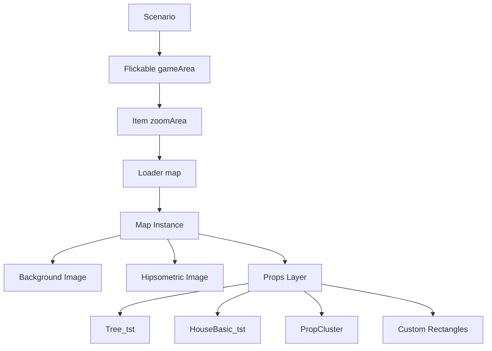
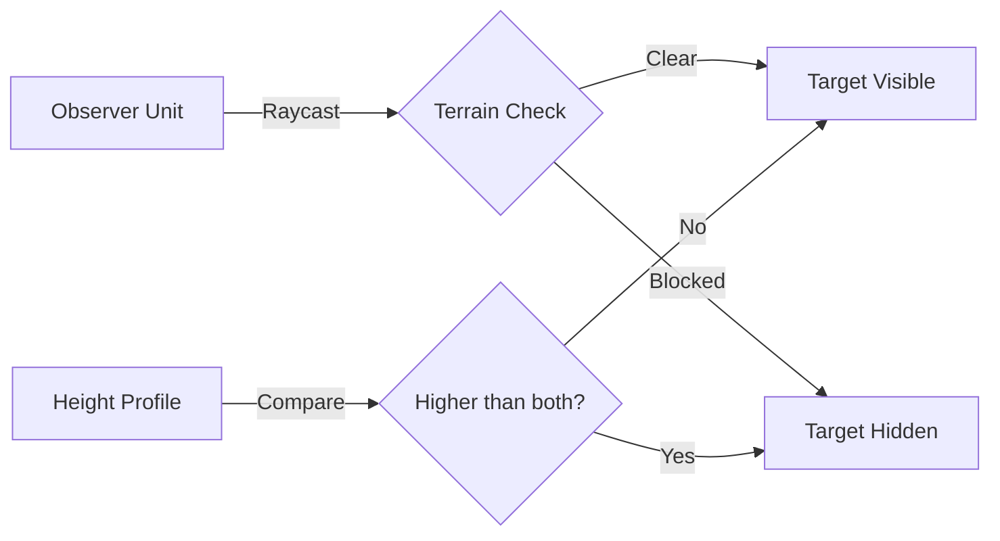
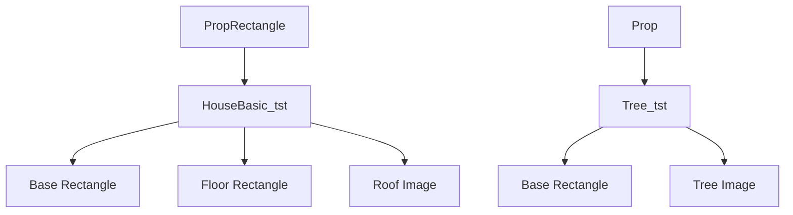
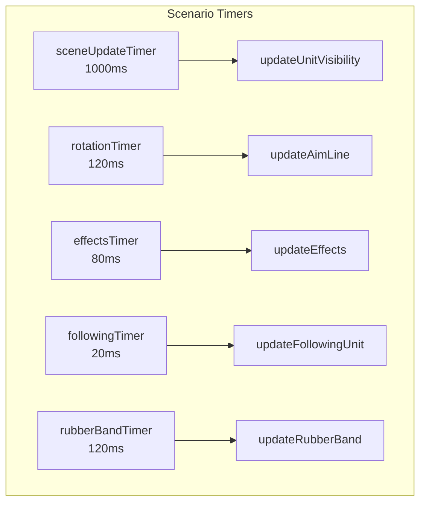
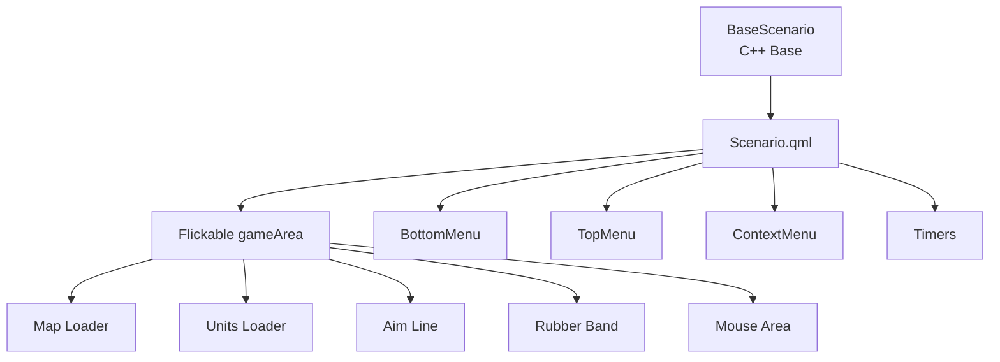
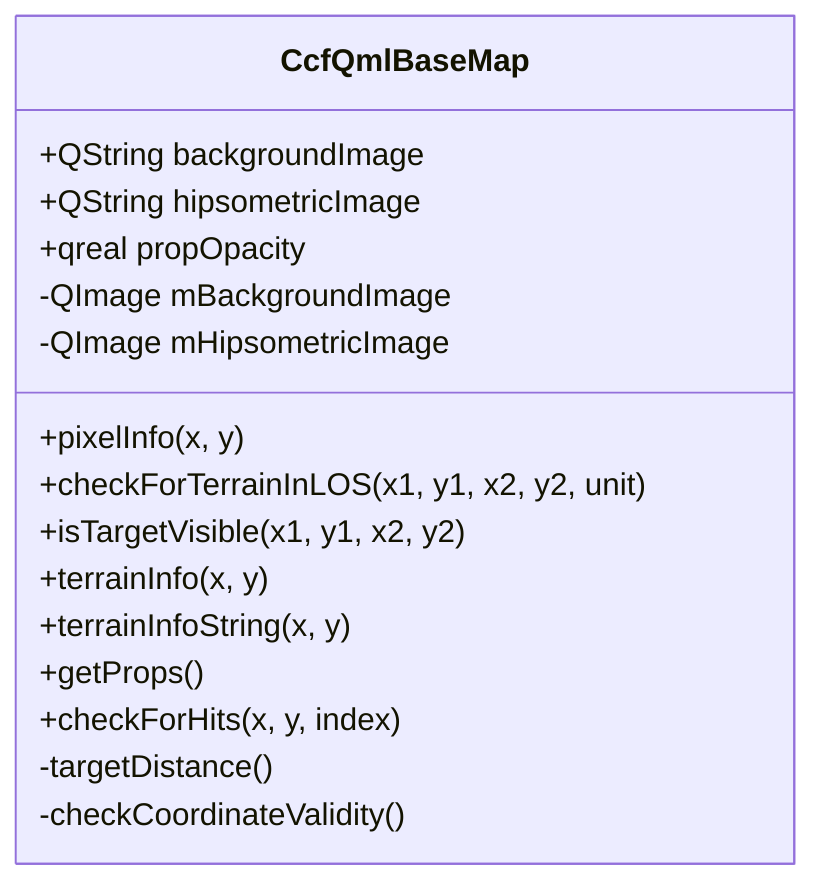
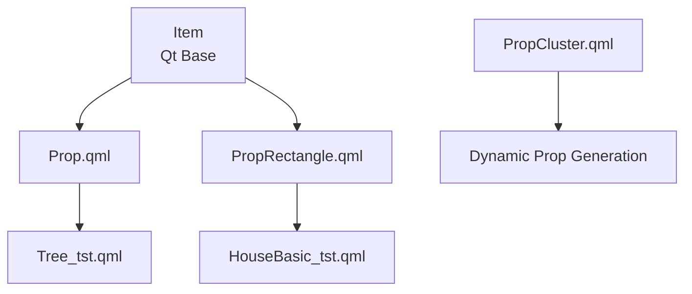
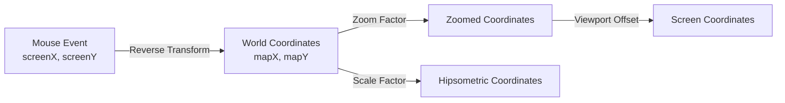
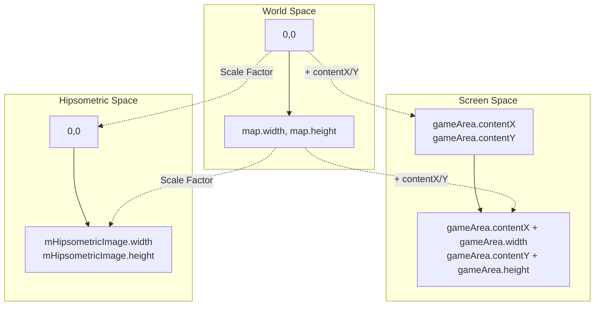

# Chapter 6: World, Map, and Terrain System

## Overview

The World, Map, and Terrain System in CloseCombatFree (CCF) provides the foundation for tactical gameplay. This system manages the game environment, terrain properties that affect unit movement and combat, and the Line of Sight (LOS) calculations that determine visibility between units. The architecture follows a three-tier design: the game world simulation (Scenario), the map rendering and terrain storage (Map), and the individual terrain elements (Props).

---

## 1. Concept: The Game World as Environment

### Level 1: Gameplay Perspective

In CCF, the game world represents the battlefield where tactical operations unfold. Unlike abstract strategy games, CCF emphasizes realistic terrain interaction:

- **Environmental Realism**: Units cannot see through hills, buildings provide cover, and trees obstruct line of sight
- **Tactical Positioning**: Elevated positions provide advantages, forests offer concealment
- **Dynamic Visibility**: What units can see depends on their position relative to terrain features

The world serves as the stage where all game mechanics come together - movement, combat, and strategy are all influenced by the terrain.

### Level 2: System Architecture

The world system consists of three primary layers:

```
┌─────────────────────────────────────────────────────────────┐
│                    Scenario (World)                         │
│         - Game loop management                              │
│         - Unit visibility updates                           │
│         - Input handling                                    │
├─────────────────────────────────────────────────────────────┤
│                     Map (Terrain)                           │
│         - Background rendering                              │
│         - Elevation data (hipsometric map)                  │
│         - Prop management                                   │
├─────────────────────────────────────────────────────────────┤
│                    Props (Elements)                         │
│         - Trees, buildings, obstacles                       │
│         - Cover properties                                  │
│         - Collision detection                               │
└─────────────────────────────────────────────────────────────┘
```

### Level 3: Implementation Structure

The world is implemented through a hierarchy of QML and C++ components:

- **Scenario.qml** (`qml/scenarios/Scenario.qml:32`): The root world container
- **CcfQmlBaseScenario** (`src/qmlBase/ccfqmlbasescenario.h:29`): C++ base class for scenario logic
- **CcfQmlBaseMap** (`src/qmlBase/ccfqmlbasemap.h:47`): C++ base class for map functionality
- **Map** type: Registered from CcfQmlBaseMap, used in map definition files

---

## 2. Terrain System in Practice

### Level 1: Gameplay Examples

Terrain directly impacts gameplay in several ways:

**Example 1: Forest Combat**
A squad moving through a forest (represented by Tree props) receives "average" cover. When enemy units attempt to spot them, the trees may block line of sight, making the squad harder to detect.

**Example 2: Urban Warfare**
Buildings (HouseBasic_tst) provide "great" cover. Units inside buildings are significantly protected from incoming fire and are concealed from units outside.

**Example 3: Hill Advantage**
Units positioned on elevated terrain (defined by hipsometric maps) can see over obstacles that would normally block line of sight, giving them tactical advantages in spotting and firing.

### Level 2: Map Definitions

Test maps demonstrate various terrain configurations:

**Map_tst1.qml** - Basic terrain:
```qml
// maps/Map_tst1.qml:25-27
Map {
    backgroundImage: "img/maps/test2.png"
}
```

**Map_tst2.qml** - Complex terrain with props:
```qml
// maps/Map_tst2.qml:28-81
Map {
    backgroundImage: "img/maps/test2.png"
    hipsometricImage: "img/maps/hipsometric_test1.png"

    HouseBasic_tst {
        id: house1
        x: 20
        y: 50
    }

    Tree_tst {
        x: 220
        y: 30
    }
    // ... more trees and obstacles
}
```

**Map_tst4.qml** - Large map with elevation:
```qml
// maps/Map_tst4.qml:27-44
Map {
    backgroundImage: "img/maps/test1.png"
    hipsometricImage: "img/maps/hipsometric_2sides.png"
    
    height: 1200
    width: 1200
    // Water obstacle
}
```

### Level 3: Map Component Hierarchy



---

## 3. The Three Pillars of Terrain

### Level 1: Terrain Effects on Gameplay

**Cover** ✓ IMPLEMENTED
- Reduces damage from incoming fire
- Values: "none", "poor", "average", "great"
- Provided by: Buildings, trees, terrain features

**Hindrance** ✓ IMPLEMENTED
- Obstructs line of sight
- Makes units harder to spot
- Provided by: All props with collision bounds

**Elevation** ✓ IMPLEMENTED
- Affects visibility based on height
- Units on high ground see over obstacles
- Implemented via hipsometric (height) maps

### Level 2: Data Representation

**Cover System** (`qml/maps/props/Prop.qml:27`):
```qml
property string cover: "none"  // none | poor | average | great
```

**Elevation System** (`src/qmlBase/ccfqmlbasemap.h:71`):
- Height calculated from hipsometric image
- Sum of RGB values (0-765) divided by 10 = meters
- Maximum elevation: 76.5 meters

### Level 3: Implementation

**Cover Property Usage** (`src/qmlBase/ccfqmlbasemap.cpp:242-260`):
```cpp
QVariantMap CcfQmlBaseMap::terrainInfo(qreal x, qreal y)
{
    QVariantMap result;
    int info = pixelInfo(x, y);
    result.insert("heightOverZero", info / 10);

    if (childExistsAt(x, y)) {
        QObject *child = childAt(x, y);
        result.insert("objectType", child->objectName());
        result.insert("cover", child->getString("cover"));
    } else {
        result.insert("objectType", "unknown");
        result.insert("cover", "poor");
    }
    return result;
}
```

---

## 4. Line of Sight: Visibility Calculations

### Level 1: Gameplay Mechanics

Line of Sight (LOS) determines what units can see:

- **Spotting**: Units can only engage enemies they can see
- **Firing**: Weapons require clear LOS to target
- **Concealment**: Breaking LOS allows units to hide

The LOS system creates tactical depth - players must consider terrain when positioning units and planning movements.

### Level 2: Algorithm Design

CCF uses two complementary LOS systems:

1. **Elevation-Based LOS** (`CcfQmlBaseMap::isTargetVisible`): Uses hipsometric height data
2. **Obstacle-Based LOS** (`CcfEngineHelpers::isObstacleInLOS`): Uses prop bounding boxes

Both systems use raycasting - casting a line from observer to target and checking for intersections.

### Level 3: Implementation

**Raycasting Algorithm** (`src/qmlBase/ccfqmlbasemap.cpp:340-373`):
```cpp
bool CcfQmlBaseMap::isTargetVisible(qreal x1, qreal y1, qreal x2, qreal y2)
{
    qreal distance = targetDistance(x1, y1, x2, y2);
    qreal a = (y2 - y1) / (x2 - x1);  // Line slope
    qreal b = y1 - (a * x1);           // Line intercept
    
    qreal originHeight = pixelInfo(x1, y1);
    qreal targetHeight = pixelInfo(x2, y2);

    // Raycast along the line
    for (int i = 0; i < distance; ++i) {
        if (x2 >= x1) {
            if (x > x2) break;
            x = x1 + i;
        } else {
            if (x < x2) break;
            x = x1 - i;
        }
        y = (a * x) + b;

        // Check if terrain blocks view
        qreal currentHeight = pixelInfo(x, y);
        if ((currentHeight > originHeight) && (currentHeight > targetHeight)) {
            return false;  // Terrain blocks LOS
        }
    }
    return true;
}
```

**Obstacle Detection** (`src/logic/ccfenginehelpers.cpp:280-319`):
```cpp
bool CcfEngineHelpers::isObstacleInLOS(QList<QObject *> items, qreal x1, qreal y1,
                                       qreal x2, qreal y2, QObject *currentUnit)
{
    qreal distance = targetDistance(x1, y1, x2, y2);
    qreal a = (y2 - y1) / (x2 - x1);
    qreal b = y1 - (a * x1);

    for (int i = 0; i < distance; ++i) {
        // Calculate point along ray
        if (x2 >= x1) {
            if (x > x2) break;
            x = x1 + i;
        } else {
            if (x < x2) break;
            x = x1 - i;
        }
        y = (a * x) + b;

        // Check collision with all props
        for (int j = 0; j < items.length(); ++j) {
            QObject *item = items.at(j);
            if ((item == currentUnit) || (item == NULL)) continue;

            // Check if point is inside prop bounds
            if (((x <= item->property("x").toReal() + item->property("width").toReal())
                 && (x >= item->property("x").toReal()))
                && ((y <= item->property("y").toReal() + item->property("height").toReal())
                    && (y >= item->property("y").toReal()))) {
                return true;  // Obstacle found
            }
        }
    }
    return false;
}
```

### LOS Raycasting Visualization



---

## 5. Buildings as Strategic Points

### Level 1: Tactical Value

Buildings in CCF serve as critical strategic positions:

- **Superior Cover**: "great" cover rating significantly reduces damage
- **Concealment**: Units inside are hidden from outside observers
- **Control Points**: Buildings often become focal points for combat

### Level 2: Building System Architecture

Buildings are implemented using a component hierarchy:



### Level 3: Implementation

**HouseBasic_tst.qml** (`maps/props/HouseBasic_tst.qml:24-47`):
```qml
PropRectangle {
    objectName: "house"
    cover: "great"

    width: 140
    height: 100

    id: base
    color: "#999fa4"

    Rectangle {
        id: floor
        anchors.fill: parent
        anchors.margins: 5
        color: "#4f1708"
    }

    Image {
        id: roof
        visible: topVisible
        anchors.fill: parent
        source: "../../img/maps/props/HouseBasicRoof1.png"
    }
}
```

**PropRectangle Base** (`qml/maps/props/PropRectangle.qml:23-38`):
```qml
Rectangle {
    objectName: "default prop rectangle"
    property string cover: "none"
    property bool topVisible: true

    function removeTop() {
        if (topVisible == true) {
            topVisible = false;
        }
    }
    function toggleTop() {
        topVisible = !topVisible;
    }
}
```

---

## 6. World Simulation Loop

### Level 1: Game Flow

The world simulation operates on multiple timers coordinating different update frequencies:

- **Scene Updates** (1 second): Visibility checks, game state updates
- **Rotation Updates** (120ms): Aim line rotation animations
- **Effects Updates** (80ms): Visual effects (explosions, smoke)
- **Following Timer** (20ms): Camera tracking selected units

### Level 2: Timer Architecture



### Level 3: Implementation

**Timer Definitions** (`qml/scenarios/Scenario.qml:446-492`):
```qml
// Scene update timer - handles visibility and game state
Timer {
    objectName: "sceneUpdateTimer"
    id: sceneUpdateTimer
    interval: 1000
    running: true
    repeat: true
}

// Rotation timer - updates aim line orientation
Timer {
    objectName: "rotationTimer"
    id: rotationTimer
    interval: 120
    running: false
    repeat: true
}

// Effects timer - manages visual effects
Timer {
    objectName: "effectsTimer"
    id: effectsTimer
    interval: 80
    running: false
    repeat: true
    triggeredOnStart: true
}

// Following timer - tracks selected unit
Timer {
    property int index: -1
    objectName: "followingTimer"
    id: followingTimer
    interval: 20
    running: false
    repeat: true
    triggeredOnStart: true
}
```

**World Simulation Loop** (`src/qmlBase/ccfqmlbasescenario.cpp` - conceptual):
```cpp
void CcfQmlBaseScenario::updateUnitVisibility()
{
    // Check visibility for all units
    // Uses both elevation and obstacle LOS
    // Updates unit visibility flags
}

void CcfQmlBaseScenario::updateAimLine()
{
    // Update aim line rotation based on mouse position
    // Check for obstacles and update aim line visualization
}
```

---

## 7. Implementation: World Class

### Level 1: Scenario Responsibilities

The Scenario class serves as the world controller:

- **Input Handling**: Mouse clicks, keyboard commands, pinch-to-zoom
- **Unit Management**: Selection, grouping, command issuing
- **Camera Control**: Zoom, pan, follow units
- **Game State**: Pause, win/lose conditions

### Level 2: Scenario Architecture



### Level 3: Scenario Implementation

**Scenario.qml Structure** (`qml/scenarios/Scenario.qml:32-493`):
```qml
BaseScenario {
    id: root
    focus: true;

    // Input handling
    Keys.onPressed: {
        handleKeyPress(event);
    }

    // Zoom management
    onZoomChanged: {
        zoomPoint = Qt.point(gameArea.width/2 + gameArea.contentX,
                             gameArea.height/2 + gameArea.contentY);
        gameArea.resizeContent((map.width * zoom), (map.height * zoom), zoomPoint);
        gameArea.returnToBounds();
    }

    // Game area with map and units
    Flickable {
        objectName: "gameArea"
        id: gameArea
        // ... configuration
        
        PinchArea {
            id: pinchArea
            onPinchUpdated: {
                zoom += pinch.scale - pinch.previousScale;
            }
        }

        Item {
            id: zoomArea
            scale: zoom

            Loader {
                objectName: "map"
                id: map
                // Map loading
            }

            Loader {
                objectName: "unitsLoader"
                id: unitsLoader
                z: map.z + 1
            }
        }
    }
    // ... menus, timers, handlers
}
```

**CcfQmlBaseScenario Properties** (`src/qmlBase/ccfqmlbasescenario.h:38-91`):
```cpp
class CcfQmlBaseScenario : public CcfObjectBase
{
    Q_OBJECT

    Q_PROPERTY(QString scenarioFile READ getScenarioFile WRITE setScenarioFile NOTIFY scenarioFileChanged)
    Q_PROPERTY(QString scenarioWinStatus READ getScenarioWinStatus WRITE setScenarioWinStatus NOTIFY scenarioWinStatusChanged)
    Q_PROPERTY(int aimLineRotation READ getAimLineRotation WRITE setAimLineRotation NOTIFY aimLineRotationChanged)
    Q_PROPERTY(bool isCampaign READ getIsCampaign WRITE setIsCampaign NOTIFY isCampaignChanged)
    Q_PROPERTY(QString mapFile READ getMapFile WRITE setMapFile NOTIFY mapFileChanged)
    Q_PROPERTY(qreal zoom READ getZoom WRITE setZoom NOTIFY zoomChanged)
    Q_PROPERTY(QPoint zoomPoint READ getZoomPoint WRITE setZoomPoint NOTIFY zoomPointChanged)
    Q_PROPERTY(bool paused READ getPaused WRITE setPaused NOTIFY pausedChanged)
    Q_PROPERTY(QColor menuBackgroundColor READ getMenuBackgroundColor WRITE setMenuBackgroundColor NOTIFY menuBackgroundColorChanged)
    Q_PROPERTY(QObjectList units READ getUnits WRITE setUnits NOTIFY unitsChanged)
```

---

## 8. Implementation: Map Class and Tile Storage

### Level 1: Map Functionality

The Map class provides:

- **Background Rendering**: Displays the terrain image
- **Elevation Data**: Reads and interprets hipsometric (height) maps
- **Prop Management**: Contains all terrain elements as children
- **LOS Queries**: Answers visibility questions

### Level 2: Map Architecture

**CcfQmlBaseMap Class Structure**:



### Level 3: Map Implementation

**CcfQmlBaseMap Header** (`src/qmlBase/ccfqmlbasemap.h:47-136`):
```cpp
class CcfQmlBaseMap : public CcfObjectBase
{
    Q_OBJECT
public:
    Q_PROPERTY(QString backgroundImage READ getBackgroundImagePath WRITE setBackgroundImagePath NOTIFY backgroundImageChanged)
    Q_PROPERTY(QString hipsometricImage READ getHipsometricImagePath WRITE setHipsometricImagePath NOTIFY hipsometricImageChanged)
    Q_PROPERTY(qreal propOpacity READ getPropOpacity WRITE setPropOpacity NOTIFY propOpacityChanged)

    explicit CcfQmlBaseMap(QQuickItem *parent = 0);
    void toggleBackgroundImage();
    QSGNode *updatePaintNode(QSGNode *oldNode, UpdatePaintNodeData *update);

    // Terrain info methods
    int pixelInfo(qreal x, qreal y);
    int checkForTerrainInLOS(qreal x1, qreal y1, qreal x2, qreal y2, QObject *currentUnit);
    bool isTargetVisible(qreal x1, qreal y1, qreal x2, qreal y2);
    void setUnits(const QObjectList &units);
    bool childExistsAt(qreal x, qreal y);
    QObjectList getProps();
    QVariantMap terrainInfo(qreal x, qreal y);
    QString terrainInfoString(qreal x, qreal y);
```

**Type Registration** (`src/ccfmain.cpp:59`):
```cpp
qmlRegisterType<CcfQmlBaseMap>("QmlBase", 0, 1, "Map");
```

**Pixel Information Retrieval** (`src/qmlBase/ccfqmlbasemap.cpp:282-290`):
```cpp
int CcfQmlBaseMap::pixelInfo(qreal x, qreal y)
{
    // Scale coordinates to hipsometric image size
    qreal scaleFactorX = mBackgroundImage.width() / mHipsometricImage.width();
    qreal scaleFactorY = mBackgroundImage.height() / mHipsometricImage.height();

    QRgb result(mHipsometricImage.pixel(QPoint((int) (x / scaleFactorX), (int) (y / scaleFactorY))));
    return qRed(result) + qGreen(result) + qBlue(result);
}
```

**Background Rendering** (`src/qmlBase/ccfqmlbasemap.cpp:66-86`):
```cpp
QSGNode *CcfQmlBaseMap::updatePaintNode(QSGNode *oldNode, UpdatePaintNodeData *update)
{
    Q_UNUSED(update);
    QSGSimpleTextureNode *node = static_cast<QSGSimpleTextureNode *>(oldNode);

    if (!node) {
        node = new QSGSimpleTextureNode();
    }

    if (mBackgroundPath.isEmpty() || mHipsometricMapInFront) {
        mHipsometricTexture = window()->createTextureFromImage(mHipsometricImage);
        node->setTexture(mHipsometricTexture);
    } else {
        mBackgroundTexture = window()->createTextureFromImage(mBackgroundImage);
        node->setTexture(mBackgroundTexture);
    }

    node->setRect(boundingRect());
    return node;
}
```

---

## 9. Implementation: Terrain/Element Classes

### Level 1: Prop System

Props are terrain elements that interact with units:

- **Trees**: Provide "average" cover, obstruct LOS
- **Buildings**: Provide "great" cover, completely block LOS
- **Water**: Movement obstacles (partially implemented)
- **Custom Props**: Extensible system for new terrain types

### Level 2: Prop Hierarchy



### Level 3: Prop Implementation

**Base Prop Component** (`qml/maps/props/Prop.qml:23-46`):
```qml
Item {
    // Warning! All props should have "objectName" set!
    // This information is used in terrain info.
    objectName: "default prop"
    property string cover: "none"
    property bool topVisible: true

    function removeTop() {
        if (topVisible == true) {
            topVisible = false;
        }
    }
    function toggleTop() {
        topVisible = !topVisible;
    }
}
```

**Prop Rectangle Base** (`qml/maps/props/PropRectangle.qml:23-38`):
```qml
Rectangle {
    objectName: "default prop rectangle"
    property string cover: "none"
    property bool topVisible: true

    function removeTop() {
        if (topVisible == true) {
            topVisible = false;
        }
    }
    function toggleTop() {
        topVisible = !topVisible;
    }
}
```

**Tree Implementation** (`maps/props/Tree_tst.qml:24-51`):
```qml
Prop {
    objectName: "tree"
    cover: "average"
    width: top.width
    height: top.height

    Rectangle {
        id: base
        width: 4
        height: 4
        radius: 1
        color: "#4f1708"
        anchors.top: parent.top
        anchors.left: parent.left
        anchors.topMargin: top.width/2
        anchors.leftMargin: top.width/2

        Image {
            id: top
            visible: topVisible
            source: "../../img/maps/props/Tree1.png"
            width: 25
            height: width
            anchors.horizontalCenter: base.horizontalCenter
            anchors.verticalCenter: base.verticalCenter
        }
    }
}
```

**Prop Cluster** (`qml/maps/props/PropCluster.qml:23-61`):
```qml
Item {
    property int numberOfObjects: 0
    property string baseElement: ""

    id: root
    width: 300
    height: 262

    function getProps() {
        var result = new Array;
        for (var i = 0; i < repeater.count; ++i) {
            result.push(repeater.itemAt(i));
        }
        return result;
    }

    Repeater {
        id: repeater
        anchors.fill: parent
        model: numberOfObjects

        Loader {
            x: { return Math.random(0) * root.width; }
            y: { return Math.random(0) * root.height; }
            source: baseElement
        }
    }
}
```

---

## 10. Implementation: Building System

### Level 1: Building Features

Buildings provide:

- **Cover**: "great" rating reduces incoming damage
- **Concealment**: Roof visibility toggling shows/hides occupants
- **Strategic Value**: Control points, defensive positions
- **Collision**: Units cannot walk through buildings

### Level 2: Building Component Architecture

```mermaid
graph TD
    A[HouseBasic_tst] --> B[PropRectangle Base]
    A --> C[Visual Components]
    
    B --> D[cover: "great"]
    B --> E[topVisible property]
    
    C --> F[Base Rectangle<br/>Building walls]
    C --> G[Floor Rectangle<br/>Interior]
    C --> H[Roof Image<br/>Concealment layer]
```

### Level 3: Building Implementation

**HouseBasic_tst.qml** (`maps/props/HouseBasic_tst.qml:1-47`):
```qml
import QtQuick 2.1
import "../../qml/maps/props"

PropRectangle {
    objectName: "house"
    cover: "great"

    width: 140
    height: 100

    id: base
    color: "#999fa4"

    Rectangle {
        id: floor
        anchors.fill: parent
        anchors.margins: 5
        color: "#4f1708"
    }

    Image {
        id: roof
        visible: topVisible
        anchors.fill: parent
        source: "../../img/maps/props/HouseBasicRoof1.png"
    }
}
```

**Usage in Map** (`maps/Map_tst2.qml:32-36`):
```qml
Map {
    // ... background and hipsometric images
    
    HouseBasic_tst {
        id: house1
        x: 20
        y: 50
    }
    // ... more props
}
```

**Collision Detection** (`src/qmlBase/ccfqmlbasemap.cpp:194-209`):
```cpp
void CcfQmlBaseMap::checkForHits(qreal x, qreal y, int index)
{
    Q_UNUSED(index);

    if (!childExistsAt(x, y))
        return;

    QObject *child = childAt(x, y);
    // WARNING! This checks x and y only. No check for width/height/rotation. Yet.

    mlogger->log("Hit! Who: " + child->objectName());

    if (child->property("topVisible").isValid())
        invoke(child, "removeTop");
}
```

---

## 11. Implementation: Line of Sight System

### Level 1: LOS System Overview

The LOS system determines visibility between game entities:

- **Elevation LOS**: Uses hipsometric height maps
- **Obstacle LOS**: Uses prop bounding boxes
- **Combined Result**: Both must pass for visibility

### Level 2: LOS Algorithms

**Height-Based LOS**:
1. Sample heights along line from observer to target
2. If any point is higher than both observer and target, LOS is blocked

**Obstacle-Based LOS**:
1. Iterate along line from observer to target
2. Check if any point intersects with prop bounds
3. Return true if obstacle found

### Level 3: LOS Implementation

**Terrain LOS Check** (`src/qmlBase/ccfqmlbasemap.cpp:297-335`):
```cpp
int CcfQmlBaseMap::checkForTerrainInLOS(qreal x1, qreal y1,
                                        qreal x2, qreal y2,
                                        QObject *currentUnit)
{
    Q_UNUSED(currentUnit);

    int result = 0;
    qreal distance = targetDistance(x1, y1, x2, y2);
    qreal a = (y2 - y1) / (x2 - x1);  // Slope
    qreal b = y1 - (a * x1);          // Intercept
    qreal x = x2;
    qreal y = y2;
    
    qreal targetHeight = pixelInfo(x2, y2);

    for (int i = 0; i < distance; ++i) {
        if (x2 >= x1) {
            if (x > x2) break;
            x = x1 + i;
        } else {
            if (x < x2) break;
            x = x1 - i;
        }

        y = (a * x) + b;

        // Detect height in this particular pixel
        if (pixelInfo(x, y) > targetHeight) {
            result = targetDistance(x1, y1, x, y);
            return result;
        }
    }
    return result;
}
```

**Target Visibility** (`src/qmlBase/ccfqmlbasemap.cpp:340-373`):
```cpp
bool CcfQmlBaseMap::isTargetVisible(qreal x1, qreal y1, qreal x2, qreal y2)
{
    qreal distance = targetDistance(x1, y1, x2, y2);
    qreal a = (y2 - y1) / (x2 - x1);
    qreal b = y1 - (a * x1);
    qreal x = x2;
    qreal y = y2;

    qreal originHeight = pixelInfo(x1, y1);
    qreal targetHeight = pixelInfo(x2, y2);

    for (int i = 0; i < distance; ++i) {
        if (x2 >= x1) {
            if (x > x2) break;
            x = x1 + i;
        } else {
            if (x < x2) break;
            x = x1 - i;
        }

        y = (a * x) + b;

        qreal currentHeight = pixelInfo(x, y);
        if ((currentHeight > originHeight) && (currentHeight > targetHeight)) {
            return false;
        }
    }
    return true;
}
```

**Obstacle LOS from EngineHelpers** (`src/logic/ccfenginehelpers.cpp:234-275`):
```cpp
qreal CcfEngineHelpers::checkForObstaclesInLOS(QList<QObject *> items, qreal x1, qreal y1,
                                               qreal x2, qreal y2, QObject *currentUnit)
{
    qreal result = 0.0;
    qreal distance = targetDistance(x1, y1, x2, y2);
    qreal a = (y2 - y1) / (x2 - x1);
    qreal b = y1 - (a * x1);
    qreal x = x2;
    qreal y = y2;

    for (int i = 0; i < distance; ++i) {
        if (x2 >= x1) {
            if (x > x2) break;
            x = x1 + i;
        } else {
            if (x < x2) break;
            x = x1 - i;
        }

        y = (a * x) + b;

        for (int j = 0; j < items.length(); ++j) {
            QObject *item = items.at(j);
            if ((item == currentUnit) || (item == NULL)) continue;

            if (((x <= item->property("x").toReal() + item->property("width").toReal())
                 && (x >= item->property("x").toReal()))
                && ((y <= item->property("y").toReal() + item->property("height").toReal())
                    && (y >= item->property("y").toReal()))) {
                result = targetDistance(x1, y1, x, y);
                return result;
            }
        }
    }
    return result;
}
```

---

## 12. Coordinate Systems

### Level 1: Coordinate Concepts

CCF uses multiple coordinate systems:

- **World Coordinates**: Absolute positions on the map (0,0 to mapWidth,mapHeight)
- **Screen Coordinates**: Positions relative to the viewport
- **Hipsometric Coordinates**: Scaled coordinates for elevation lookup
- **Zoom-Affected Coordinates**: World coords adjusted by zoom level

### Level 2: Coordinate Transformations



### Level 3: Coordinate Implementation

**Hipsometric Scaling** (`src/qmlBase/ccfqmlbasemap.cpp:282-290`):
```cpp
int CcfQmlBaseMap::pixelInfo(qreal x, qreal y)
{
    // Scale coordinates to hipsometric image size
    qreal scaleFactorX = mBackgroundImage.width() / mHipsometricImage.width();
    qreal scaleFactorY = mBackgroundImage.height() / mHipsometricImage.height();

    QRgb result(mHipsometricImage.pixel(
        QPoint((int) (x / scaleFactorX), (int) (y / scaleFactorY))
    ));
    return qRed(result) + qGreen(result) + qBlue(result);
}
```

**Zoom Point Calculation** (`qml/scenarios/Scenario.qml:43-49`):
```qml
onZoomChanged: {
    zoomPoint = Qt.point(gameArea.width/2 + gameArea.contentX,
                         gameArea.height/2 + gameArea.contentY);
    gameArea.resizeContent((map.width * zoom), (map.height * zoom), zoomPoint);
    gameArea.returnToBounds();
}
```

**Distance Calculation** (`src/qmlBase/ccfqmlbasemap.cpp:378-393`):
```cpp
qreal CcfQmlBaseMap::targetDistance(qreal originX, qreal originY, 
                                    qreal targetX, qreal targetY)
{
    qreal result = 0.0;

    if (targetX == originX) {
        result = qAbs(originY - targetY);
        return result;
    } else if (targetY == originY) {
        result = qAbs(originX - targetX);
        return result;
    }

    result = qSqrt(qPow((originX - targetX), 2) + qPow((originY - targetY), 2));
    return result;
}
```

**Coordinate Validation** (`src/qmlBase/ccfqmlbasemap.cpp:398-410`):
```cpp
bool CcfQmlBaseMap::checkCoordinateValidity(qreal x, qreal y)
{
    if (!mBackgroundTexture && !mHipsometricTexture)
        return false; // Images are empty!

    if (x < 0 || x > mHipsometricImage.width())
        return false;

    if (y < 0 || y > mHipsometricImage.height())
        return false;

    return true;
}
```

**Rotation Angle Calculation** (`src/logic/ccfenginehelpers.cpp:53-85`):
```cpp
qreal CcfEngineHelpers::rotationAngle(qreal oldX, qreal oldY,
                                      qreal newX, qreal newY)
{
    qreal result = 0;

    if (qFuzzyCompare(newX, oldX)) {
        if (newY > oldY)
            result = 0;
        else
            result = 180;
        return result;
    }
    else if (qFuzzyCompare(newY, oldY)) {
        if (newX > oldX)
            result = 90;
        else
            result = 270;
        return result;
    }

    qreal angle = (qAtan(qAbs(newX - oldX) / qAbs(newY - oldY)) * 180 / 3.14159);

    if ((newY > oldY) && (newX > oldX)) // 2nd quarter
        result = 180 - angle;
    else if ((newY > oldY) && (newX < oldX)) // 3rd quarter
        result = 180 + angle;
    else if ((newY < oldY) && (newX < oldX)) // 4th quarter
        result = 360 - angle;
    else // 1st quarter
        result = angle;

    return result;
}
```

### Coordinate System Mapping



---

## Summary

The World, Map, and Terrain System in CCF provides a sophisticated environment for tactical gameplay. Key features include:

1. **Three-Tier Architecture**: Scenario (world) → Map (terrain) → Props (elements)
2. **Elevation System**: Hipsometric maps provide height data up to 76.5 meters
3. **Dual LOS System**: Both elevation and obstacles affect visibility
4. **Cover System**: Props provide "none" to "great" protection levels
5. **Extensible Design**: Easy to add new prop types and map configurations

The system successfully bridges the gap between realistic terrain simulation and performant real-time gameplay, creating the tactical depth that defines the Close Combat series.

---

## File Reference

| File | Purpose | Key Components |
|------|---------|----------------|
| `src/qmlBase/ccfqmlbasemap.h` | Map base class definition | CcfQmlBaseMap class |
| `src/qmlBase/ccfqmlbasemap.cpp` | Map implementation | LOS, terrain info, rendering |
| `src/logic/ccfenginehelpers.h/cpp` | Utility functions | Obstacle detection, geometry |
| `src/qmlBase/ccfqmlbasescenario.h` | Scenario base class | Game state, timers |
| `qml/scenarios/Scenario.qml` | World simulation | UI, input, timers |
| `qml/maps/props/Prop.qml` | Base prop component | cover, topVisible |
| `qml/maps/props/PropRectangle.qml` | Rectangular prop base | Rectangle with cover |
| `maps/props/Tree_tst.qml` | Tree prop | "average" cover |
| `maps/props/HouseBasic_tst.qml` | Building prop | "great" cover |
| `qml/maps/props/PropCluster.qml` | Prop generator | Random placement |
| `maps/Map_tst1-4.qml` | Test maps | Various terrain setups |
| `src/ccfmain.cpp` | Type registration | Map type export |
