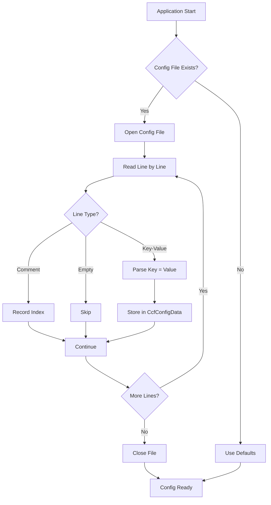
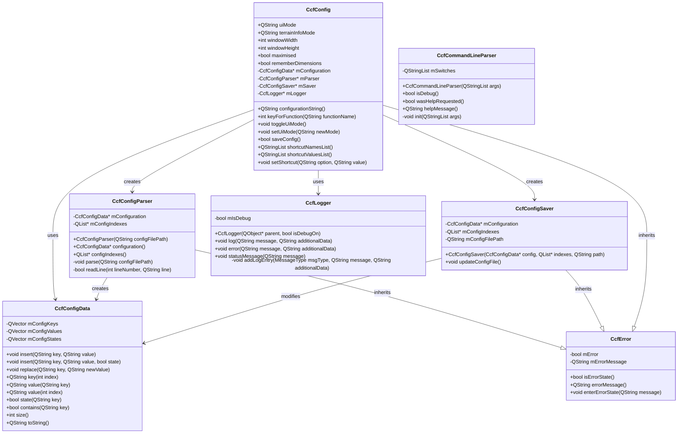
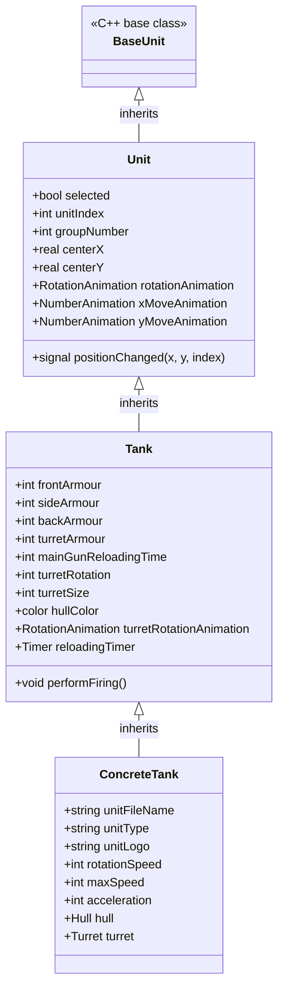
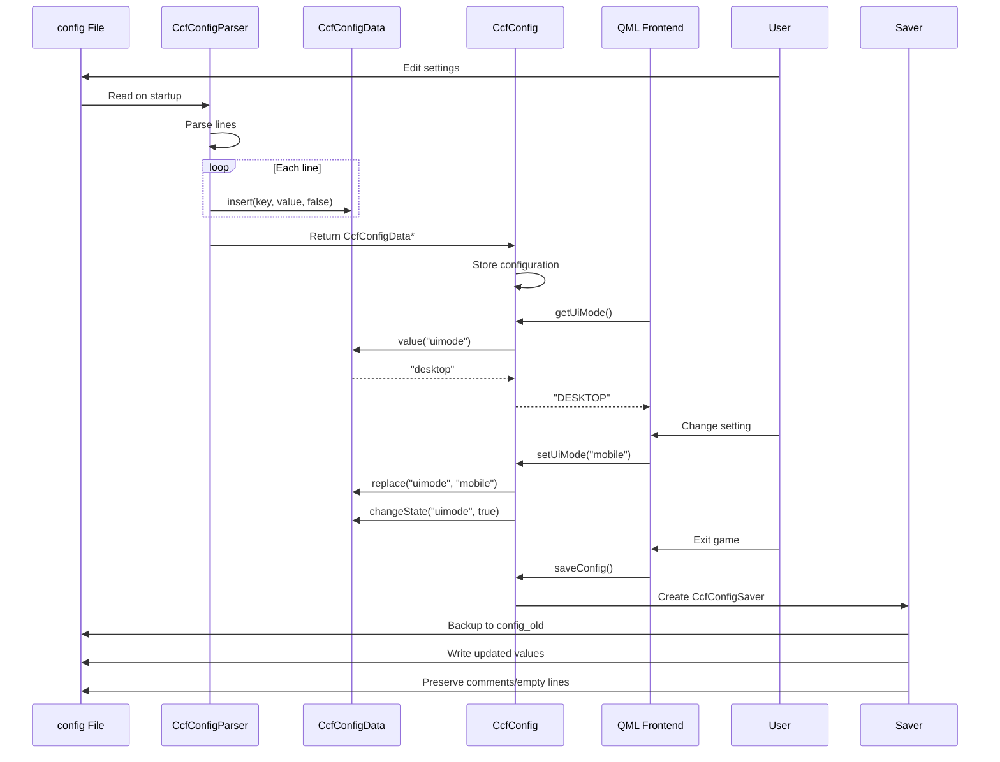
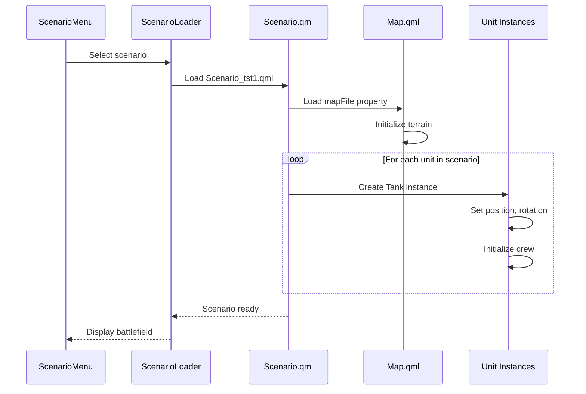
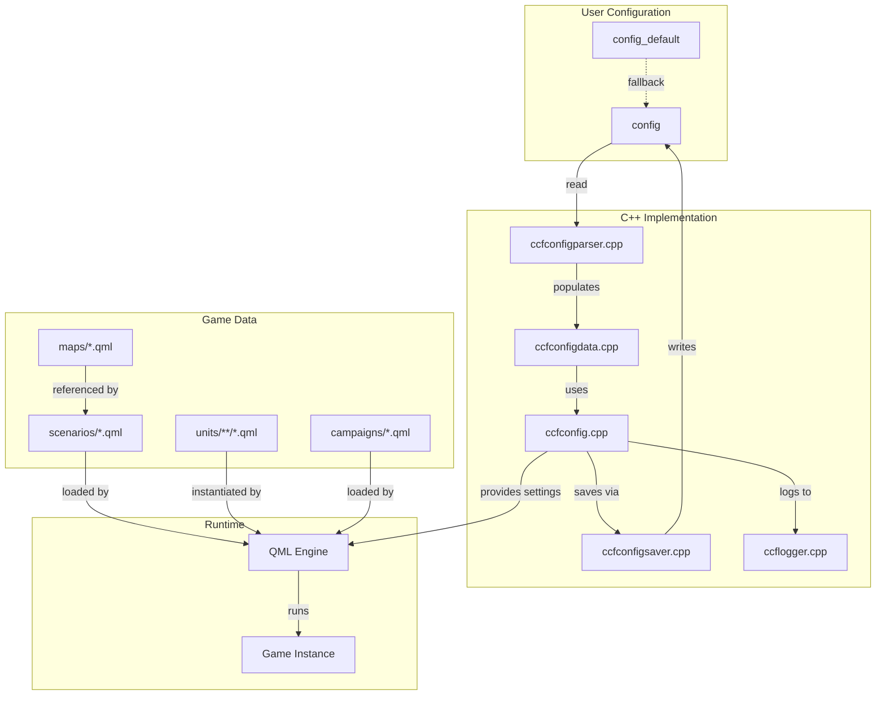

# Chapter 7: Configuration Files and Data Schemas

This chapter provides comprehensive documentation of CloseCombatFree's configuration system, covering all aspects from player-facing settings to low-level implementation details.

---

## Table of Contents

1. [Overview: What Is Configuration?](#1-overview-what-is-configuration)
2. [Unit Configuration](#2-unit-configuration)
3. [Combat Configuration](#3-combat-configuration)
4. [World Configuration](#4-world-configuration)
5. [Animation Configuration](#5-animation-configuration)
6. [UI Configuration](#6-ui-configuration)
7. [Audio Configuration](#7-audio-configuration)
8. [Action/State Configuration](#8-actionstate-configuration)
9. [Implementation: Config Loading](#9-implementation-config-loading)
10. [Manager Class Diagrams](#10-manager-class-diagrams)
11. [Data Flow](#11-data-flow)
12. [Configuration Summary](#12-configuration-summary)
13. [Modding Perspective](#13-modding-perspective)

---

## 1. Overview: What Is Configuration?

### 1.1 Configuration System Architecture

CloseCombatFree (CCF) uses a multi-layered configuration system that separates game data into distinct categories:

| Category | Format | Location | Purpose |
|----------|--------|----------|---------|
| **Game Settings** | Text-based | `config`, `config_default` | User preferences, key bindings, window settings |
| **Unit Definitions** | QML | `units/` | Tank/vehicle properties, sprites, crew |
| **Scenarios** | QML | `scenarios/` | Mission setups, initial unit placements |
| **Campaigns** | QML | `campaigns/` | Multi-mission progressions, map clusters |
| **Maps** | QML | `maps/` | Terrain definitions, backgrounds |
| **Save Games** | QML-based | `saves/` | Dynamic game state preservation |

### 1.2 Configuration Philosophy

CCF follows these design principles:

1. **Human-Readable**: All configuration files use plain text formats
2. **Version-Control Friendly**: Line-based formats enable meaningful diffs
3. **Modder-Friendly**: Clear separation of concerns allows easy customization
4. **Runtime-Configurable**: Many settings can be changed without restarting

### 1.3 Configuration Files at a Glance

```
closecombatfree/
├── config                    # Active user configuration
├── config_default            # Default/template configuration
├── src/config/               # C++ configuration implementation
│   ├── ccfconfig.h/cpp       # Main configuration manager
│   ├── ccfconfigdata.h/cpp   # Data storage container
│   ├── ccfconfigparser.h/cpp # File parsing logic
│   ├── ccfconfigsaver.h/cpp  # File saving logic
│   ├── ccfcommandlineparser.h/cpp  # CLI argument handling
│   └── ccflogger.h/cpp       # Debug/logging system
├── units/                    # Unit definition files
│   └── tanks/
│       └── tests/
│           ├── Tank_tst1.qml
│           ├── Tank_tst2.qml
│           └── Tank_tst3.qml
├── scenarios/                # Mission scenarios
│   ├── Scenario_tst1.qml
│   ├── Scenario_tst2.qml
│   ├── Scenario_tst3.qml
│   └── Scenario_tst4.qml
├── campaigns/                # Campaign definitions
│   └── Campaign_tst1.qml
└── maps/                     # Map definitions
    ├── Map_tst1.qml
    ├── Map_tst2.qml
    ├── Map_tst3.qml
    └── Map_tst4.qml
```

---

## 2. Unit Configuration

### 2.1 Unit Hierarchy

CCF units are organized in a hierarchical QML structure:

```
BaseUnit (C++ base class)
    └── Unit (qml/units/Unit.qml)
            └── Tank (qml/units/tanks/Tank.qml)
                    └── Concrete Tank (units/tanks/tests/Tank_tst1.qml)
```

### 2.2 Tank Definition Example

**File**: `units/tanks/tests/Tank_tst1.qml`

```qml
import QtQuick 2.1
import QmlBase 0.1
import "../../../qml/units"
import "../../../qml/units/tanks"

Tank {
    id: root
    unitFileName: "Tank_tst1"
    unitType: "Test tank 1"
    unitLogo: "../../../img/units/tanks/generic/tank_tst1_logo.png"
    rotationSpeed: 40
    turretRotationSpeed: 35
    maxSpeed: 20
    acceleration: 2
    unitWidth: 62
    unitHeight: 100

    Tank_tst1_hull {
        id: hull
    }

    Tank_tst1_turret {
        id: turret
    }

    Soldier { role: "Commander" }
    Soldier { role: "Gunner" }
    Soldier { role: "Loader" }
    Soldier { role: "Assistant" }
    Soldier { role: "Assistant" }
}
```

### 2.3 Unit Properties Reference

#### Base Properties (Unit.qml)

| Property | Type | Description |
|----------|------|-------------|
| `unitFileName` | string | Unique identifier for the unit type |
| `unitType` | string | Human-readable unit classification |
| `unitLogo` | string | Path to unit icon image |
| `unitWidth` | int | Width in pixels |
| `unitHeight` | int | Height in pixels |
| `rotationSpeed` | int | Degrees per second for hull rotation |
| `maxSpeed` | int | Maximum movement speed |
| `acceleration` | int | Acceleration rate |

#### Tank-Specific Properties (Tank.qml)

| Property | Type | Description |
|----------|------|-------------|
| `frontArmour` | int | Front armor thickness in mm |
| `sideArmour` | int | Side armor thickness in mm |
| `backArmour` | int | Rear armor thickness in mm |
| `turretArmour` | int | Turret armor thickness in mm |
| `mainGunReloadingTime` | int | Milliseconds to reload |
| `turretRotationSpeed` | int | Turret rotation speed |
| `turretSize` | int | Turret diameter in pixels |
| `hullColor` | color | Hull paint color |

### 2.4 Visual Components

Each tank consists of separate visual components:

```qml
Tank_tst1_hull {
    id: hull
    // Hull graphics, tracks, body
}

Tank_tst1_turret {
    id: turret
    // Turret graphics, gun barrel
}
```

This separation allows:
- Independent rotation of hull and turret
- Different coloring of components
- Modular damage visualization

---

## 3. Combat Configuration

### 3.1 Scenario Structure

Scenarios define combat missions with initial unit placement and scripted behaviors.

**File**: `scenarios/Scenario_tst1.qml`

```qml
import QtQuick 2.1
import "../units/tanks/tests"
import "../qml/units"

Item {
    property string mapFile: "maps/Map_tst2.qml"
    id: root

    Tank_tst1 {
        objectName: "tank1"
        x: 150
        y: 400
    }

    Tank_tst3 {
        objectName: "tank2"
        x: 300
        y: 400
        rotation: 90
        hullColor: "#ffffff"
    }
}
```

### 3.2 Scenario Properties

| Property | Type | Description |
|----------|------|-------------|
| `mapFile` | string | Path to map definition |
| `objectName` | string | Unique identifier for scripting |
| `x`, `y` | real | Initial position coordinates |
| `rotation` | int | Initial facing direction (degrees) |
| `unitSide` | string | Faction affiliation ("good"/"bad") |
| `hullColor` | color | Override default hull color |

### 3.3 Scripted Actions

Scenarios can include scripted unit behaviors:

```qml
Tank_tst1 {
    objectName: "tank1"
    x: 550
    y: 400

    Component.onCompleted: {
        fireTo(650, 300);
        smokeTo(700, 250);
        fireTo(750, 200);
    }
}
```

### 3.4 Order Queues

Units can have pre-defined order queues:

```qml
Tank_tst3 {
    objectName: "tank4"
    x: 750
    y: 400

    Component.onCompleted: {
        queueOrder("Move", 700, 300);
        queueOrder("Move", 500, 250);
        queueOrder("Attack", 50, 50);
    }
}
```

---

## 4. World Configuration

### 4.1 Map Definitions

Maps define the battlefield terrain and visual backdrop.

**File**: `maps/Map_tst1.qml`

```qml
import QtQuick 2.1
import QmlBase 0.1
import "../qml/maps"

Map {
    backgroundImage: "img/maps/test2.png"
}
```

### 4.2 Map Properties

| Property | Type | Description |
|----------|------|-------------|
| `backgroundImage` | string | Path to terrain background image |

### 4.3 Campaign Structure

Campaigns link multiple maps into a progression.

**File**: `campaigns/Campaign_tst1.qml`

```qml
import QtQuick 2.1
import "../qml/campaigns"
import "../qml/maps"
import "../maps"
import "../units/tanks/tests"

CampaignMapList {
    campaignName: "Test campaign 1"

    CampaignMapList: [
        MapCluster {
            clusterName: "Initial invasion"
            clusterMaps: [
                Map_tst1 {},
                Map_tst3 {}
            ]
            enemyUnitsList: [
                Tank_tst1 { unitSide: "bad" },
                Tank_tst1 { unitSide: "bad" },
                Tank_tst1 { unitSide: "bad" }
            ]
        },
        MapCluster {
            clusterName: "Secondary map cluster"
            clusterDescription: "You have won in cluster 1, welcome to cluster 2."
            clusterMaps: [
                Map_tst2 {},
                Map_tst3 {}
            ]
            enemyUnitsList: [
                Tank_tst2 { unitSide: "bad" },
                Tank_tst2 { unitSide: "bad" },
                Tank_tst2 { unitSide: "bad" }
            ]
        }
    ]
}
```

### 4.4 Campaign Components

| Component | Purpose |
|-----------|---------|
| `CampaignMapList` | Container for all campaign maps |
| `MapCluster` | Groups related maps into a node |
| `clusterName` | Display name for the node |
| `clusterDescription` | Flavor text for the player |
| `clusterMaps` | Array of available maps |
| `enemyUnitsList` | Default enemy forces for this node |

---

## 5. Animation Configuration

### 5.1 QML Animation System

CCF uses Qt Quick's declarative animation system for all visual effects.

### 5.2 Unit Movement Animation

**Source**: `qml/units/Unit.qml:157-186`

```qml
NumberAnimation on x {
    objectName: "xMoveAnimation"
    id: xMoveAnimation
    duration: 2500
    easing.type: Easing.InOutQuad
    paused: running? root.paused : false

    onRunningChanged: {
        if (!xMoveAnimation.running) {
            moving = false;
        }
        if ((!xMoveAnimation.running) && (unitStatus != "STOPPED")) {
            changeStatus("READY");
            actionFinished(unitIndex, orderTarget().x, orderTarget().y);
            continueQueue();
        }
    }
}

NumberAnimation on y {
    objectName: "yMoveAnimation"
    id: yMoveAnimation
    duration: 2500
    easing.type: Easing.InOutQuad
    paused: running? root.paused : false
}
```

### 5.3 Rotation Animation

**Source**: `qml/units/Unit.qml:139-155`

```qml
RotationAnimation on rotation {
    objectName: "rotationAnimation"
    id: rotationAnimation
    duration: 2000
    direction: RotationAnimation.Shortest
    easing.type: Easing.InOutQuad
    paused: running? root.paused : false
}
```

### 5.4 Turret Rotation

**Source**: `qml/units/tanks/Tank.qml:92-110`

```qml
RotationAnimation on turretRotation {
    objectName: "turretRotationAnimation"
    id: turretRotationAnimation
    paused: running? root.paused : false
    duration: 3000
    direction: RotationAnimation.Shortest
    easing.type: Easing.InOutQuad
}
```

### 5.5 Animation Timing Reference

| Animation | Duration | Easing |
|-----------|----------|--------|
| Hull Rotation | 2000ms | InOutQuad |
| Turret Rotation | 3000ms | InOutQuad |
| Movement | 2500ms | InOutQuad |
| Gun Reload | 5000ms (configurable) | - |

---

## 6. UI Configuration

### 6.1 Configuration File Format

The game settings file uses a simple key-value format:

**File**: `config_default`

```
# Close Combat Free - cofiguration file
# Lines beginning with '#' are comments and are ignored by the parser.
# Accepted format is: "option = value" (with any number of intervening spaces).
# Option names and values are expected to be given in lower case.
# Boolean switches accept "true", "false", '1', '0' as valid values.
#
# This file should be encoded in UTF-8.

######
# General settings:
uimode = desktop
maximised = false
remember dimensions on exit = true
width = 1270
height = 700

######
# Keyboard layout:
pause = p
zoom in = =
zoom out = -
quit = q
# Orders:
follow = f
stop = s
move fast = r
move = m
sneak = n
attack = a
smoke = k
defend = d
ambush = b
toggle top menu = t
toggle bottom menu = g
```

### 6.2 UI Settings Reference

| Setting | Type | Default | Description |
|---------|------|---------|-------------|
| `uimode` | string | "desktop" | Interface mode: "desktop" or "mobile" |
| `maximised` | bool | false | Start window maximized |
| `remember dimensions on exit` | bool | true | Save window size on close |
| `width` | int | 1270 | Window width in pixels |
| `height` | int | 700 | Window height in pixels |

### 6.3 Keyboard Shortcuts

| Action | Default Key | Purpose |
|--------|-------------|---------|
| `pause` | p | Toggle game pause |
| `zoom in` | = | Zoom camera in |
| `zoom out` | - | Zoom camera out |
| `quit` | q | Exit game |
| `follow` | f | Follow unit order |
| `stop` | s | Stop unit order |
| `move fast` | r | Fast move order |
| `move` | m | Normal move order |
| `sneak` | n | Sneak/stealth move |
| `attack` | a | Attack order |
| `smoke` | k | Deploy smoke |
| `defend` | d | Defend position |
| `ambush` | b | Set ambush |
| `toggle top menu` | t | Show/hide top menu |
| `toggle bottom menu` | g | Show/hide bottom menu |

---

## 7. Audio Configuration

### 7.1 Current Implementation

**Note**: As of the current codebase version, audio configuration is not fully implemented in the configuration system. Audio assets are referenced directly in QML files.

### 7.2 Audio References in QML

Sound effects are typically triggered by state changes and actions:

```qml
// Example from effects (conceptual)
VehicleExplosion {
    id: explode
    // Audio triggered via state change
}
```

### 7.3 Future Audio Configuration

Planned audio configuration options:

```
# Audio settings (planned):
master volume = 100
music volume = 80
effects volume = 100
ambient volume = 60
voice volume = 100
```

---

## 8. Action/State Configuration

### 8.1 Unit States

Units operate within a state machine defined in QML:

**Source**: `qml/units/tanks/Tank.qml:142-153`

```qml
states: [
    State { name: "healthy_base" },
    State { name: "damaged_base" },
    State { name: "abandonned_base" },
    State { name: "destroyed_base"
        StateChangeScript {
            name: "destroyed_baseScript"
            script: { explode.run(); }
        }
    },
    State { name: "long destroyed_base" }
]
```

### 8.2 Unit Status Values

| Status | Description |
|--------|-------------|
| `READY` | Unit ready for orders |
| `STOPPED` | Unit halted |
| `RELOADING` | Weapon reloading |
| `MOVING` | Unit in motion |
| `FIRING` | Weapon firing |

### 8.3 Action Queue System

Units can queue multiple actions for sequential execution:

```qml
// Example usage:
queueOrder("Move", 700, 300);
queueOrder("Move fast", 500, 650);
queueOrder("Attack", 50, 50);
```

Action types:
- `Move` - Standard movement
- `Move fast` - Maximum speed movement
- `Attack` - Fire at target
- `Follow` - Follow another unit
- `Stop` - Halt all actions

---

## 9. Implementation: Config Loading

### 9.1 Configuration Loading Flowchart



### 9.2 CcfConfigParser Implementation

**File**: `src/config/ccfconfigparser.cpp`

The parser processes configuration files line by line:

```cpp
// Constructor - initiates parsing
CcfConfigParser::CcfConfigParser(const QString &configFilePath, QObject *parent) :
    QObject(parent), CcfError()
{
    mConfiguration = new CcfConfigData();
    mConfigIndexes = new QList<QString>();
    parse(configFilePath);  // src/config/ccfconfigparser.cpp:40
}

// Main parsing function
void CcfConfigParser::parse(const QString &configFilePath)
{
    QFile file(configFilePath);
    if (!file.open(QIODevice::ReadOnly | QIODevice::Text)) {
        enterErrorState("Could not open the config file.");
        return;
    }

    int i = 0;
    while (!file.atEnd()) {
        if (!readLine(i, file.readLine()))
            return;
        i++;
    }

    file.close();
}
```

### 9.3 Line Parsing Logic

**Source**: `src/config/ccfconfigparser.cpp:93-134`

```cpp
bool CcfConfigParser::readLine(int lineNumber, const QString &lineToParse)
{
    QString line = lineToParse.simplified();

    if (line.isEmpty()) {
        mConfigIndexes->insert(lineNumber, "Empty");
        return true;
    }

    // Detect empty lines and comments
    for (int i = 0; i < line.length(); i++) {
        QChar character = line.at(i);
        if (character.isSpace()) {
            continue;
        } else if (character == QChar('#')) {
            mConfigIndexes->insert(lineNumber, "Comment");
            return true;
        } else {
            break;
        }
    }

    QStringList lineData;

    if (line.contains(" = ")) {
        lineData = line.split(" = ");
    } else if (line.contains("=")) {
        lineData = line.split("=");
    } else {
        enterErrorState("Invalid line detected - not empty, not comment, and no data!");
        return false;
    }

    QString key = lineData.at(0);
    QString value = lineData.at(1);

    mConfiguration->insert(key, value, false);
    mConfigIndexes->insert(lineNumber, key);

    return true;
}
```

### 9.4 Configuration Data Storage

**File**: `src/config/ccfconfigdata.h`

The `CcfConfigData` class acts as a Data Transfer Object:

```cpp
class CcfConfigData
{
public:
    explicit CcfConfigData();

    void insert(const QString &newKey, const QString &newValue);
    void insert(const QString &newKey, const QString &newValue, bool state);
    void replace(const QString &key, const QString &newValue);
    
    QString key(int index);
    QString value(const QString &key);
    QString value(int index);
    bool state(const QString &key);
    bool contains(const QString &key);
    int size();

private:
    QVector<QString> mConfigKeys;
    QVector<QString> mConfigValues;
    QVector<bool>    mConfigStates;
};
```

### 9.5 Configuration Saving

**File**: `src/config/ccfconfigsaver.cpp:40-106`

```cpp
void CcfConfigSaver::updateConfigFile()
{
    // Check for changes
    bool wasChange = false;
    for (int i = 0; i < mConfiguration->size(); ++i) {
        if (mConfiguration->state(i) == true) {
            wasChange = true;
            break;
        }
    }

    if (wasChange == false) {
        return;  // No changes, skip writing
    }

    // Backup old config
    QFile::remove(mConfigFilePath + "_old");
    QFile::rename(mConfigFilePath, mConfigFilePath + "_old");

    // Write new config preserving structure
    QFile file(mConfigFilePath + "_old");
    QFile newFile(mConfigFilePath);
    
    file.open(QIODevice::ReadOnly | QIODevice::Text);
    newFile.open(QIODevice::WriteOnly | QIODevice::Text);

    int i = 0;
    while (!file.atEnd()) {
        QString line = file.readLine();
        QString option = mConfigIndexes->at(i);
        
        if ((option == "Empty") || (option == "Comment")) {
            newFile.write(line.toUtf8());
        } else if (mConfiguration->contains(option) 
                   && mConfiguration->state(option) == true) {
            // Write updated value
            QString replacement = option + " = " + mConfiguration->value(option);
            newFile.write(replacement.toUtf8() + "\n");
        } else {
            newFile.write(line.toUtf8());
        }
        i++;
    }

    file.close();
    newFile.close();
}
```

---

## 10. Manager Class Diagrams

### 10.1 Configuration Class Hierarchy



### 10.2 QML Unit Hierarchy



---

## 11. Data Flow

### 11.1 Config File to Usage Flow



### 11.2 Scenario Loading Flow



### 11.3 Configuration Dependency Graph



---

## 12. Configuration Summary

### 12.1 All Configuration Options

#### Game Settings (config file)

| Option | Type | Values | Description |
|--------|------|--------|-------------|
| `uimode` | string | desktop, mobile | Interface mode |
| `maximised` | bool | true, false | Window maximized state |
| `remember dimensions on exit` | bool | true, false | Auto-save window size |
| `width` | int | >0 | Window width (pixels) |
| `height` | int | >0 | Window height (pixels) |
| `pause` | char | any key | Pause game key |
| `zoom in` | char | any key | Zoom in key |
| `zoom out` | char | any key | Zoom out key |
| `quit` | char | any key | Exit game key |
| `follow` | char | any key | Follow order key |
| `stop` | char | any key | Stop order key |
| `move fast` | char | any key | Fast move key |
| `move` | char | any key | Move order key |
| `sneak` | char | any key | Sneak move key |
| `attack` | char | any key | Attack order key |
| `smoke` | char | any key | Smoke deploy key |
| `defend` | char | any key | Defend position key |
| `ambush` | char | any key | Ambush key |
| `toggle top menu` | char | any key | Top menu toggle |
| `toggle bottom menu` | char | any key | Bottom menu toggle |

#### Unit Properties

| Property | Type | Typical Range | Description |
|----------|------|---------------|-------------|
| `unitFileName` | string | - | Unique identifier |
| `unitType` | string | - | Display name |
| `rotationSpeed` | int | 1-100 | Hull rotation deg/sec |
| `turretRotationSpeed` | int | 1-100 | Turret rotation deg/sec |
| `maxSpeed` | int | 1-100 | Max movement speed |
| `acceleration` | int | 1-10 | Acceleration rate |
| `frontArmour` | int | 1-200 | Front armor mm |
| `sideArmour` | int | 1-200 | Side armor mm |
| `backArmour` | int | 1-200 | Rear armor mm |
| `turretArmour` | int | 1-200 | Turret armor mm |
| `mainGunReloadingTime` | int | 1000-10000 | Reload time ms |

#### Scenario Properties

| Property | Type | Description |
|----------|------|-------------|
| `mapFile` | string | Path to map QML |
| `objectName` | string | Unique ID |
| `x`, `y` | real | Position |
| `rotation` | int | Facing degrees |
| `unitSide` | string | "good" or "bad" |
| `hullColor` | color | Custom color |

### 12.2 File Locations Summary

| File Type | Path | Format |
|-----------|------|--------|
| User Config | `./config` | Text |
| Default Config | `./config_default` | Text |
| Config Backup | `./config_old` | Text |
| Scenarios | `./scenarios/` | QML |
| Units | `./units/` | QML |
| Maps | `./maps/` | QML |
| Campaigns | `./campaigns/` | QML |
| Saves | `./saves/` | QML |

---

## 13. Modding Perspective

### 13.1 Creating a New Tank

1. **Create hull component** (`units/tanks/myTank/MyTank_hull.qml`):

```qml
import QtQuick 2.1
import "../../../qml/units/tanks"

Hull {
    hullWidth: 70
    hullHeight: 110
    // Custom hull graphics here
}
```

2. **Create turret component** (`units/tanks/myTank/MyTank_turret.qml`):

```qml
import QtQuick 2.1
import "../../../qml/units/tanks"

Turret {
    turretSize: 70
    // Custom turret graphics here
}
```

3. **Create tank definition** (`units/tanks/myTank/MyTank.qml`):

```qml
import QtQuick 2.1
import "../../../qml/units"
import "../../../qml/units/tanks"

Tank {
    unitFileName: "MyTank"
    unitType: "Custom Tank"
    unitLogo: "../../../img/units/tanks/myTank/logo.png"
    
    // Performance stats
    rotationSpeed: 45
    turretRotationSpeed: 40
    maxSpeed: 25
    acceleration: 3
    
    // Armor (mm)
    frontArmour: 120
    sideArmour: 90
    backArmour: 70
    turretArmour: 100
    
    // Combat
    mainGunReloadingTime: 4000
    
    // Visual
    unitWidth: 70
    unitHeight: 110
    hullColor: "#4a5d23"  // Olive drab
    
    MyTank_hull { id: hull }
    MyTank_turret { id: turret }
    
    // Crew
    Soldier { role: "Commander" }
    Soldier { role: "Gunner" }
    Soldier { role: "Loader" }
    Soldier { role: "Driver" }
}
```

### 13.2 Creating a New Scenario

**File**: `scenarios/Scenario_myMission.qml`

```qml
import QtQuick 2.1
import "../units/tanks/myTank"
import "../qml/units"

Item {
    property string mapFile: "maps/Map_custom.qml"
    id: root

    // Player units
    MyTank {
        objectName: "player_tank_1"
        x: 100
        y: 500
        unitSide: "good"
    }

    // Enemy units
    Tank_tst1 {
        objectName: "enemy_tank_1"
        x: 800
        y: 200
        unitSide: "bad"
        rotation: 180
    }
}
```

### 13.3 Modifying Key Bindings

Edit the `config` file to customize controls:

```
# Custom key bindings
pause = space
zoom in = plus
zoom out = minus
quit = escape
attack = f
move = w
```

### 13.4 Adding Custom Campaigns

**File**: `campaigns/Campaign_myCampaign.qml`

```qml
import QtQuick 2.1
import "../qml/campaigns"
import "../maps"
import "../units/tanks/myTank"

CampaignMapList {
    campaignName: "My Custom Campaign"
    
    CampaignMapList: [
        MapCluster {
            clusterName: "First Battle"
            clusterDescription: "Defend the position"
            clusterMaps: [
                Map_tst1 {},
                Map_custom {}
            ]
            enemyUnitsList: [
                MyTank { unitSide: "bad" }
            ]
        }
    ]
}
```

### 13.5 Best Practices

1. **Always back up** the original `config` file before editing
2. **Use `config_default`** as a reference for valid options
3. **Test incrementally** - make small changes and verify
4. **Follow naming conventions**: Use descriptive object names
5. **Preserve file structure**: When editing QML, maintain import statements
6. **Validate syntax**: QML is sensitive to syntax errors
7. **Use version control**: Track your modifications

### 13.6 Debugging Configuration Issues

Enable debug mode via command line:

```bash
./closecombatfree --debug
```

This enables verbose logging through `CcfLogger` (`src/config/ccflogger.cpp`).

Common issues:
- **Config not loading**: Check file encoding (must be UTF-8)
- **Key bindings not working**: Verify key names are lowercase
- **QML errors**: Check import paths are correct relative to file location
- **Missing units**: Ensure all referenced files exist

---

## Appendix: Complete Config File Template

```
# Close Combat Free - Configuration File
# =====================================
#
# Format: option = value
# Comments start with '#'
# Boolean values: true, false, 1, 0
# Encoding: UTF-8

######
# Display Settings
######
uimode = desktop              # desktop or mobile
maximised = false             # start maximized
remember dimensions on exit = true
width = 1270                  # window width
height = 700                  # window height

######
# Camera Controls
######
zoom in = =
zoom out = -

######
# Game Controls
######
pause = p
quit = q

######
# Unit Orders
######
follow = f
stop = s
move fast = r
move = m
sneak = n
attack = a
smoke = k
defend = d
ambush = b

######
# UI Toggles
######
toggle top menu = t
toggle bottom menu = g
```

---

*End of Chapter 7: Configuration Files and Data Schemas*
