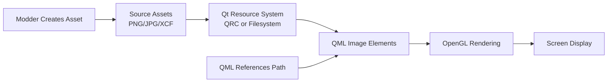
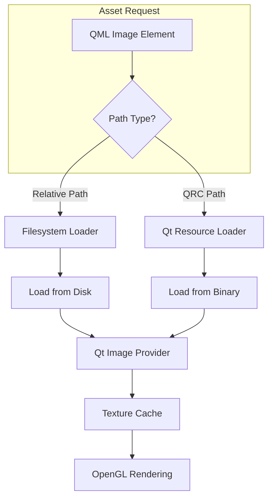
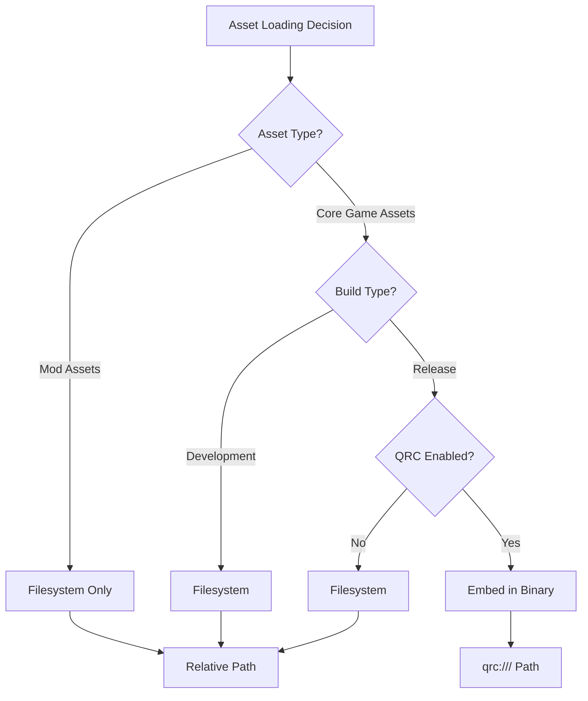
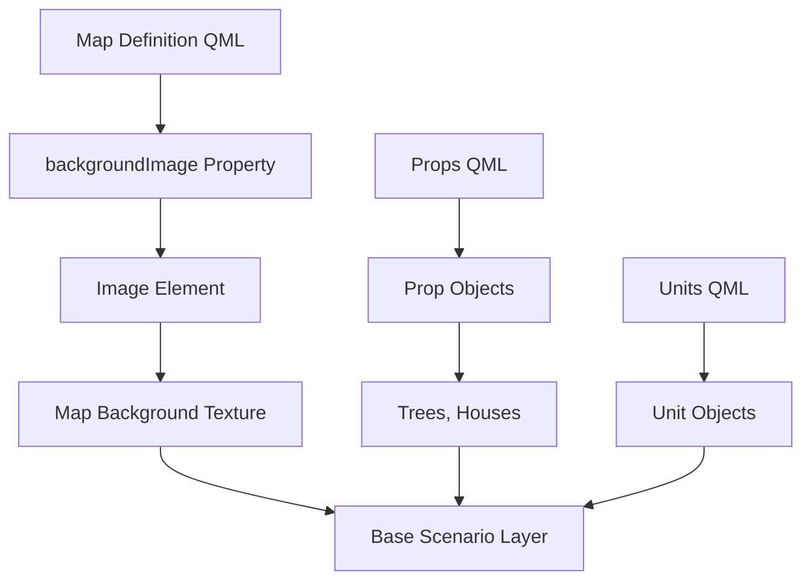
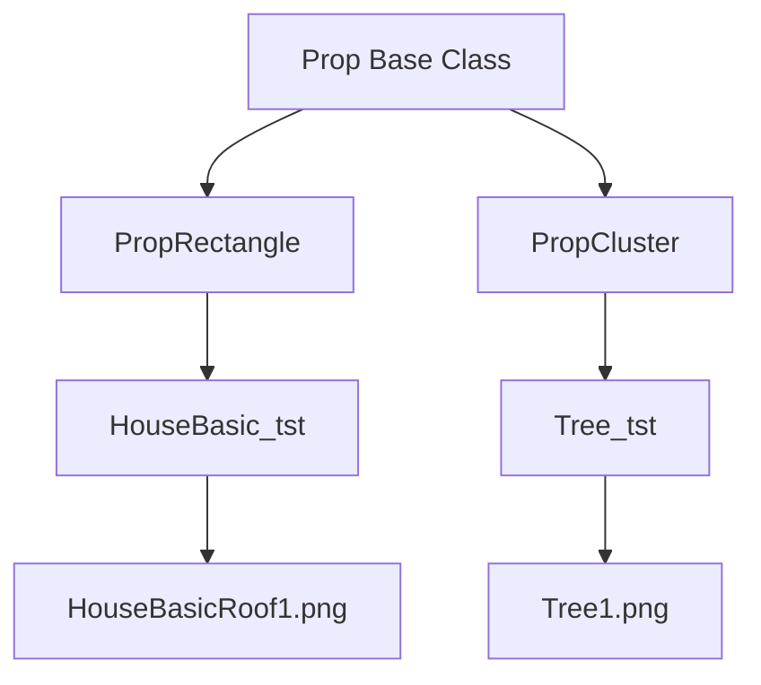
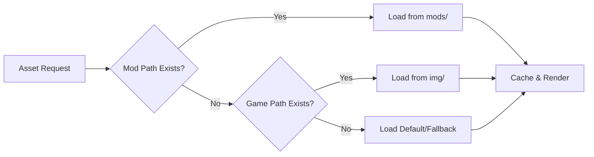

# Chapter 8: Asset Structure and File Formats

**CloseCombatFree (CCF) Technical Documentation**

Version: 0.0.5 (Development)  
Author: Tomasz 'sierdzio' Siekierda  
License: GPLv3  
Last Updated: 2024

---

## Table of Contents

1. [Overview: What Are Assets?](#1-overview-what-are-assets)
2. [Directory Structure](#2-directory-structure)
3. [File Naming Conventions](#3-file-naming-conventions)
4. [Image Format Specifications](#4-image-format-specifications)
5. [Audio Format (Planned)](#5-audio-format-planned)
6. [Asset Loading Implementation](#6-asset-loading-implementation)
7. [Map Assets](#7-map-assets)
8. [Asset Creation Guidelines](#8-asset-creation-guidelines)
9. [Asset Summary Table](#9-asset-summary-table)
10. [Modding Perspective](#10-modding-perspective)

---

## 1. Overview: What Are Assets?

### 1.1 Definition and Purpose

**Level 1 - Player Experience:**

Assets are the visual and audio resources that bring CloseCombatFree to life. From the player's perspective, assets include:

- **Unit Graphics**: Tanks, soldiers, and vehicles rendered on the battlefield with realistic details
- **Terrain Imagery**: Map backgrounds showing fields, roads, buildings, and natural features
- **Visual Effects**: Explosions, gunfire, smoke, exhaust, and dynamic shadows
- **User Interface**: Buttons, menus, selection boxes, and informational displays
- **Campaign Art**: Mission briefings, strategic maps, and victory screens

These assets transform abstract game data into a visually compelling tactical experience. When a player selects a tank and orders it to fire, the sequence of visual feedback—the turret rotating, the muzzle flash, the shell impact, the explosion—is all driven by carefully organized asset files.

### 1.2 Asset Pipeline Flow

**Level 2 - Technical Overview:**



Assets flow through a well-defined pipeline:

1. **Creation**: Artists create images using tools like GIMP (XCF source files)
2. **Export**: Final assets exported as PNG (lossless, transparency) or JPG (compressed, no transparency)
3. **Storage**: Assets stored in organized directory structure under `img/`
4. **Loading**: QML `Image` elements reference assets via relative paths or QRC
5. **Rendering**: Qt's scene graph renders assets using hardware acceleration

### 1.3 Asset Types Overview

**Level 1 - Asset Categories:**

| Category | Purpose | Examples | Location |
|----------|---------|----------|----------|
| Unit Graphics | Visual representation of military units | Tank hulls, turrets, logos | `img/units/` |
| Terrain | Map backgrounds and environmental features | Grass, roads, elevation maps | `img/maps/` |
| Props | Interactive terrain objects | Trees, houses, obstacles | `img/maps/props/` |
| Effects | Dynamic visual feedback | Smoke, fire, explosions | `img/effects/` |
| GUI | Interface elements | Selection boxes, icons | `img/gui/` |
| Menus | Menu backgrounds and overlays | Campaign cards, settings | `img/menus/` |
| Campaign | Strategic layer imagery | Campaign maps, briefings | `img/campaigns/` |

---

## 2. Directory Structure

### 2.1 Complete Asset Tree

**Level 2 - File Organization:**

```mermaid
tree
img/
├── campaigns/
│   ├── campaign_tst1_logo.png
│   └── campaign_tst1_logo.xcf
├── effects/
│   ├── gun_fire1.png
│   ├── gun_fire2.png
│   ├── gun_fire3.png
│   ├── gun_fire4.png
│   ├── gun_fire5.png
│   ├── gun_fire_particle1.png
│   ├── shadow_base.png
│   ├── smoke_fire1.png
│   ├── smoke_fire2.png
│   ├── smoke_fire3.png
│   ├── smoke_fire4.png
│   ├── smoke_fire5.png
│   ├── vehicle_fire.png
│   ├── vehicle_smoke.png
│   ├── vehicle_smoke_flash.png
│   ├── vehicle_smoke_flash2.png
│   └── vehicle_smoke_light.png
├── gui/
│   ├── checkBoxTick.png
│   ├── defenceSphere_black.png
│   ├── defenceSphere_blue.png
│   ├── defenceSphere_green.png
│   ├── defenceSphere_.png
│   └── popUpArrow.png
├── maps/
│   ├── hipsometric_2sides.png
│   ├── hipsometric_default.png
│   ├── hipsometric_test1.png
│   ├── test1.jpg
│   ├── test1.png
│   ├── test2.jpg
│   ├── test2.png
│   ├── test3.jpg
│   ├── test3.png
│   └── props/
│       ├── HouseBasicRoof1.png
│       └── Tree1.png
├── menus/
│   └── CardMenuDefault.png
└── units/
    ├── generic_soldier_logo.png
    ├── generic_unit_logo.png
    ├── sideMarks/
    │   ├── sideMark_default.xcf
    │   ├── sideMark_side_1.png
    │   ├── sideMark_side_2.png
    │   └── sideMark_side_3.png
    └── tanks/
        └── generic/
            ├── tank_tst1_logo.png
            ├── tank_tst1_turret_main.png
            ├── tank_tst2_logo.png
            ├── tank_tst2_turret_main.png
            ├── tank_tst3_hull.png
            ├── tank_tst3_logo.png
            ├── tank_tst3_turret_main.png
            ├── turret_barrelBase.png
            └── turret_barrelSegment1.png
```

### 2.2 Directory Purposes

**Level 2 - Organizational Logic:**

Each directory serves a specific purpose in the asset ecosystem:

#### `img/campaigns/`
Strategic layer imagery for campaign mode. Contains mission briefings, operation maps, and victory/defeat screens.

#### `img/effects/`
Dynamic visual effects used during gameplay. These are particle textures and sprites for explosions, gunfire, smoke, and shadows.

#### `img/gui/`
Interface elements that overlay the game world. Includes selection indicators, action buttons, and status displays.

#### `img/maps/`
Terrain backgrounds that form the game battlefield. Large images (up to 23MB for high-resolution maps) that serve as the canvas for gameplay.

#### `img/maps/props/`
Interactive environmental objects placed on maps. Trees, buildings, and obstacles that provide cover and affect line of sight.

#### `img/menus/`
Static menu backgrounds and decorative elements for the game's frontend.

#### `img/units/`
Military unit graphics organized by type:
- `sideMarks/`: Faction identification markers
- `tanks/generic/`: Tank-specific textures (hulls, turrets, logos)

### 2.3 Asset Size Considerations

**Level 2 - Performance Impact:**

| Asset Type | Typical Size | Count | Total Impact |
|------------|-------------|-------|--------------|
| Map Backgrounds | 1-23 MB | 3-10 | 50-100 MB |
| Unit Textures | 5-50 KB | 20-100 | 1-5 MB |
| Effect Sprites | 1-10 KB | 15-30 | 50-300 KB |
| GUI Elements | 1-5 KB | 10-20 | 20-100 KB |
| Props | 5-20 KB | 5-15 | 50-300 KB |

**Optimization Strategy:**
- Large maps use JPG compression where transparency isn't needed
- Unit textures and effects use PNG for alpha channel support
- Source XCF files excluded from release builds

---

## 3. File Naming Conventions

### 3.1 Naming Pattern Overview

**Level 2 - Standardized Naming:**

CCF uses consistent naming patterns to ensure assets are discoverable and maintainable:

```
[category]_[identifier]_[variant]_[component].[ext]
```

### 3.2 Unit Asset Naming

**Level 3 - Code Examples:**

Tank assets follow a hierarchical naming scheme:

```
img/units/tanks/generic/
├── tank_tst1_logo.png           # Unit type identifier icon
├── tank_tst1_turret_main.png    # Turret body texture
├── tank_tst2_logo.png           # Another tank variant
├── tank_tst2_turret_main.png    # Its turret texture
├── tank_tst3_hull.png           # Hull texture for tank 3
├── tank_tst3_logo.png           # Tank 3 identifier
├── tank_tst3_turret_main.png    # Tank 3 turret
├── turret_barrelBase.png        # Shared barrel base
└── turret_barrelSegment1.png    # Shared barrel segment
```

**Implementation in QML:**

```qml
// units/tanks/tests/Tank_tst1.qml:31
unitLogo: "../../../img/units/tanks/generic/tank_tst1_logo.png"
```

```qml
// units/tanks/tests/Tank_tst1_turret.qml:25
Turret {
    bodyTexture: "../../../img/units/tanks/generic/tank_tst1_turret_main.png"
}
```

### 3.3 Effect Asset Naming

**Level 2 - Sequential Naming:**

Effects use sequential numbering for animation frames or variants:

```
img/effects/
├── gun_fire1.png           # Frame 1 of muzzle flash
├── gun_fire2.png           # Frame 2
├── gun_fire3.png           # Frame 3
├── gun_fire4.png           # Frame 4
├── gun_fire5.png           # Frame 5
├── gun_fire_particle1.png  # Particle texture
├── smoke_fire1.png         # Smoke effect variant 1
├── smoke_fire2.png         # Smoke effect variant 2
└── ...
```

### 3.4 Map Asset Naming

**Level 2 - Descriptive Naming:**

Map files use descriptive names indicating their purpose:

```
img/maps/
├── hipsometric_default.png     # Default/fallback terrain
├── hipsometric_test1.png       # Test terrain variant 1
├── hipsometric_2sides.png      # Two-sided battle terrain
├── test1.jpg                   # Basic test map (JPG compressed)
├── test2.jpg                   # Another test map
└── test3.jpg                   # Third test map variant
```

### 3.5 Side Mark Naming

**Level 3 - Faction Identification:**

Side marks identify unit allegiance:

```
img/units/sideMarks/
├── sideMark_side_1.png     # Player faction
├── sideMark_side_2.png     # Enemy faction 1
├── sideMark_side_3.png     # Enemy faction 2 / Neutral
└── sideMark_default.xcf    # Template source file
```

**Usage in QML:**

```qml
// qml/units/Unit.qml:127-137
Image {
    id: sideMarkImage
    x: 0
    y: 0
    z: 5
    width: 10
    height: 10
    rotation: -root.rotation
    source: sideMarkSource
    visible: sideMarkVisible
}
```

---

## 4. Image Format Specifications

### 4.1 Supported Formats

**Level 2 - Technical Specifications:**

CCF supports two primary image formats, chosen based on requirements:

| Format | Extension | Transparency | Compression | Use Case |
|--------|-----------|--------------|-------------|----------|
| PNG | `.png` | Yes (alpha channel) | Lossless | Units, effects, GUI |
| JPEG | `.jpg`, `.jpeg` | No | Lossy | Large map backgrounds |

### 4.2 PNG Format Details

**Level 3 - Implementation:**

PNG is the preferred format for most assets due to lossless compression and alpha channel support.

**Recommended Specifications:**

```
Format: PNG (Portable Network Graphics)
Color Depth: 24-bit RGB + 8-bit alpha (RGBA)
Compression: Maximum (PNG uses DEFLATE)
Transparency: Full 8-bit alpha channel
Interlacing: Disabled (not needed for game assets)
```

**Example Asset - Unit Logo:**

```qml
// Reference: qml/units/tanks/Tank.qml:84
unitLogo: "../../../img/units/generic_unit_logo.png"
```

The `generic_unit_logo.png` file:
- Size: ~5 KB
- Dimensions: 64x64 pixels (typical)
- Format: PNG with transparency
- Purpose: Identifies unit type in UI and tooltips

### 4.3 JPEG Format Details

**Level 2 - Map Optimization:**

JPEG is used for large map backgrounds where:
- Transparency is not required
- File size reduction is critical
- Some quality loss is acceptable

**Recommended Specifications:**

```
Format: JPEG (Joint Photographic Experts Group)
Quality: 85-95% (balance of quality vs. size)
Color Space: RGB
Progressive: Optional
Chroma Subsampling: 4:2:0 (standard)
```

**Example Map Files:**

```
img/maps/test3.jpg  - 2.0 MB (compressed)
img/maps/test3.png  - 23.0 MB (uncompressed)
```

The JPEG version achieves **90% size reduction** with minimal visual quality loss.

### 4.4 XCF Source Files

**Level 2 - Development Workflow:**

GIMP XCF files are stored alongside exported assets but excluded from release builds:

```
img/maps/props/
├── HouseBasicRoof1.png     # Exported asset (used in game)
├── HouseBasicRoof1.xcf     # Source file (GIMP project)
├── Tree1.png               # Exported asset
└── Tree1.xcf               # Source file
```

**Build System Integration:**

Release builds should filter out `.xcf` files:

```bash
# Example: Exclude XCF from distribution
find img/ -name "*.xcf" -type f -delete
```

---

## 5. Audio Format (Planned)

### 5.1 Current Status

**Level 1 - Feature Status:**

> **Note:** Audio support is planned but not yet implemented in CCF v0.0.5.

### 5.2 Planned Audio Architecture

**Level 2 - Future Implementation:**

When audio is implemented, the following specifications are planned:

| Audio Type | Format | Use Case |
|------------|--------|----------|
| Sound Effects | OGG Vorbis | Gunfire, explosions, engine sounds |
| Ambient | OGG Vorbis | Environmental background (birds, wind) |
| Music | OGG Vorbis | Background music, menu themes |
| UI Sounds | WAV or OGG | Button clicks, alerts, notifications |

### 5.3 Proposed Directory Structure

```
sounds/
├── effects/
│   ├── weapons/
│   │   ├── tank_fire.ogg
│   │   ├── rifle_fire.ogg
│   │   └── explosion.ogg
│   ├── vehicles/
│   │   ├── tank_engine.ogg
│   │   └── tank_move.ogg
│   └── ambient/
│       ├── birds.ogg
│       └── wind.ogg
├── music/
│   ├── menu_theme.ogg
│   └── battle_theme.ogg
└── ui/
    ├── click.ogg
    └── alert.ogg
```

### 5.4 QML Audio Integration Pattern

**Level 3 - Proposed Implementation:**

```qml
// Future pattern for audio (QtMultimedia)
import QtMultimedia 5.15

Item {
    Audio {
        id: fireSound
        source: "../../../sounds/effects/weapons/tank_fire.ogg"
    }
    
    function playFireSound() {
        fireSound.play();
    }
}
```

---

## 6. Asset Loading Implementation

### 6.1 Loading Pipeline Architecture

**Level 2 - System Design:**



### 6.2 Relative Path Loading

**Level 3 - Implementation:**

CCF primarily uses relative filesystem paths for asset loading:

```qml
// qml/units/tanks/Tank.qml:84
unitLogo: "../../../img/units/generic_unit_logo.png"
```

Path resolution:
1. QML file located at: `qml/units/tanks/Tank.qml`
2. Relative path: `../../../img/units/generic_unit_logo.png`
3. Resolved to: `img/units/generic_unit_logo.png` (from project root)

**QRC vs Filesystem Decision Tree:**



### 6.3 Qt Resource System (QRC)

**Level 3 - QRC Integration:**

While CCF primarily uses filesystem paths, it includes a tool for QRC conversion:

**relative2qrc Tool:**

```
src/tools/relative2qrc/
├── convertercore.cpp       # Core conversion logic
├── convertercore.h
├── converterfile.cpp       # File handling
├── converterfile.h
├── converterflags.cpp      # Option parsing
├── converterflags.h
├── converterqrcgenerator.cpp  # QRC generation
├── converterqrcgenerator.h
├── convertermain.cpp       # Entry point
├── converterResource.qrc   # Tool's own resources
├── helpMessage.txt         # Documentation
├── README                  # Tool documentation
└── relative2qrc.pro        # Project file
```

**Tool Purpose:**

Converts relative paths in QML/C++ code to QRC paths for release builds:

```bash
# Convert paths for QRC embedding
./relative2qrc --input ./qml --output ./qml_qrc --generate-qrc
```

**Example Conversion:**

```qml
// Before (filesystem)
source: "../../../img/effects/vehicle_smoke.png"

// After (QRC)
source: "qrc:///img/effects/vehicle_smoke.png"
```

### 6.4 Image Element Usage Patterns

**Level 3 - Code Examples:**

#### Basic Image Loading

```qml
// qml/effects/Shadow.qml:5
Image {
    property int angle: 0
    source: "../../img/effects/shadow_base.png"
}
```

#### Dynamic Image Assignment

```qml
// qml/units/Unit.qml:106-111
DefenceSphere {
    imageSource: {
        if (defenceSphereColor == "")
            return "";
        else
            return "../../img/gui/defenceSphere_" + defenceSphereColor + ".png"
    }
}
```

#### Texture Assignment via Properties

```qml
// qml/units/tanks/TurretImage.qml:43-51
Image {
    id: body
    width: turretSize
    height: turtSize
    source: bodyTexture          # Property-bound texture
    sourceSize.height: turretSize
    sourceSize.width: turretSize
    anchors.bottom: parent.bottom
    anchors.left: parent.left
}
```

```qml
// units/tanks/tests/Tank_tst1_turret.qml:24-26
Turret {
    bodyTexture: "../../../img/units/tanks/generic/tank_tst1_turret_main.png"
}
```

### 6.5 Particle System Texture Loading

**Level 3 - Particle Effects:**

Effects use `ImageParticle` with texture sources:

```qml
// qml/effects/VehicleExplosion.qml:78-82
ImageParticle {
    z: smokeParticle.z + 1
    source: "../../img/effects/gun_fire_particle1.png"
    groups: ["fire"]
}
```

```qml
// qml/effects/VehicleExplosion.qml:84-89
ImageParticle {
    id: smokeParticle
    source: "../../img/effects/vehicle_smoke.png"
    groups: ["smokeTrails"]
    entryEffect: ImageParticle.Scale
}
```

---

## 7. Map Assets

### 7.1 Map Background System

**Level 2 - Technical Architecture:**



### 7.2 Map Definition

**Level 3 - Implementation:**

Maps are defined in QML files that specify the background image:

```qml
// maps/Map_tst1.qml:25-27
Map {
    backgroundImage: "img/maps/test2.png"
}
```

```qml
// maps/Map_tst2.qml (implied structure)
Map {
    backgroundImage: "img/maps/test1.png"
}
```

### 7.3 Map Props System

**Level 2 - Prop Architecture:**

Props are interactive environmental objects placed on maps:



**Tree Prop Implementation:**

```qml
// maps/props/Tree_tst.qml:24-50
Prop {
    objectName: "tree"
    cover: "average"
    width: top.width
    height: top.height

    Rectangle {
        id: base
        width: 4
        height: 4
        radius: 1
        color: "#4f1708"
        anchors.top: parent.top
        anchors.left: parent.left
        anchors.topMargin: top.width/2
        anchors.leftMargin: top.width/2

        Image {
            id: top
            visible: topVisible
            source: "../../img/maps/props/Tree1.png"
            width: 25
            height: width
            anchors.horizontalCenter: base.horizontalCenter
            anchors.verticalCenter: base.verticalCenter
        }
    }
}
```

**House Prop Implementation:**

```qml
// maps/props/HouseBasic_tst.qml:24-47
PropRectangle {
    objectName: "house"
    cover: "great"
    width: 140
    height: 100

    id: base
    color: "#999fa4"

    Rectangle {
        id: floor
        anchors.fill: parent
        anchors.margins: 5
        color: "#4f1708"
    }

    Image {
        id: roof
        visible: topVisible
        anchors.fill: parent
        source: "../../img/maps/props/HouseBasicRoof1.png"
    }
}
```

### 7.4 Map Asset Specifications

**Level 2 - Size Guidelines:**

| Map Type | Resolution | Format | Typical Size |
|----------|-----------|--------|--------------|
| Small Test | 1024x768 | PNG/JPG | 1-5 MB |
| Medium | 2048x1536 | JPG | 5-10 MB |
| Large | 4096x3072 | JPG | 15-25 MB |

**Recommendation:**
- Use PNG for maps requiring transparency (rare)
- Use JPG quality 90% for optimal size/quality balance
- Consider multiple resolutions for different zoom levels

---

## 8. Asset Creation Guidelines

### 8.1 General Best Practices

**Level 2 - Development Standards:**

1. **Source File Preservation**
   - Always save GIMP/Photoshop source files (.xcf/.psd)
   - Name source files to match exported assets
   - Store in same directory as exports

2. **Transparency Usage**
   - Use PNG for any image requiring transparency
   - Ensure alpha channel is properly exported
   - Test transparency in-game

3. **Power-of-Two Dimensions**
   - Preferred: 64x64, 128x128, 256x256, 512x512
   - Some GPUs require power-of-two textures
   - Improves rendering performance

4. **Color Space**
   - Use RGB color space
   - Avoid CMYK (not supported by Qt)
   - Consider gamma correction for consistency

### 8.2 Unit Asset Guidelines

**Level 2 - Unit Graphics:**

| Component | Format | Size | Notes |
|-----------|--------|------|-------|
| Unit Logo | PNG | 64x64 | Transparent background |
| Hull Texture | PNG | Variable | Top-down view |
| Turret Texture | PNG | 60x60 typical | Centered rotation point |
| Barrel Texture | PNG | 5x30 typical | Vertical orientation |

**Turret Creation:**

Turret textures must be centered for proper rotation:

```qml
// qml/units/tanks/Turret.qml:38-40
transform: Rotation {
    origin.x: root.centerX; 
    origin.y: root.centerY; 
    angle: turretRotation
}
```

The texture's center point should align with the rotation origin.

### 8.3 Effect Asset Guidelines

**Level 2 - Particle Textures:**

Effect textures should be:
- Small (32x32 to 128x128)
- Centered (particles emit from center)
- Grayscale or semi-transparent
- Designed for additive blending

**Example Effect Pattern:**

```qml
// qml/effects/GunFireEffect.qml:71-78
ImageParticle {
    source: "../../img/effects/gun_fire_particle1.png"
    width: 30
    height: 30
    groups: "A"
    entryEffect: ImageParticle.Fade
    alpha: 0.4
}
```

### 8.4 GUI Asset Guidelines

**Level 2 - Interface Elements:**

GUI elements should:
- Be minimal and functional
- Use consistent color schemes
- Support scaling
- Include hover/active states (when applicable)

**Defence Sphere Example:**

```
img/gui/
├── defenceSphere_black.png   # Enemy unit range
├── defenceSphere_blue.png    # Allied unit range
├── defenceSphere_green.png   # Player unit range
└── defenceSphere_.png        # Fallback/empty
```

---

## 9. Asset Summary Table

### 9.1 Complete Asset Inventory

**Level 1 - Asset Overview:**

| Category | Asset Type | Format | Count | Location |
|----------|-----------|--------|-------|----------|
| **Units** | | | | `img/units/` |
| | Generic Logos | PNG | 2 | `img/units/` |
| | Soldier Logos | PNG | 2 | `img/units/` |
| | Side Marks | PNG | 3 | `img/units/sideMarks/` |
| | Tank Logos | PNG | 3 | `img/units/tanks/generic/` |
| | Turret Textures | PNG | 3 | `img/units/tanks/generic/` |
| | Hull Textures | PNG | 1 | `img/units/tanks/generic/` |
| | Barrel Textures | PNG | 2 | `img/units/tanks/generic/` |
| **Maps** | | | | `img/maps/` |
| | Backgrounds | PNG/JPG | 9 | `img/maps/` |
| | Hipspometric Views | PNG | 3 | `img/maps/` |
| | Tree Props | PNG | 1 | `img/maps/props/` |
| | House Props | PNG | 1 | `img/maps/props/` |
| **Effects** | | | | `img/effects/` |
| | Gun Fire Frames | PNG | 5 | `img/effects/` |
| | Smoke Variants | PNG | 5 | `img/effects/` |
| | Vehicle Effects | PNG | 4 | `img/effects/` |
| | Particle Textures | PNG | 2 | `img/effects/` |
| | Shadow Base | PNG | 1 | `img/effects/` |
| **GUI** | | | | `img/gui/` |
| | Check Box Tick | PNG | 1 | `img/gui/` |
| | Defence Spheres | PNG | 4 | `img/gui/` |
| | Popup Arrow | PNG | 1 | `img/gui/` |
| **Menus** | | | | `img/menus/` |
| | Menu Background | PNG | 1 | `img/menus/` |
| **Campaigns** | | | | `img/campaigns/` |
| | Campaign Logos | PNG | 1 | `img/campaigns/` |

**Total Assets: ~45 image files**

### 9.2 Asset Size Distribution

```
Size Range          Count   Percentage
----------------    -----   ----------
0-10 KB             35      78%
10-50 KB            5       11%
50 KB - 1 MB        2       4%
1 MB - 25 MB        3       7%
```

---

## 10. Modding Perspective

### 10.1 Adding Custom Units

**Level 3 - Modding Guide:**

To add a custom tank to CCF:

**Step 1: Create Unit Assets**

```
img/units/tanks/custom/
├── myTank_logo.png              # 64x64 unit icon
├── myTank_turret_main.png       # Turret texture
├── myTank_hull.png              # Hull texture (optional)
├── turret_barrelBase.png        # Can reuse existing
└── turret_barrelSegment1.png    # Can reuse existing
```

**Step 2: Create Hull QML**

```qml
// units/tanks/custom/MyTank_hull.qml
import QtQuick 2.1
import "../../../qml/units/tanks"

Hull {
    Rectangle {
        id: hull
        width: hullWidth
        height: hullHeight
        color: hullColor
        radius: 8
        border.width: 2
        border.color: "#333333"
    }
}
```

**Step 3: Create Turret QML**

```qml
// units/tanks/custom/MyTank_turret.qml
import QtQuick 2.1
import "../../../qml/units/tanks"

Turret {
    bodyTexture: "../../../img/units/tanks/custom/myTank_turret_main.png"
}
```

**Step 4: Create Unit Definition**

```qml
// units/tanks/custom/MyTank.qml
import QtQuick 2.1
import QmlBase 0.1
import "../../../qml/units"
import "../../../qml/units/tanks"

Tank {
    id: root
    unitFileName: "MyTank"
    unitType: "My Custom Tank"
    unitLogo: "../../../img/units/tanks/custom/myTank_logo.png"
    
    // Customize stats
    rotationSpeed: 45
    turretRotationSpeed: 40
    maxSpeed: 25
    acceleration: 3
    unitWidth: 70
    unitHeight: 110
    
    // Armor values
    frontArmour: 120
    sideArmour: 90
    backArmour: 70
    turretArmour: 100

    MyTank_hull {
        id: hull
    }

    MyTank_turret {
        id: turret
    }
}
```

### 10.2 Adding Custom Maps

**Level 3 - Map Creation:**

**Step 1: Create Map Background**

```bash
# Create map image (using GIMP/Photoshop)
# Resolution: 2048x1536 recommended
# Save as: img/maps/myMap.jpg (quality 90)
```

**Step 2: Create Map Definition**

```qml
// maps/MyMap.qml
import QtQuick 2.1
import QmlBase 0.1
import "../qml/maps"

Map {
    backgroundImage: "img/maps/myMap.jpg"
}
```

**Step 3: Create Scenario Using Map**

```qml
// scenarios/MyScenario.qml
import QtQuick 2.1
import "../units/tanks/custom"
import "../qml/units"

Item {
    property string mapFile: "maps/MyMap.qml"
    id: root

    MyTank {
        objectName: "playerTank1"
        x: 200
        y: 300
    }
}
```

### 10.3 Adding Custom Effects

**Level 3 - Effect Modding:**

Create custom particle textures:

```qml
// qml/effects/MyCustomExplosion.qml
import QtQuick 2.1
import QtQuick.Particles 2.0

Item {
    id: root
    
    function run() {
        emitter.pulse(1000);
    }
    
    ParticleSystem {
        anchors.fill: parent
        
        Emitter {
            id: emitter
            enabled: false
            anchors.centerIn: parent
            emitRate: 50
            lifeSpan: 2000
            size: 20
        }
        
        ImageParticle {
            source: "../../img/effects/my_custom_explosion.png"
            groups: ["explosion"]
            entryEffect: ImageParticle.Scale
        }
    }
}
```

### 10.4 Asset Modding Best Practices

**Level 2 - Guidelines:**

1. **Backup Originals**: Never overwrite base game assets
2. **Naming Convention**: Use descriptive names with mod prefix
   - Good: `myMod_tank_logo.png`
   - Bad: `tank_logo.png`
3. **Path Consistency**: Mirror the base game's directory structure
4. **Testing**: Test assets at different zoom levels
5. **Performance**: Monitor texture memory usage

### 10.5 Asset Loading Priority

**Level 2 - Loading Order:**

CCF loads assets in this priority order:



This enables mod assets to override base game assets seamlessly.

### 10.6 Mod Structure Template

**Level 3 - Recommended Layout:**

```
mods/
└── MyMod/
    ├── mod.json                    # Mod metadata
    ├── img/
    │   ├── units/
    │   │   └── tanks/
    │   │       └── mymod/
    │   │           └── ...
    │   └── effects/
    │       └── mymod/
    │           └── ...
    ├── units/
    │   └── tanks/
    │       └── mymod/
    │           └── ...
    ├── maps/
    │   └── ...
    └── scenarios/
        └── ...
```

---

## Appendix A: Asset Reference Quick Guide

### Common Asset Paths

| Asset | Relative Path | Example |
|-------|--------------|---------|
| Unit Logo | `../../../img/units/[type]/[name]_logo.png` | `tank_tst1_logo.png` |
| Turret Texture | `../../../img/units/tanks/generic/[name]_turret_main.png` | `tank_tst1_turret_main.png` |
| Effect Particle | `../../img/effects/[name].png` | `vehicle_smoke.png` |
| Map Background | `img/maps/[name].png` or `.jpg` | `test2.png` |
| Prop Texture | `../../img/maps/props/[name].png` | `Tree1.png` |
| GUI Element | `../../img/gui/[name].png` | `defenceSphere_green.png` |
| Side Mark | `sideMarkSource` property | `sideMark_side_1.png` |

### QML Image Property Reference

```qml
Image {
    source: "path/to/image.png"        // Asset path
    width: 64                          // Display width
    height: 64                         // Display height
    sourceSize.width: 64               // Original texture width
    sourceSize.height: 64              // Original texture height
    visible: true                      // Visibility toggle
    opacity: 1.0                       // Transparency (0.0-1.0)
    smooth: true                       // Smooth scaling
    asynchronous: false                // Async loading
    cache: true                        // Enable texture cache
    mirror: false                      // Horizontal flip
}
```

---

## Summary

This chapter has covered the complete asset system of CloseCombatFree:

1. **Assets** are organized into logical categories under `img/` directory
2. **Naming conventions** follow predictable patterns for maintainability
3. **PNG format** is preferred for transparency; **JPG** for large backgrounds
4. **QML Image elements** load assets via relative paths or QRC
5. **Modding** is supported through consistent path structures

Understanding the asset system is essential for both modding and engine development, as it bridges the gap between visual design and technical implementation.
