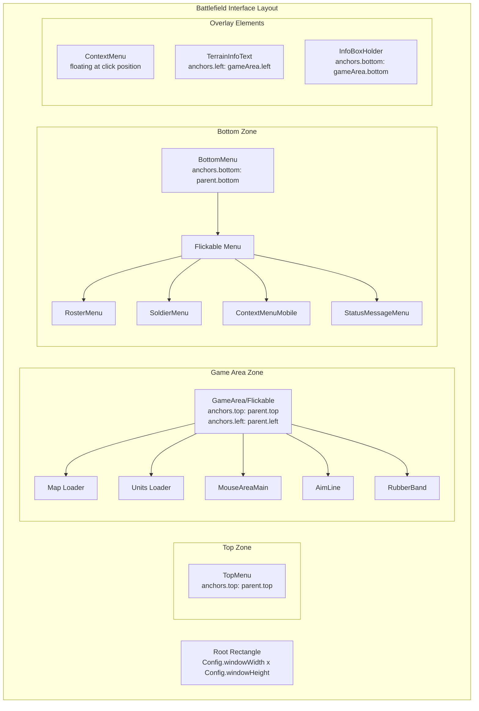
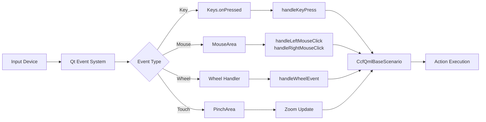
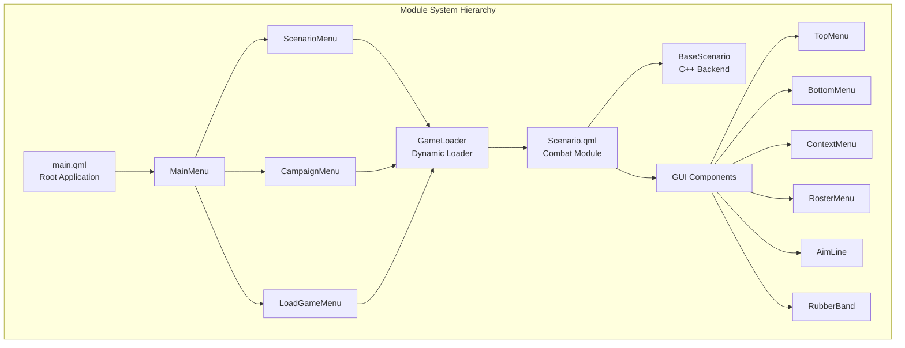
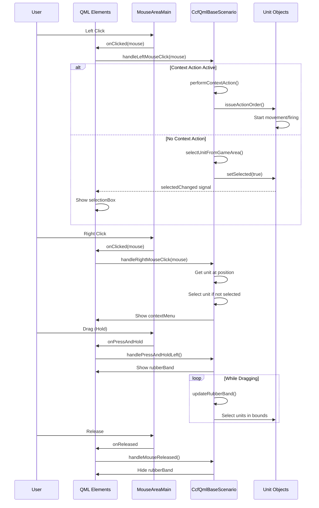
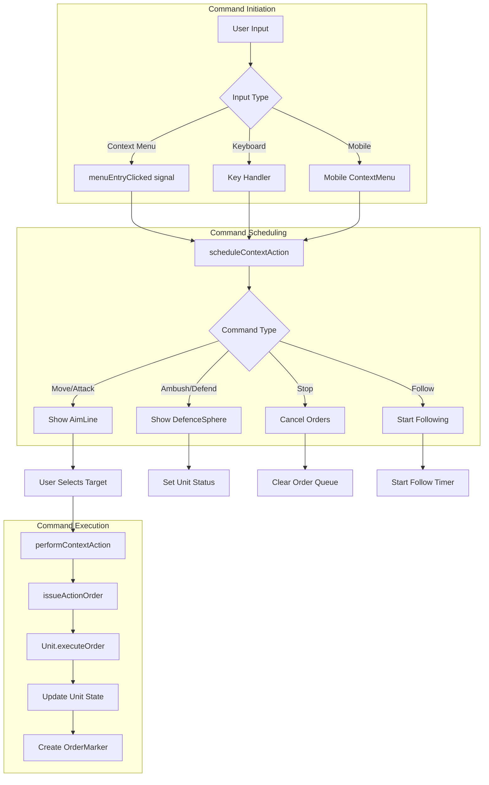
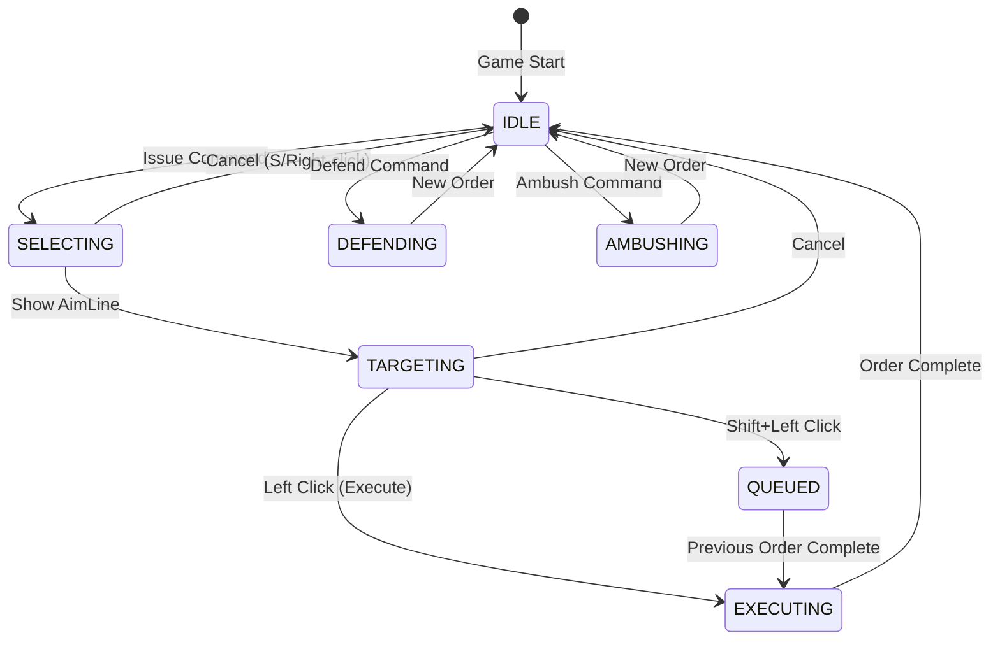
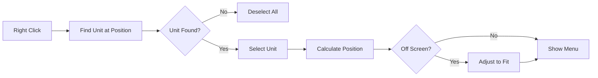
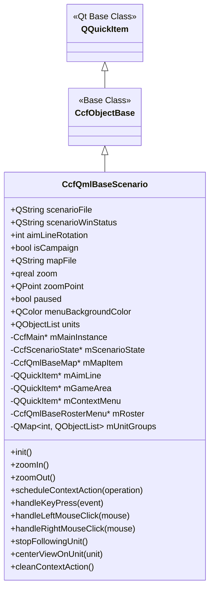
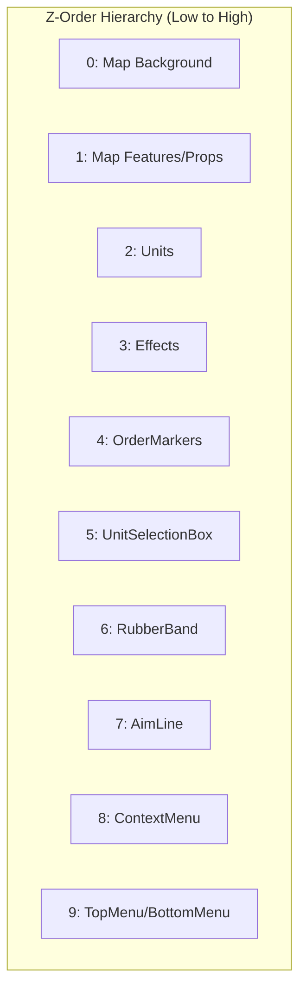

# Chapter 9: UI System and Combat Module

This chapter documents the comprehensive UI system and combat module architecture of CloseCombatFree (CCF), a Qt5/QML-based tactical wargame. The UI system provides real-time battlefield interaction, unit management, and command processing through a combination of QML-based widgets and C++ backend logic.

## Table of Contents

1. [The Battlefield Interface Layout](#1-the-battlefield-interface-layout)
2. [Input Flow Model](#2-input-flow-model)
3. [Module System Architecture](#3-module-system-architecture)
4. [Widget Hierarchy](#4-widget-hierarchy)
5. [Input Event Flow](#5-input-event-flow)
6. [Command Processing Flow](#6-command-processing-flow)
7. [Order State Machine](#7-order-state-machine)
8. [Context Menu System](#8-context-menu-system)
9. [Implementation: CombatModule Class](#9-implementation-combatmodule-class)
10. [Implementation: Widget System](#10-implementation-widget-system)
11. [Implementation: Render Flow](#11-implementation-render-flow)
12. [Implementation: Input Handling](#12-implementation-input-handling)
13. [Developer/Debug Tools](#13-developerdebug-tools)

---

## 1. The Battlefield Interface Layout

### 1.1 Concept/Gameplay: Battlefield Interface Overview

The battlefield interface in CCF follows a classic tactical wargame layout with three primary zones:

- **Top Menu Bar**: Contains game controls, zoom controls, pause button, and options
- **Main Game Area**: Displays the tactical map with terrain, units, and interactive elements
- **Bottom Menu Bar**: Contains unit roster, context menu, soldier details, and status messages

The interface is designed to provide maximum visibility of the battlefield while keeping essential controls accessible. On desktop mode, both top and bottom menus can be toggled to maximize map visibility. On mobile mode, the interface adapts with a static context menu and touch-optimized controls.

### 1.2 Algorithm/Data: Layout Architecture

The battlefield layout uses a flexible anchor-based positioning system:



**Height Calculation Logic** (from `qml/scenarios/Scenario.qml:57-62`):

```qml
height: {
    if ((bottomMenu.width < root.width) || (Config.uiMode == "MOBILE"))
        return (parent.height - bottomMenu.visibleHeight);
    else
        return parent.height;
}
```

### 1.3 Code/Implementation: Main Layout Structure

**File: `qml/scenarios/Scenario.qml:54-232`**

The main game area is implemented as a `Flickable` component containing the map and units:

```qml
Flickable {
    objectName: "gameArea"
    id: gameArea
    height: {
        if ((bottomMenu.width < root.width) || (Config.uiMode == "MOBILE"))
            return (parent.height - bottomMenu.visibleHeight);
        else
            return parent.height;
    }

    contentWidth: map.width
    contentHeight: map.height
    boundsBehavior: Flickable.StopAtBounds
    clip: true

    anchors.top: parent.top
    anchors.left: parent.left
    anchors.right: parent.right

    PinchArea {
        id: pinchArea
        anchors.fill: parent
        onPinchUpdated: {
            zoom += pinch.scale - pinch.previousScale;
        }
    }

    Item {
        objectName: "zoomArea"
        id: zoomArea
        scale: zoom

        Loader {
            property alias mapItem: map.item
            objectName: "map"
            id: map
            // Map loading logic
        }

        Loader {
            property alias unitsItem: unitsLoader.item
            objectName: "unitsLoader"
            id: unitsLoader
            anchors.fill: parent
            z: map.z + 1
        }

        MouseArea {
            objectName: "mouseAreaMain"
            id: mouseAreaMain
            anchors.fill: parent
            acceptedButtons: Qt.LeftButton | Qt.RightButton | Qt.Wheel
            hoverEnabled: true
            z: -1
        }
    }
}
```

---

## 2. Input Flow Model

### 2.1 Concept/Gameplay: Input Handling Overview

CCF supports multiple input methods:

- **Keyboard Shortcuts**: Order commands (A=Attack, M=Move, S=Stop), menu toggles (T=Top, G=Bottom), unit groups (Ctrl+1-9)
- **Mouse Interactions**: Left-click (select), right-click (context menu), wheel (zoom/scroll), drag (rubber band selection)
- **Touch Gestures**: Pinch-to-zoom (mobile), press-and-hold (context menu), flick (map pan)

### 2.2 Algorithm/Data: Input Processing Pipeline



**Input Event Routing**:

1. Qt's event system captures raw input
2. QML elements receive events through their respective handlers (`Keys.onPressed`, `MouseArea.onClicked`, etc.)
3. Events are delegated to C++ backend methods via `Q_INVOKABLE` functions
4. Backend processes input and updates game state
5. Property changes trigger UI updates through Qt's signal/slot mechanism

### 2.3 Code/Implementation: Keyboard Input Handler

**File: `qml/scenarios/Scenario.qml:39-41`**

```qml
Keys.onPressed: {
    handleKeyPress(event);
}
```

**File: `src/qmlBase/ccfqmlbasescenario.cpp:1261-1339`**

```cpp
void CcfQmlBaseScenario::handleKeyPress(QObject *event)
{
    int digit = digitPressed(event);
    int modifiers = event->getInt("modifiers");
    int key = event->getInt("key");
    CcfConfig *config = mmain->config();

    if (modifiers == Qt::ControlModifier) {
        if (digit != -1)
            groupUnits(digit);
    } else {
        // Development key bindings
        if (key == Qt::Key_BracketRight) {
            mMapItem->toggleBackgroundImage();
        } else if (key == Qt::Key_BracketLeft) {
            togglePlayer();
        } else if (key == config->keyForFunction("toggle top menu")) {
            invoke(child("topMenu"), "toggleMenu");
        } else if (key == config->keyForFunction("toggle bottom menu")) {
            invoke(child("bottomMenu"), "toggleMenu");
        } else if (key == config->keyForFunction("follow")) {
            // Follow unit logic
        } else if (selectedUnitsCount() > 0) {
            if (key == config->keyForFunction("Stop")) {
                // Stop order logic
            } else if (key == config->keyForFunction("Move fast")) {
                scheduleContextAction("Move fast");
            } else if (key == config->keyForFunction("Move")) {
                scheduleContextAction("Move");
            }
            // ... additional order handlers
        }
        
        if (digit != -1)
            selectGroup(digit);
    }
}
```

---

## 3. Module System Architecture

### 3.1 Concept/Gameplay: Module Organization

CCF's UI is organized into modular QML components that can be loaded dynamically:

- **Menu System**: Main menu, scenario selection, campaign selection, saved games
- **Scenario System**: Active gameplay with combat module
- **GUI Components**: Reusable widgets (menus, buttons, markers)
- **Game Objects**: Units, maps, effects

### 3.2 Algorithm/Data: Module Loading System



**Dynamic Loading Flow**:

1. `MainMenu` displays initial options (Scenarios, Campaigns, Saved Games)
2. User selection triggers visibility of submenu
3. Submenu selection invokes `GameLoader.load()` with scenario path
4. `GameLoader` dynamically loads `Scenario.qml` with specified scenario file
5. `Scenario.qml` initializes `BaseScenario` (C++ backend) which loads units and map

### 3.3 Code/Implementation: Scenario Loading

**File: `qml/menus/MainMenu.qml:97-131`**

```qml
Loader {
    property string gameFile: ""
    id: gameLoader
    anchors.fill: parent
    visible: false

    onLoaded: {
        item.scenarioFile = gameFile;
        item.closeScenario.connect(close);
        item.loadScenario.connect(loadSaveGame)
        focus = true;
        visible = true;
    }

    function loadSaveGame(whatToLoad) {
        load(whatToLoad, true)
    }

    function load(whatToLoad, isSave) {
        close();
        if (isSave)
            gameFile = "saves/" + whatToLoad;
        else
            gameFile = "scenarios/" + whatToLoad;

        source = "../../qml/scenarios/Scenario.qml"
    }

    function close() {
        source = "";
        visible = false;
        focus = false;
    }
}
```

---

## 4. Widget Hierarchy

### 4.1 Concept/Gameplay: Widget Organization

The UI widget system provides visual feedback and interaction points for:

- **Selection Visualization**: `UnitSelectionBox` highlights selected units
- **Order Visualization**: `OrderMarker` shows queued orders, `DefenceSphere` shows ambush/defend zones
- **Interaction Aids**: `AimLine` for targeting, `RubberBand` for multi-select
- **Menu Widgets**: `PopUpArrow` for menu toggles, `ZoomBox` for zoom controls

### 4.2 Algorithm/Data: Widget Parent-Child Relationships

```mermaid
tree
    root["Scenario (BaseScenario)
    id: root"]
        gameArea["Flickable: gameArea"]
            zoomArea["Item: zoomArea"]
                map["Loader: map"]
                unitsLoader["Loader: unitsLoader"]
                    units["Unit instances"]
                        selectionBox["UnitSelectionBox (child of Unit)"]
                        orderMarkers["OrderMarker[] (order queue)"]
                        defenceSphere["DefenceSphere (conditional)"]
                mouseAreaMain["MouseArea: mouseAreaMain"]
                aimLine["Rectangle: aimLine"]
                    aimLineObscured["Rectangle: aimLineObscured"]
                    aimLineInvisible["Rectangle: aimLineInvisible"]
                rubberBand["RubberBand"]
        bottomMenu["BottomMenu"]
            trigger["PopUpArrow (toggle)"]
            menu["Flickable: menu"]
                row["Row"]
                    contextMenuMobile["ContextMenu"]
                    roster["RosterMenu"]
                        background["Rectangle"]
                            unitsView["GridView"]
                    soldierMenu["SoldierMenu"]
                    statusMessageViewer["StatusMessageMenu"]
        topMenu["TopMenu"]
            trigger2["PopUpArrow (toggle)"]
            menu2["Flickable: menu"]
                row2["Row"]
                    terrainInfoEntry["MenuEntry"]
                    zoomBox["ZoomBox"]
                    optionsEntry["MenuEntry"]
                    pauseEntry["MenuEntry"]
        contextMenu["ContextMenu (floating)"]
            entries["Grid"]
                contextMenuEntries["ContextMenuEntry[9]"]
```

### 4.3 Code/Implementation: Widget Definitions

**File: `qml/gui/UnitSelectionBox.qml:23-51`**

```qml
Rectangle {
    property int unitWidth: 60
    property int unitHeight: 60
    property int centerX: width/2
    property int centerY: height/2
    property int borderMargin: 16

    width: unitWidth + borderMargin
    height: unitHeight + borderMargin
    x: -(borderMargin/2)
    y: -(borderMargin/2)

    color: "#00000000"
    border.width: 2
    border.color: "#eeee11"

    Rectangle {
        width: 10
        height: 10
        anchors.top: parent.top
        anchors.left: parent.left
        anchors.topMargin: parent.centerY - (height/2)
        anchors.leftMargin: parent.centerX - (width/2)
        color: "#00000000"
        border.width: 2
        border.color: "#eeee11"
    }
}
```

**File: `qml/gui/OrderMarker.qml:23-75`**

```qml
Rectangle {
    property int centerX: width/2
    property int centerY: height/2
    property real targetX: x + centerX
    property real targetY: y + centerY
    property color orderColor: "#bb3333"
    property int index: -1
    property int number: -1
    property string operation: ""
    property bool performed: false

    id: root
    width: 21
    height: width
    radius: width/2
    color: "#345634"
    border.color: "#111111"
    border.width: 1

    Rectangle {
        width: parent.width/2
        height: width
        radius: width/2
        color: orderColor
        anchors.horizontalCenter: parent.horizontalCenter
        anchors.verticalCenter: parent.verticalCenter

        Text {
            text: (number == -1)? "" : number + 1;
            verticalAlignment: Text.AlignVCenter
            horizontalAlignment: Text.AlignHCenter
            style: Text.Outline
            anchors.fill: parent
            font.pointSize: 7
            color: "#dddddd"
        }
    }

    MouseArea {
        anchors.fill: parent
        drag {
            target: root
            axis: Drag.XandYAxis
            minimumX: 5
            minimumY: 5
        }
    }
}
```

---

## 5. Input Event Flow

### 5.1 Concept/Gameplay: Event Handling Strategy

CCF uses a layered event handling approach:

- **QML Layer**: Captures raw events, performs basic transformations
- **Bridge Layer**: Passes events to C++ via `Q_INVOKABLE` methods
- **Logic Layer**: C++ backend processes events, updates game state
- **Feedback Layer**: UI updates based on state changes

### 5.2 Algorithm/Data: Event Flow Sequence



### 5.3 Code/Implementation: Mouse Event Handlers

**File: `qml/scenarios/Scenario.qml:128-171`**

```qml
MouseArea {
    objectName: "mouseAreaMain"
    id: mouseAreaMain
    anchors.fill: parent
    acceptedButtons: Qt.LeftButton | Qt.RightButton | Qt.Wheel
    hoverEnabled: true
    z: -1

    onClicked: {
        if (mouse.button == Qt.LeftButton) {
            handleLeftMouseClick(mouse);
        } else if (mouse.button == Qt.RightButton) {
            handleRightMouseClick(mouse);
        }
    }

    onPressAndHold: {
        if (Config.uiMode == "DESKTOP") {
            gameArea.interactive = false;
            if (mouse.button == Qt.LeftButton) {
                handlePressAndHoldLeft(mouse);
            } else if (mouse.button == Qt.RightButton) {
                handlePressAndHoldRight(mouse);
            }
        } else if (Config.uiMode == "MOBILE") {
            if (terrainInfoMode == "OFF") {
                handleRightMouseClick(mouse);
            } else {
                handlePressAndHoldRight(mouse);
            }
        }
    }

    onReleased: {
        if (Config.uiMode == "DESKTOP") {
            handleMouseReleased();
            gameArea.interactive = true;
        }
    }

    onDoubleClicked: {
        if (followingTimer.index != -1) {
            stopFollowingUnit();
        } else {
            handleRightMouseClick(mouse);
        }
    }

    onWheel: {
        handleWheelEventMouseAreaMain(wheel);
    }
}
```

**File: `src/qmlBase/ccfqmlbasescenario.cpp:1115-1169`**

```cpp
void CcfQmlBaseScenario::handleLeftMouseClick(QObject *mouse)
{
    if ((!mContextMenu->isVisible()) && (mAimLine->isVisible())) {
        if (mouse->getInt("modifiers") == Qt::ShiftModifier) {
            placeWaypoint(mAimLine->getInt("unitIndex"),
                          mMouseAreaMain->getReal("mouseX"),
                          mMouseAreaMain->getReal("mouseY"));
        } else {
            performContextAction(mAimLine->getInt("unitIndex"),
                                 mMouseAreaMain->getReal("mouseX"),
                                 mMouseAreaMain->getReal("mouseY"));
        }
    } else {
        cleanContextAction();
        selectUnitFromGameArea(mouse);
    }
}

void CcfQmlBaseScenario::handleRightMouseClick(QObject *mouse)
{
    cleanContextAction();
    if (mAimLine->isVisible() == true)
        cancelAllSelectedOrders();

    QObject *unitObject = unitAt(mMouseAreaMain->getReal("mouseX"), 
                                 mMouseAreaMain->getReal("mouseY"));

    if ((unitObject == mMouseAreaMain) || (unitObject == NULL)
            || (unitObject->getString("unitSide") != mScenarioState->getPlayerSide())) {
        deselectAllUnits();
        return;
    }

    CcfQmlBaseUnit *unit = ccfUnit(unitObject);

    if (!unit->getSelected()) {
        selectUnitFromGameArea(mouse);
    }

    QPointF mappedCoords = mapFromItem(mGameArea,
        QPointF((unit->x() + unit->getCenterX()) * mZoom,
                (unit->y() + unit->getCenterY()) * mZoom));

    setContextMenuPosition(mContextMenu,
        mappedCoords.x() - (mGameArea->getReal("contentX")),
        mappedCoords.y() - (mGameArea->getReal("contentY")));

    mContextMenu->setVisible(true);
    mAimLine->set("unitIndex", unit->getUnitIndex());
}
```

---

## 6. Command Processing Flow

### 6.1 Concept/Gameplay: Command System

Players issue commands through:
- **Context Menu**: Right-click on unit, select command from menu
- **Keyboard Shortcuts**: Hotkeys for common commands (A=Attack, M=Move, etc.)
- **Mobile Menu**: Static context menu for touch devices

Available commands:
- Move, Move Fast, Sneak - Movement orders
- Attack, Smoke - Combat orders
- Ambush, Defend - Defensive postures
- Stop - Cancel orders
- Follow - Camera follows unit

### 6.2 Algorithm/Data: Command Execution Pipeline



### 6.3 Code/Implementation: Command Processing

**File: `src/qmlBase/ccfqmlbasescenario.cpp:357-401`**

```cpp
void CcfQmlBaseScenario::scheduleContextAction(const QString &operation)
{
    CcfUnitList units = objectToUnitList(selectedUnits());

    mAimLine->set("unitIndex", units.at(0)->property("unitIndex"));
    mAimLine->set("scheduledOperation", operation);
    mContextMenu->setVisible(false);

    if (operation == "Stop") {
        for (int i = 0; i < units.length(); ++i) {
            units.at(i)->cancelOrder();
        }
        cleanContextAction();
    } else if (operation == "Follow") {
        if (mFollowingTimer->getBool("running"))
            stopFollowingUnit();
        else
            startFollowingUnit(units.at(0)->getInt("unitIndex"));
    } else {
        if ((operation != "Ambush") && (operation != "Defend")) {
            mAimLine->setX(units.at(0)->x() + units.at(0)->getCenterX());
            mAimLine->setY(units.at(0)->y() + units.at(0)->getCenterY());
            mAimLine->set("color", CcfEngineHelpers::colorForOrder(operation));
            invoke(mRotationTimer, "start");
            mAimLine->setVisible(true);
        } else {
            if (operation == "Ambush") {
                for (int i = 0; i < units.length(); ++i) {
                    units.at(i)->setDefenceSphereColor("green");
                    ccfUnit(units.at(i))->changeStatus("AMBUSHING");
                }
            }
            else if (operation == "Defend") {
                for (int i = 0; i < units.length(); ++i) {
                    units.at(i)->setDefenceSphereColor("blue");
                    ccfUnit(units.at(i))->changeStatus("AMBUSHING");
                }
            }
            invoke(mRotationTimer, "start");
        }
    }
}
```

**File: `src/qmlBase/ccfqmlbasescenario.cpp:216-250`**

```cpp
void CcfQmlBaseScenario::performContextAction(int index, qreal targetX, qreal targetY)
{
    QList<QObject *> selectedGroup = selectedUnits();
    CcfQmlBaseUnit *unit = ccfUnit(mUnits.at(index));
    QString scheduledOperation = mAimLine->getString("scheduledOperation");

    if ((scheduledOperation != "Ambush")
            && (scheduledOperation != "Defend")
            && (scheduledOperation != "Stop")
            && (scheduledOperation != "Follow")) {
        if (!checkIfUnitCanFire(scheduledOperation)) {
            return;
        }

        issueActionOrder(unit, targetX, targetY, scheduledOperation);

        for (int i = 0; i < selectedGroup.length(); ++i) {
            unit = ccfUnit(selectedGroup.at(i));
            if (unit->getUnitIndex() == index)
                continue;

            qreal tempX = targetX + (unit->x() - mUnits.at(index)->getReal("x"));
            qreal tempY = targetY + (unit->y() - mUnits.at(index)->getReal("y"));

            issueActionOrder(unit, tempX, tempY, scheduledOperation);
        }
    }

    cleanContextAction();
}
```

---

## 7. Order State Machine

### 7.1 Concept/Gameplay: Order States

The order system operates through a state machine with the following states:

- **IDLE**: No order pending
- **SELECTING**: Command issued, waiting for target selection
- **TARGETING**: AimLine active, tracking mouse position
- **EXECUTING**: Order submitted to unit, being processed
- **QUEUED**: Order added to waypoint queue

### 7.2 Algorithm/Data: Order State Transitions



### 7.3 Code/Implementation: Order State Handling

**File: `qml/gui/menus/ContextMenu.qml:24-142`**

```qml
Rectangle {
    property int buttonWidth: moveFastButton.width
    property int buttonHeight: 19
    property color backgroundColor: "#5e2c24"
    property color entryBackgroundColor: backgroundColor

    signal menuEntryClicked(string menuEntry)

    function prepareSignal(menuEntry) {
        menuEntryClicked(menuEntry);
    }

    id: root
    width: entries.width + 5
    height: entries.height + 5
    color: backgroundColor
    border.width: 2
    border.color: "#000000"

    Grid {
        id: entries
        anchors.top: parent.top
        anchors.left: parent.left
        anchors.topMargin: 2
        anchors.leftMargin: 2
        spacing: 1
        rows: 9
        flow: Grid.TopToBottom

        ContextMenuEntry {
            id: moveFastButton
            buttonText: qsTr("Move fast")
            height: buttonHeight
            backgroundColor: entryBackgroundColor
            Component.onCompleted: moveFastButton.entryClicked.connect(prepareSignal);
        }

        ContextMenuEntry {
            id: moveButton
            buttonText: qsTr("Move")
            width: buttonWidth
            height: buttonHeight
            backgroundColor: entryBackgroundColor
            Component.onCompleted: moveButton.entryClicked.connect(prepareSignal);
        }

        ContextMenuEntry {
            id: sneakButton
            buttonText: qsTr("Sneak")
            width: buttonWidth
            height: buttonHeight
            backgroundColor: entryBackgroundColor
            Component.onCompleted: sneakButton.entryClicked.connect(prepareSignal);
        }

        ContextMenuEntry {
            id: smokeButton
            buttonText: qsTr("Smoke")
            width: buttonWidth
            height: buttonHeight
            backgroundColor: entryBackgroundColor
            Component.onCompleted: smokeButton.entryClicked.connect(prepareSignal);
        }

        ContextMenuEntry {
            id: attackButton
            buttonText: qsTr("Attack")
            width: buttonWidth
            height: buttonHeight
            backgroundColor: entryBackgroundColor
            Component.onCompleted: attackButton.entryClicked.connect(prepareSignal);
        }

        ContextMenuEntry {
            id: ambushButton
            buttonText: qsTr("Ambush")
            width: buttonWidth
            height: buttonHeight
            backgroundColor: entryBackgroundColor
            Component.onCompleted: ambushButton.entryClicked.connect(prepareSignal);
        }

        ContextMenuEntry {
            id: defendButton
            buttonText: qsTr("Defend")
            width: buttonWidth
            height: buttonHeight
            backgroundColor: entryBackgroundColor
            Component.onCompleted: defendButton.entryClicked.connect(prepareSignal);
        }

        ContextMenuEntry {
            id: stopButton
            buttonText: qsTr("Stop")
            width: buttonWidth
            height: buttonHeight
            backgroundColor: entryBackgroundColor
            Component.onCompleted: stopButton.entryClicked.connect(prepareSignal);
        }

        ContextMenuEntry {
            id: followButton
            buttonText: qsTr("Follow")
            width: buttonWidth
            height: buttonHeight
            backgroundColor: entryBackgroundColor
            Component.onCompleted: followButton.entryClicked.connect(prepareSignal);
        }
    }
}
```

---

## 8. Context Menu System

### 8.1 Concept/Gameplay: Context Menu Functionality

The context menu provides quick access to unit commands. Two variants exist:

- **Desktop Context Menu**: Appears at unit location on right-click, disappears after selection
- **Mobile Context Menu**: Static menu always visible in bottom panel for touch devices

### 8.2 Algorithm/Data: Menu Positioning and Display



**Positioning Logic**:
- Menu appears centered on the selected unit
- Automatically adjusts if it would extend beyond screen boundaries
- Maps coordinates from game world to screen space accounting for zoom and scroll

### 8.3 Code/Implementation: Context Menu Components

**File: `qml/gui/menus/ContextMenu.qml`**: See section 7.3 above.

**File: `qml/gui/menuEntries/ContextMenuEntry.qml:23-58`**

```qml
Rectangle {
    property string buttonText: ""
    signal entryClicked(string entryName)
    property color backgroundColor: "#5e2c24"

    id: entryButton
    color: backgroundColor
    border.color: "#c0baba"
    width: entryText.paintedWidth + 5
    height: entryText.paintedHeight + 5

    Text {
        id: entryText
        anchors.verticalCenter: parent.verticalCenter
        anchors.horizontalCenter: parent.horizontalCenter
        color: "#ffffff"
        text: buttonText
        font.pointSize: 11
        style: Text.Raised
        font.bold: true
        font.family: "FreeMono"
        verticalAlignment: Text.AlignVCenter
        horizontalAlignment: Text.AlignHCenter
    }

    MouseArea {
        id: moveFastMouseArea
        anchors.fill: parent
        acceptedButtons: Qt.LeftButton
        hoverEnabled: true

        onEntered: parent.color = Qt.tint(backgroundColor, "#80202020");
        onExited: parent.color = backgroundColor;
        onClicked: entryClicked(buttonText);
    }
}
```

**Menu Positioning in C++** (`src/qmlBase/ccfqmlbasescenario.cpp:1033-1044`):

```cpp
void CcfQmlBaseScenario::setContextMenuPosition(QQuickItem *menu, qreal x, qreal y)
{
    if ((x + menu->width()) > width())
        menu->setX(width() - menu->width());
    else
        menu->setX(x);

    if ((y + menu->height()) > height())
        menu->setY(height() - menu->height());
    else
        menu->setY(y);
}
```

---

## 9. Implementation: CombatModule Class

### 9.1 Concept/Gameplay: Combat Module Purpose

The CombatModule (implemented as `BaseScenario` in C++ and `Scenario` in QML) is the central controller for:
- Scenario initialization and lifecycle management
- Input event coordination
- Unit management and selection
- Order processing and execution
- Camera control and zoom
- Game state management (pause, victory conditions)

### 9.2 Algorithm/Data: Class Architecture



### 9.3 Code/Implementation: Scenario Initialization

**File: `src/qmlBase/ccfqmlbasescenario.cpp:40-104`**

```cpp
void CcfQmlBaseScenario::init()
{
    if (mScenarioFile != "") {
        QStringList unitSideList;
        QObject *unitsLoader = child("unitsLoader");
        QObject *unitItem = unitsLoader->property("unitsItem").value<QObject *>();
        QObject *map = child("map");

        if (unitItem->objectName() != "Campaign") {
            // This is a single scenario
            map->set("source", unitItem->getString("mapFile"));
            QObjectList tempList = unitItem->children();

            for (int i = 0; i < tempList.count(); ++i) {
                CcfQmlBaseUnit *unit = ccfUnit(tempList.at(i));
                if ((unit != 0) && (unit->property("unitIndex").isValid())) {
                    unit->setUnitIndex(i);
                    connect(this, &CcfQmlBaseScenario::togglePause,
                            unit, &CcfQmlBaseUnit::togglePause);
                    connect(unit, &CcfQmlBaseUnit::actionFinished,
                            this, &CcfQmlBaseScenario::actionFinished);
                    connect(unit, &CcfQmlBaseUnit::movementStateChange,
                            this, &CcfQmlBaseScenario::handleUnitMovement);
                    unitSideList.append(unit->getUnitSide());
                    mUnits.append(unit);
                }
            }

            mMapItem = map->property("mapItem").value<CcfQmlBaseMap *>();

            if(mMapItem != 0)
                mMapItem->setUnits(mUnits);
            else
                mlogger->error("MapItem object was not properly initialised",
                               "Robin Hood is a jerk");
        }

        mScenarioState->setAvailableSides(unitSideList);

        // Cache frequently accessed QML items
        mAimLine = item("aimLine");
        mGameArea = item("gameArea");
        mZoomArea = item("zoomArea");
        mContextMenu = item("contextMenu");
        mEffectsTimer = child("effectsTimer");
        mRotationTimer = child("rotationTimer");
        mFollowingTimer = child("followingTimer");
        mMouseAreaMain = child("mouseAreaMain");

        mRoster = findChild<CcfQmlBaseRosterMenu *>("roster");
        mRoster->populateUnits(mUnits);

        // Connect signals to slots
        connect(mContextMenu, SIGNAL(menuEntryClicked(QString)), 
                this, SLOT(scheduleContextAction(QString)));
        connect(mRotationTimer, SIGNAL(triggered()), 
                this, SLOT(updateAimLine()));
        connect(mEffectsTimer, SIGNAL(triggered()), 
                this, SLOT(updateEffects()));
        connect(mFollowingTimer, SIGNAL(triggered()), 
                this, SLOT(updateFollowingUnit()));
        connect(child("sceneUpdateTimer"), SIGNAL(triggered()), 
                this, SLOT(updateUnitVisibility()));
        connect(child("rubberBandTimer"), SIGNAL(triggered()), 
                this, SLOT(updateRubberBand()));

        hideNonPlayerUnits();
        setSideMarks();
    }
}
```

---

## 10. Implementation: Widget System

### 10.1 Concept/Gameplay: Widget Categories

The widget system is divided into several functional categories:

**Selection Widgets**:
- `UnitSelectionBox`: Yellow border around selected units
- `RubberBand`: Selection rectangle for multi-select

**Order Visualization**:
- `OrderMarker`: Circular markers showing queued orders
- `DefenceSphere`: Visual indicator for ambush/defend positions
- `AimLine`: Line showing targeting direction with obscuration

**Menu Widgets**:
- `PopUpArrow`: Toggle button for menu visibility
- `ZoomBox`: Zoom in/out controls with percentage display
- `MenuEntry`: Standard menu item component

### 10.2 Algorithm/Data: Widget Communication

```mermaid
graph TB
    subgraph "Widget Communication"
        SCEN[Scenario] -->|Properties| AIM[AimLine]
        SCEN -->|Visibility| CM[ContextMenu]
        SCEN -->|Position| RB[RubberBand]
        
        UNIT[Unit] -->|Parent| USB[UnitSelectionBox]
        UNIT -->|Children| OM[OrderMarker[]]
        UNIT -->|Conditional| DS[DefenceSphere]
        
        AIM -->|Rotation| SCEN
        AIM -->|Position| UNIT
        
        CM -->|Signal| SCEN
        SCEN -->|Slot| CM
        
        TM[TopMenu] -->|Signals| SCEN
        BM[BottomMenu] -->|Signals| SCEN
    end
```

### 10.3 Code/Implementation: Key Widgets

**File: `qml/gui/DefenceSphere.qml:23-34`**

```qml
Item {
    property string imageSource: "../../img/gui/defenceSphere_blue.png"

    id: root
    width: 120
    height: 100

    Image {
        anchors.right: parent.right
        source: imageSource
    }
}
```

**File: `qml/gui/RubberBand.qml:23-30`**

```qml
Rectangle {
    width: 2
    height: 2

    color: "#66bbbb11"
    border.width: 2
    border.color: "#eeee11"
}
```

**File: `qml/gui/PopUpArrow.qml:23-54`**

```qml
Rectangle {
    property int size: 50
    property bool poppedUp: false
    property color backgroundColor: "#dd333232"

    color: backgroundColor
    border.color: Qt.tint(backgroundColor, "#88aaaaaa")
    border.width: 1
    width: size
    height: width
    radius: 5

    Image {
        opacity: 0.7
        width: parent.width - 10
        height: width
        source: "../../img/gui/popUpArrow.png"
        anchors.horizontalCenter: parent.horizontalCenter
        anchors.verticalCenter: parent.verticalCenter
        rotation: (poppedUp)? 180 : 0
    }

    MouseArea {
        id: mouseAreaPopUp
        acceptedButtons: Qt.LeftButton
        anchors.fill: parent
        onClicked: {
            poppedUp = !poppedUp;
        }
    }
}
```

---

## 11. Implementation: Render Flow

### 11.1 Concept/Gameplay: UI Rendering Order

The UI is rendered in a specific z-order to ensure proper layering:

1. **Background**: Map terrain and features
2. **Mid-ground**: Units, props, and effects
3. **Foreground**: Selection boxes, order markers, aim lines
4. **Overlay**: Menus, UI panels, info text

### 11.2 Algorithm/Data: Z-Order and Rendering



**Z-Order Implementation**:
- Map: z=0 (default)
- Units: z=map.z + 1 (`qml/scenarios/Scenario.qml:104`)
- AimLine: z=root.z + 1 (`qml/scenarios/Scenario.qml:182`)
- RubberBand: z=root.z + 1 (`qml/scenarios/Scenario.qml:223`)
- ContextMenu: z=roster.z + 1 (`qml/scenarios/Scenario.qml:358`)

### 11.3 Code/Implementation: Render Components

**File: `qml/scenarios/Scenario.qml:235-247`**

```qml
FastBlur {
    anchors.fill: gameArea
    source: gameArea
    radius: 50

    NumberAnimation on radius {
        duration: 2000
        from: 50
        to: 0
        id: blurAnimation
    }
}
```

This blur effect creates a cinematic transition when loading scenarios, fading from a blurred state to clear focus.

---

## 12. Implementation: Input Handling

### 12.1 Concept/Gameplay: Input System Design

The input system is designed for:
- **Responsiveness**: Immediate visual feedback
- **Flexibility**: Multiple input methods (mouse, keyboard, touch)
- **Extensibility**: Easy to add new commands
- **Configurability**: Key bindings can be customized

### 12.2 Algorithm/Data: Keyboard Reference

From `doc/KEYBOARD_reference`:

| Key | Function | Context |
|-----|----------|---------|
| LMB | Select single unit | Game Area |
| LMB (hold) | Rubber band selection | Game Area |
| Ctrl + LMB | Add to selection | Game Area |
| RMB | Open context menu | Game Area |
| Ctrl + [1-9] | Create unit group | With units selected |
| [1-9] | Select unit group | Anytime |
| T | Toggle top menu | Anytime |
| G | Toggle bottom menu | Anytime |
| P | Pause | Anytime |
| S | Stop/Cancel order | With units selected |
| F | Follow unit | With unit selected |
| R | Move fast (run) | With units selected |
| M | Move | With units selected |
| N | Sneak | With units selected |
| A | Attack | With units selected |
| K | Smoke | With units selected |
| D | Defend | With units selected |
| B | Ambush | With units selected |
| Wheel | Scroll vertical | Game Area |
| Shift + Wheel | Scroll horizontal | Game Area |
| Ctrl + Wheel | Zoom | Game Area |

### 12.3 Code/Implementation: Input Processing

**File: `src/qmlBase/ccfqmlbasescenario.cpp:1049-1076`**

```cpp
int CcfQmlBaseScenario::digitPressed(QObject *event)
{
    int result = -1;
    int key = event->getInt("key");

    if (key == Qt::Key_1)
        result = 1;
    else if (key == Qt::Key_2)
        result = 2;
    else if (key == Qt::Key_3)
        result = 3;
    else if (key == Qt::Key_4)
        result = 4;
    else if (key == Qt::Key_5)
        result = 5;
    else if (key == Qt::Key_6)
        result = 6;
    else if (key == Qt::Key_7)
        result = 7;
    else if (key == Qt::Key_8)
        result = 8;
    else if (key == Qt::Key_9)
        result = 9;
    else if (key == Qt::Key_0)
        result = 10;

    return result;
}
```

**File: `src/qmlBase/ccfqmlbasescenario.cpp:1347-1365`**

```cpp
void CcfQmlBaseScenario::handleWheelEventMouseAreaMain(QObject *wheel)
{
    QPointF delta = wheel->property("angleDelta").toPointF();

    if (wheel->getInt("modifiers") == Qt::ControlModifier) {
        mZoom += delta.y()/800;
        emit zoomChanged();
    } else if (wheel->getInt("modifiers") == Qt::ShiftModifier) {
        int magnitude = 0;
        if (delta.x() != 0)
            magnitude = delta.x();
        else
            magnitude = delta.y();

        invoke(mGameArea, "flick", Q_ARG(qreal, magnitude * 5), Q_ARG(qreal, 1.0));
    } else {
        wheel->set("accepted", false);
    }
}
```

---

## 13. Developer/Debug Tools

### 13.1 Concept/Gameplay: Development Features

CCF includes several development and debugging features:

- **Map Background Toggle**: Switch between normal and hypsometric view (])
- **Side Toggle**: Switch player side for testing ([)
- **Terrain Info**: Display terrain information at cursor position
- **Active Pause**: Pause game while still allowing order input
- **Unit Following**: Camera automatically follows selected unit

### 13.2 Algorithm/Data: Debug Tool Implementation

```mermaid
flowchart TB
    A[Debug Key Press] --> B{Key}
    
    B -->|]| C[Toggle Background]
    B -->|[| D[Toggle Player Side]
    
    C --> E[Map.toggleBackgroundImage]
    D --> F[Switch to Next Side]
    
    F --> G[hideNonPlayerUnits]
    F --> H[setSideMarks]
    F --> I[checkScenarioFinished]
```

### 13.3 Code/Implementation: Debug Tools

**File: `src/qmlBase/ccfqmlbasescenario.cpp:783-810`**

```cpp
void CcfQmlBaseScenario::togglePlayer()
{
    QStringList sides;
    // Find all available sides
    for (int i = 0; i < mUnits.count(); ++i) {
        if (!sides.contains(mUnits.at(i)->getString("unitSide"))) {
            sides.append(mUnits.at(i)->getString("unitSide"));
        }
    }

    // Switch to next one in line
    for (int i = 0; i < sides.length(); ++i) {
        if (sides.at(i) == mScenarioState->getPlayerSide()) {
            if (i != (sides.length() - 1)) {
                mScenarioState->setPlayerSide(sides.at(i + 1));
            } else {
                mScenarioState->setPlayerSide(sides.at(0));
            }

            mlogger->statusMessage("Player side changed to: " + mScenarioState->getPlayerSide());
            break;
        }
    }

    hideNonPlayerUnits();
    mScenarioWinStatus = "no";
    checkScenarioFinished();
}
```

**Terrain Info Display** (`src/qmlBase/ccfqmlbasescenario.cpp:1233-1237`):

```cpp
void CcfQmlBaseScenario::handlePressAndHoldRight(QObject *mouse)
{
    QString infoString = mMapItem->terrainInfoString(mouse->getReal("x"), mouse->getReal("y"));
    child("terrainInfoText")->set("text", infoString);
}
```

**Following Timer Configuration** (`qml/scenarios/Scenario.qml:482-492`):

```qml
Timer {
    property int index: -1
    objectName: "followingTimer"
    id: followingTimer
    interval: 20
    running: false
    repeat: true
    triggeredOnStart: true
}
```

---

## Summary

The UI System and Combat Module in CloseCombatFree represents a sophisticated integration of Qt5/QML frontend components with a robust C++ backend. Key architectural decisions include:

1. **Separation of Concerns**: QML handles visual presentation and basic interaction, while C++ manages game logic, state, and complex calculations

2. **Signal/Slot Communication**: Loose coupling between components enables flexible UI updates and event propagation

3. **Hierarchical Organization**: Widgets are organized in a clear parent-child hierarchy with explicit z-ordering

4. **Multi-Platform Support**: The UI adapts between desktop (mouse/keyboard) and mobile (touch) modes through configuration

5. **Extensible Command System**: Orders are processed through a consistent pipeline allowing easy addition of new command types

The system provides a responsive, intuitive interface for tactical wargame operations while maintaining clean separation between presentation and logic layers.

---

*Documentation generated for CloseCombatFree (CCF) - Chapter 9: UI System and Combat Module*
