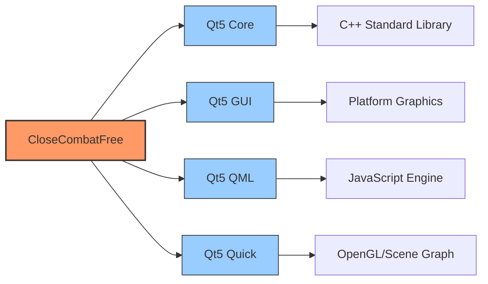
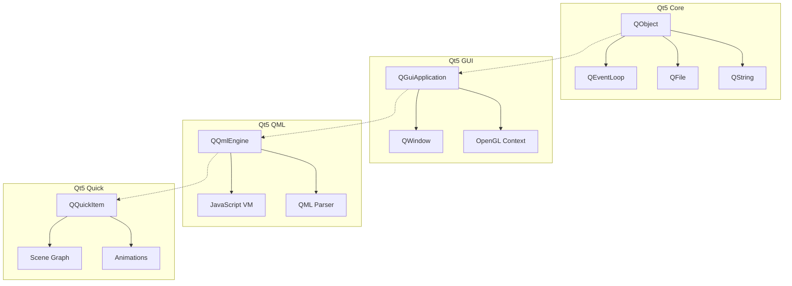
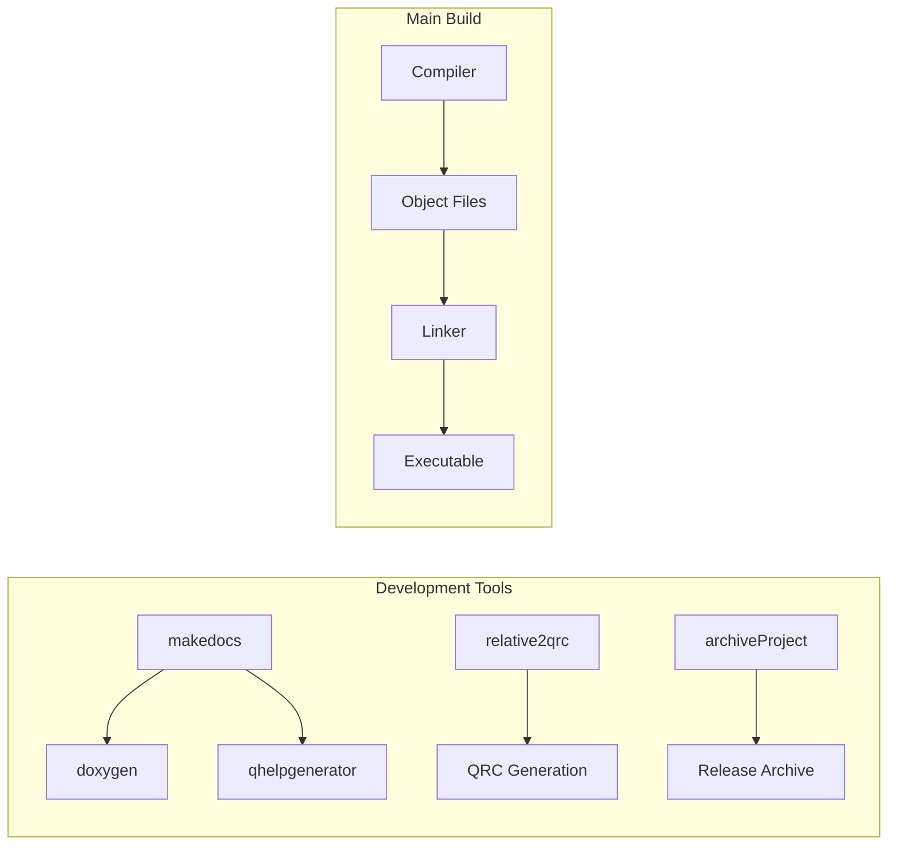
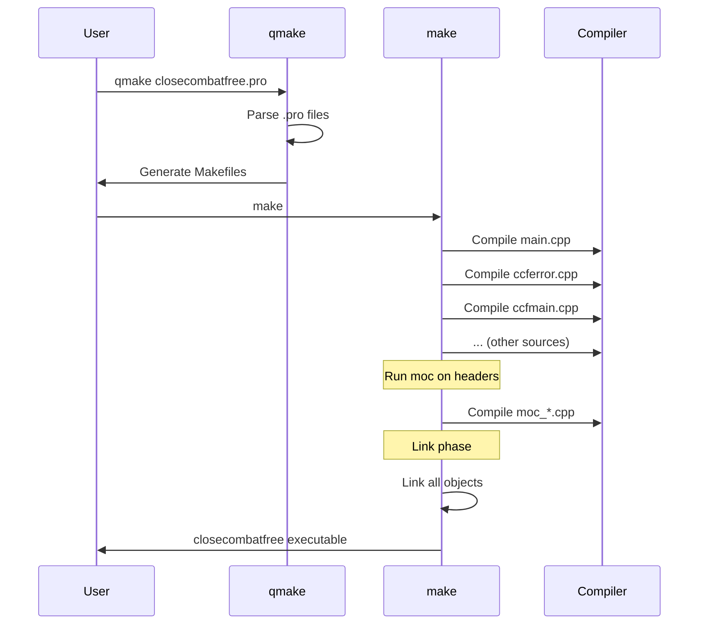

# Chapter 10: Build System and Dependencies

**CloseCombatFree (CCF) Technical Documentation**

Version: 0.0.5 (Development)  
Author: Tomasz 'sierdzio' Siekierda  
License: GPLv3  
Last Updated: 2024

---

## Table of Contents

1. [Concept: What You Need](#1-concept-what-you-need)
2. [Prerequisites: Why Each Dependency Is Needed](#2-prerequisites-why-each-dependency-is-needed)
3. [Setup: Installing Dependencies](#3-setup-installing-dependencies)
4. [Building: How to Compile](#4-building-how-to-compile)
5. [Running: How to Execute and Test](#5-running-how-to-execute-and-test)
6. [Self-Tests](#6-self-tests)
7. [Troubleshooting](#7-troubleshooting)
8. [Platform-Specific Notes](#8-platform-specific-notes)
9. [Advanced Build Options](#9-advanced-build-options)
10. [Distribution and Release](#10-distribution-and-release)
11. [Quick Command Reference](#11-quick-command-reference)

---

## 1. Concept: What You Need

### 1.1 Required Components to Build and Run CCF

**Level 1 - User Perspective:**

To build CloseCombatFree from source code, you need the following components:

| Component | Minimum Version | Purpose | Required? |
|-----------|----------------|---------|-------------|
| Qt Framework | 5.0+ | Core application framework | **Yes** |
| qmake | Comes with Qt | Build system generator | **Yes** |
| C++ Compiler | GCC 4.8+, Clang 3.4+, MSVC 2012+ | Compiles C++ source code | **Yes** |
| make | GNU Make | Executes build steps | **Yes** |
| doxygen | 1.8+ (optional) | Documentation generation | No |
| qhelpgenerator | Comes with Qt (optional) | Qt Compressed Help files | No |

**Level 2 - System Dependencies:**



**Level 3 - Build File Structure:**

The CCF project uses a hierarchical qmake-based build system:

```
closecombatfree.pro          # Root project file (subdirs template)
├── src/
│   ├── src.pro              # Main application build
│   ├── globalImports.pri    # Common build variables
│   └── tools/
│       ├── tools.pro        # Tools sub-project
│       └── relative2qrc/
│           └── relative2qrc.pro  # Path conversion tool
```

### 1.2 Platform Support Matrix

**Level 1 - Supported Platforms:**

| Platform | Status | Notes |
|----------|--------|-------|
| Linux | Primary | Ubuntu/Debian tested, Qt5 from repositories |
| Windows | Supported | Qt5 from qt.io installer |
| macOS | Supported | Qt5 from qt.io installer |
| Android | Planned | Mobile adaptation via Necessitas/Qt5 |
| iOS | Planned | Mobile adaptation |
| Symbian | Planned | Legacy mobile support |

**Level 3 - Conditional Compilation:**

The build system is designed to work across platforms without platform-specific code in the .pro files:

```makefile
# closecombatfree.pro:10
TEMPLATE = subdirs
SUBDIRS += \
    src \
    src/tools
```

---

## 2. Prerequisites: Why Each Dependency Is Needed

### 2.1 Qt5 Framework Components

**Level 1 - User Understanding:**

Qt5 provides the foundation for CCF's cross-platform capabilities. Each Qt module serves a specific purpose:

| Qt Module | Purpose in CCF | Required By |
|-----------|----------------|-------------|
| **Qt5 Core** | Event loop, object model, file I/O, timers | All C++ classes |
| **Qt5 GUI** | Window management, OpenGL context, basic graphics | QGuiApplication, rendering |
| **Qt5 QML** | Declarative UI language engine | All QML files, scripting |
| **Qt5 Quick** | Scene graph, animations, touch input | UI components, effects |

**Level 2 - Technical Details:**



**Level 3 - Implementation in src.pro:**

```makefile
# src/src.pro:12
QT = core gui qml quick
```

This single line in `src/src.pro:12` declares all required Qt modules. The qmake build system will:

1. Add the appropriate include paths for each module
2. Link against the corresponding Qt libraries
3. Enable moc (Meta-Object Compiler) for signal/slot support
4. Include QML runtime dependencies

### 2.2 Development Tools

**Level 1 - Optional Tools:**

| Tool | Purpose | When Needed |
|------|---------|-------------|
| doxygen | Generate HTML/QCH documentation | When updating docs |
| qhelpgenerator | Create Qt Assistant help files | For offline docs |
| relative2qrc | Convert paths for mobile deployment | For mobile builds |
| archiveProject | Create release archives | For distribution |
| makedocs | Automated documentation build | Developer workflow |

**Level 2 - Tool Architecture:**



**Level 3 - Tool Build Configuration:**

Tools are built as separate sub-projects under `src/tools/`:

```makefile
# src/tools/tools.pro:10
TEMPLATE = subdirs
SUBDIRS += \
    relative2qrc
```

The `relative2qrc` tool (`src/tools/relative2qrc/relative2qrc.pro:12`) is the only tool currently enabled in the build:

```makefile
# src/tools/relative2qrc/relative2qrc.pro:12
include(../../globalImports.pri)
TARGET = convert2qrc
TEMPLATE = app
```

### 2.3 Build Directory Structure

**Level 3 - Build Output Locations:**

```makefile
# src/globalImports.pri:1-7
ROOT_DIRECTORY = $$PWD/../
BUILD_DIRECTORY = $${ROOT_DIRECTORY}/build
TESTS_DIRECTORY = $${BUILD_DIRECTORY}/tests
EXAMPLES_DIRECTORY = $${BUILD_DIRECTORY}/examples
EXEC_DIRECTORY = $${ROOT_DIRECTORY}
```

These variables define:

- `BUILD_DIRECTORY`: Where object files and intermediate build artifacts go
- `EXEC_DIRECTORY`: Where the final executable is placed (project root)
- `TESTS_DIRECTORY`: Where test outputs are stored
- `EXAMPLES_DIRECTORY`: Where example files are generated

**Level 2 - Build File Layout:**

```
/home/juk/temp/closecombatfree/
├── closecombatfree              # Final executable (EXEC_DIRECTORY)
├── build/                       # Build artifacts (BUILD_DIRECTORY)
│   ├── *.o                      # Object files
│   ├── moc_*.cpp                # Moc generated files
│   └── qrc_*.cpp                # Resource compiler output
└── tools/
    └── convert2qrc              # Tools executable
```

---

## 3. Setup: Installing Dependencies

### 3.1 Ubuntu/Debian Linux

**Level 1 - Quick Install:**

```bash
# Install Qt5 development packages
sudo apt-get update
sudo apt-get install qt5-default qtbase5-dev qtdeclarative5-dev

# Install build essentials
sudo apt-get install build-essential make g++

# Install optional documentation tools
sudo apt-get install doxygen

# Optional: Install doxyqml for QML documentation
# See: http://agateau.com/projects/doxyqml/
```

**Level 2 - Package Breakdown:**

| Package | Contents | Why Needed |
|---------|----------|------------|
| `qt5-default` | Qt5 qmake and basic tools | Build system |
| `qtbase5-dev` | Qt5 Core and GUI headers/libs | Core functionality |
| `qtdeclarative5-dev` | Qt5 QML and Quick headers/libs | UI system |
| `build-essential` | GCC, make, basic libs | Compilation |
| `doxygen` | Documentation generator | Docs (optional) |

**Level 3 - Verify Installation:**

```bash
# Check Qt version
qmake --version
# Expected output: QMake version 3.0, Qt version 5.x.x

# Check compiler
g++ --version
# Expected output: g++ (Ubuntu x.x.x) x.x.x

# Check make
make --version
# Expected output: GNU Make x.x
```

### 3.2 macOS

**Level 1 - Quick Install:**

```bash
# Install Homebrew if not present
/bin/bash -c "$(curl -fsSL https://raw.githubusercontent.com/Homebrew/install/HEAD/install.sh)"

# Install Qt5
brew install qt@5

# Add Qt to PATH
echo 'export PATH="/usr/local/opt/qt@5/bin:$PATH"' >> ~/.zshrc
source ~/.zshrc

# Install Xcode Command Line Tools
xcode-select --install
```

**Level 2 - macOS Specifics:**

On macOS, Qt5 is typically installed via:

1. **Homebrew** (recommended for development):
   - Provides qt@5 formula
   - Automatically handles dependencies
   - Easy updates

2. **Qt Online Installer** (recommended for deployment):
   - Download from https://www.qt.io/download
   - Provides all Qt modules in one package
   - Better for creating distributable apps

**Level 3 - macOS Build Configuration:**

```bash
# Verify Qt installation
which qmake
# Output: /usr/local/opt/qt@5/bin/qmake

# Check Qt installation path
ls /usr/local/opt/qt@5/lib/cmake/
# Should show: Qt5Core, Qt5Gui, Qt5Qml, Qt5Quick
```

### 3.3 Windows

**Level 1 - Quick Install:**

1. Download Qt Online Installer from https://www.qt.io/download
2. Run installer and select:
   - Qt 5.15.x (or latest 5.x)
   - MinGW or MSVC compiler
   - Qt 5 QML and Quick modules
3. Install to default location (C:\Qt)
4. Add to PATH: `C:\Qt\5.15.x\mingw81_64\bin`

**Level 2 - Windows Build Options:**

| Compiler | Advantages | When to Use |
|----------|------------|-------------|
| MinGW | Open source, smaller footprint | Open source preference |
| MSVC 2019+ | Better optimization, Visual Studio integration | Professional development |

**Level 3 - Windows Build Environment:**

Using MinGW (included with Qt):

```batch
:: Open Qt MinGW command prompt from Start Menu
:: Navigate to project directory
cd C:\path\to\closecombatfree

:: Verify tools
qmake --version
gcc --version
mingw32-make --version
```

### 3.4 Platform Comparison

```mermaid
graph LR
    subgraph "Ubuntu/Debian"
        A[apt-get install] --> B[qt5-default]
        A --> C[build-essential]
    end
    
    subgraph "macOS"
        D[brew install] --> E[qt@5]
        D --> F[Xcode CLI]
    end
    
    subgraph "Windows"
        G[Qt Installer] --> H[MinGW/MSVC]
        G --> I[Qt5 Modules]
    end
    
    B --> J[Ready to Build]
    E --> J
    H --> J
```

---

## 4. Building: How to Compile

### 4.1 Build Process Overview

**Level 1 - Simple Steps:**

```bash
# Step 1: Generate build files
qmake closecombatfree.pro

# Step 2: Compile
make

# Step 3: Run
./closecombatfree
```

**Level 2 - Build Pipeline:**


**Level 3 - Detailed Build Steps:**

The complete build process involves these phases:

1. **Project Parsing** (qmake phase):
   - Read root `closecombatfree.pro`
   - Process `TEMPLATE = subdirs`
   - Recursively process all sub-project files
   - Include `globalImports.pri` in each sub-project

2. **Makefile Generation** (qmake phase):
   - Generate top-level Makefile
   - Generate `src/Makefile`
   - Generate `src/tools/Makefile`
   - Generate `src/tools/relative2qrc/Makefile`

3. **Compilation** (make phase):
   - Run moc on header files with Q_OBJECT macro
   - Compile C++ source files to object files
   - Compile moc-generated files
   - Link into final executable

### 4.2 Using Qt Creator (Recommended)

**Level 1 - GUI Build:**

1. Open Qt Creator
2. File → Open File or Project
3. Select `closecombatfree.pro`
4. Configure project (select Qt kit)
5. **Important**: Turn OFF shadow building
6. Build → Build Project (Ctrl+B)
7. Run → Run (Ctrl+R)

**Level 2 - Why No Shadow Building:**

CCF uses relative paths extensively in QML files. Shadow building creates build directories outside the source tree, which breaks path resolution for:

- QML imports: `import "../../qml/gui"`
- Image loading: `source: "../../img/tank.png"`
- Scenario loading: `source: "../scenarios/Scenario_tst1.qml"`

**Level 3 - Qt Creator Settings:**

To disable shadow building:

1. Projects mode (left sidebar)
2. Build Settings
3. Uncheck "Shadow build"
4. Build directory should be: `/home/juk/temp/closecombatfree`

### 4.3 Command Line Build

**Level 1 - Basic Commands:**

```bash
# From project root directory
cd /home/juk/temp/closecombatfree

# Clean previous builds (optional)
make clean
rm -f Makefile src/Makefile src/tools/Makefile

# Generate Makefiles
qmake closecombatfree.pro

# Build
make -j$(nproc)  # Use all CPU cores
```

**Level 2 - Build Command Reference:**



**Level 3 - Parallel Build:**

```bash
# Use all available CPU cores for faster builds
make -j$(nproc)

# Or specify number of jobs manually
make -j4

# For Windows (MinGW)
mingw32-make -j4
```

### 4.4 Clean Build Procedure

**Level 3 - Complete Clean:**

```bash
# Remove all generated files
make clean
rm -f Makefile
rm -f src/Makefile
rm -f src/tools/Makefile
rm -f src/tools/relative2qrc/Makefile
rm -rf build/

# Remove object files and executables
find . -name "*.o" -delete
find . -name "moc_*.cpp" -delete
find . -name "qrc_*.cpp" -delete
find . -name "closecombatfree" -type f -delete
find . -name "convert2qrc" -type f -delete

# Now rebuild from scratch
qmake closecombatfree.pro
make
```

---

## 5. Running: How to Execute and Test

### 5.1 Running the Game

**Level 1 - Simple Execution:**

```bash
# From project root directory
./closecombatfree
```

**Level 2 - Runtime Requirements:**

For the game to run successfully, it expects:

| Directory | Purpose | Required Files |
|-----------|---------|----------------|
| `qml/` | UI components | `main.qml`, menus, units |
| `maps/` | Map definitions | `Map_tst*.qml` |
| `scenarios/` | Scenario definitions | `Scenario_tst*.qml` |
| `units/` | Unit definitions | Tank QML files |
| `img/` | Graphics assets | PNG images |
| `config` | Configuration | Game settings |

**Level 3 - Entry Point:**

The application starts in `src/main.cpp:17-39`:

```cpp
int main(int argc, char *argv[])
{
    QGuiApplication a(argc, argv);
    CcfCommandLineParser cmd(a.arguments());
    
    // Check for --help flag
    if (cmd.wasHelpRequested()) {
        qDebug(qPrintable(cmd.helpMessage()), NULL);
        return 1;
    }

    // Create main window
    CcfMain *viewer = CcfMain::instance(&cmd);
    if (!viewer->isErrorState()) {
        // Load main QML file
        QUrl source = QUrl::fromLocalFile("qml/main.qml");
        viewer->setSource(source);
        
        // Show window
        if (viewer->isConfigMaximised()) {
            viewer->showMaximized();
        } else {
            viewer->show();
        }
        return a.exec();
    }
}
```

### 5.2 Command Line Options

**Level 2 - Available Options:**

The game supports several command-line options via `CcfCommandLineParser`:

```bash
./closecombatfree --help
```

Common options include:
- `--help`: Display help message and exit
- Configuration overrides (see config file)

### 5.3 Testing Scenarios

**Level 1 - Quick Test:**

After building, test with these steps:

1. Run the executable
2. Main menu should appear
3. Click "Scenario" to enter scenario selection
4. Select "Scenario_tst1" 
5. Units should appear on the battlefield
6. Click a unit to select it
7. Right-click to open context menu
8. Test movement by selecting "Move" and clicking destination

**Level 2 - Test Scenarios Available:**

| Scenario | Purpose | Location |
|----------|---------|----------|
| Scenario_tst1 | Basic tank unit test | `scenarios/Scenario_tst1.qml` |
| Scenario_tst2 | Scripting test | `scenarios/Scenario_tst2.qml` |
| Scenario_tst3 | Extended features | `scenarios/Scenario_tst3.qml` |
| Scenario_tst4 | Additional units | `scenarios/Scenario_tst4.qml` |

**Level 3 - Debug Environment Variable:**

```bash
# Show framerate/repaint timing
export QML_SHOW_FRAMERATE=1
./closecombatfree
```

This displays the time taken for each QML scene graph render pass, useful for performance debugging.

---

## 6. Self-Tests

### 6.1 Build Verification Tests

**Level 1 - Smoke Tests:**

After building, verify these basic operations:

```bash
# Test 1: Executable exists and is runnable
./closecombatfree --help
# Expected: Help message displayed, exit code 0

# Test 2: GUI launches
./closecombatfree
# Expected: Main window opens without errors

# Test 3: Tool built successfully
./tools/convert2qrc --help
# Expected: Help message for converter tool
```

### 6.2 Runtime Verification

**Level 2 - Manual Test Checklist:**

| Test | Expected Result | Verifies |
|------|-----------------|----------|
| Launch game | Main menu appears | Qt5 Quick working |
| Click "Scenario" | Scenario menu loads | QML loading |
| Load Scenario_tst1 | Tanks appear on map | Scenario system |
| Select tank | Selection box appears | Input handling |
| Right-click | Context menu opens | Event system |
| Issue move order | Tank moves to destination | Animation system |
| Zoom with mouse wheel | View zooms in/out | PinchArea/Flickable |
| Press Space | Game pauses/unpauses | Pause system |

### 6.3 Documentation Build Test

**Level 3 - Documentation Generation:**

```bash
# From project root
cd /home/juk/temp/closecombatfree

# Generate documentation
./src/tools/makedocs/makedocs

# Or manually with doxygen
doxygen user.docconf
doxygen developer.docconf

# Verify output
ls doc/html/
ls doc/user.qch 2>/dev/null || echo "qhelpgenerator not found, .qch not built"
```

---

## 7. Troubleshooting

### 7.1 Common Build Errors

**Level 3 - Error Solutions:**

#### Error: "Project ERROR: Unknown module(s) in QT: qml quick"

**Cause**: Qt5 declarative modules not installed

**Solution (Ubuntu/Debian)**:
```bash
sudo apt-get install qtdeclarative5-dev qml-module-qtquick2
```

**Solution (macOS)**:
```bash
brew reinstall qt@5
# Ensure Qt5 bin directory is in PATH
```

#### Error: "qmake: command not found"

**Cause**: Qt5 not in PATH

**Solution**:
```bash
# Find Qt5 installation
which qmake || find /usr -name "qmake" 2>/dev/null

# Add to PATH (adjust path as needed)
export PATH="/usr/lib/qt5/bin:$PATH"

# Or on macOS with Homebrew:
export PATH="/usr/local/opt/qt@5/bin:$PATH"
```

#### Error: "undefined reference to QQuickItem"

**Cause**: Qt5 Quick library not linked

**Solution**:
Verify `src/src.pro:12` contains:
```makefile
QT = core gui qml quick
```

If modifying, regenerate Makefiles:
```bash
qmake closecombatfree.pro
make clean
make
```

### 7.2 Runtime Errors

**Level 2 - Common Issues:**

| Symptom | Cause | Solution |
|---------|-------|----------|
| Black screen | QML not loading | Check `qml/main.qml` exists |
| Missing images | Wrong working directory | Run from project root |
| "file not found" errors | Shadow build enabled | Disable shadow build in Qt Creator |
| Slow performance | Debug build | Build with `CONFIG += release` |
| Units not visible | Scenario not loading | Check `scenarios/` directory |

### 7.3 Qt Creator Specific Issues

**Level 3 - Qt Creator Configuration:**

#### Shadow Build Problems

If you see errors like:
```
QML Error: file:///.../build-qml/main.qml: File not found
```

**Solution**:
1. Projects → Build Settings
2. Uncheck "Shadow build"
3. Clean and rebuild

#### Kit Configuration

If Qt Creator reports "No valid kit found":

1. Tools → Options → Kits
2. Verify Qt version is detected
3. Check Compiler is set (GCC/Clang/MinGW)
4. Ensure Debugger is available

---

## 8. Platform-Specific Notes

### 8.1 Linux (Primary Development Platform)

**Level 2 - Linux Details:**

CCF is primarily developed and tested on Ubuntu/Debian Linux.

**Package Variations:**

| Distribution | Qt5 Package | Notes |
|--------------|-------------|-------|
| Ubuntu 20.04+ | `qt5-default` | May need universe repo |
| Ubuntu 22.04+ | `qtbase5-dev` | qt5-default removed |
| Debian 11+ | `qtbase5-dev` | Stable has Qt5.15 |
| Fedora | `qt5-qtbase-devel` | Use dnf instead of apt |

**Level 3 - Linux Build Example:**

```bash
# Ubuntu 22.04 complete setup
sudo apt-get update
sudo apt-get install -y \
    build-essential \
    qtbase5-dev \
    qtdeclarative5-dev \
    qtbase5-dev-tools \
    qml-module-qtquick2 \
    libqt5quick5 \
    doxygen

# Clone and build
cd /home/juk/temp/closecombatfree
qmake closecombatfree.pro
make -j$(nproc)

# Run
./closecombatfree
```

### 8.2 macOS Notes

**Level 2 - macOS Considerations:**

- macOS uses Clang compiler by default
- Qt5 can be installed via Homebrew or Qt installer
- Applications may need to be signed for distribution
- Retina display support is automatic with Qt5

**Level 3 - macOS Build:**

```bash
# Using Homebrew Qt
export PATH="/usr/local/opt/qt@5/bin:$PATH"

# Build
qmake closecombatfree.pro
make

# Run
./closecombatfree.app/Contents/MacOS/closecombatfree
# Or
open closecombatfree.app
```

### 8.3 Windows Notes

**Level 2 - Windows Considerations:**

- Use MinGW or MSVC compiler (consistent with Qt installation)
- Path separators in QML are handled by Qt
- May need to deploy Qt DLLs alongside executable
- Use Qt Creator's windeployqt tool for deployment

**Level 3 - Windows Build:**

Using Qt MinGW command prompt:

```batch
:: Setup Qt environment (done by Qt MinGW prompt)
set PATH=C:\Qt\5.15.2\mingw81_64\bin;%PATH%

:: Build
cd C:\path\to\closecombatfree
qmake closecombatfree.pro
mingw32-make -j4

:: Run
closecombatfree.exe
```

### 8.4 Mobile Platforms (Planned)

**Level 1 - Future Support:**

Android and iOS support is planned. Key considerations:

- **QRC Resources**: Mobile requires all assets in Qt Resource System
- **Touch Input**: UI already uses touch-friendly components
- **relative2qrc Tool**: Converts project for mobile deployment

**Level 3 - Mobile Preparation:**

```bash
# Convert project for mobile (when ready)
./tools/convert2qrc -i ../ -o ../../closecombatfree_android -f -t
```

---

## 9. Advanced Build Options

### 9.1 Debug vs Release Builds

**Level 2 - Build Configurations:**

| Configuration | Optimization | Debug Info | Use Case |
|--------------|--------------|------------|----------|
| Debug | None (-O0) | Full | Development |
| Release | High (-O3) | None | Distribution |
| Profile | Medium (-O2) | Partial | Performance analysis |

**Level 3 - Specifying Configuration:**

```bash
# Debug build (default)
qmake closecombatfree.pro CONFIG+=debug
make

# Release build
qmake closecombatfree.pro CONFIG+=release
make

# Release with debug info
qmake closecombatfree.pro CONFIG+=release CONFIG+=force_debug_info
make
```

### 9.2 Custom Build Variables

**Level 3 - Modifying globalImports.pri:**

```makefile
# src/globalImports.pri:1-7
ROOT_DIRECTORY = $$PWD/../
BUILD_DIRECTORY = $${ROOT_DIRECTORY}/build
TESTS_DIRECTORY = $${BUILD_DIRECTORY}/tests
EXAMPLES_DIRECTORY = $${BUILD_DIRECTORY}/examples
EXEC_DIRECTORY = $${ROOT_DIRECTORY}
```

You can override these:

```bash
# Custom build directory
qmake closecombatfree.pro "BUILD_DIRECTORY=/tmp/ccf-build"

# Custom executable location
qmake closecombatfree.pro "EXEC_DIRECTORY=/opt/games"
```

### 9.3 Parallel and Distributed Builds

**Level 3 - Speed Optimization:**

```bash
# Maximum parallel jobs
make -j$(nproc)

# For very large projects, consider distcc
# On build master:
distcc-pump make -j32

# Or Icecream distributed compiler
icecc make -j16
```

---

## 10. Distribution and Release

### 10.1 Creating Release Packages

**Level 2 - Distribution Methods:**

| Method | Tool | Output | Use Case |
|--------|------|--------|----------|
| Source Archive | archiveProject | .tar.gz | Source distribution |
| Binary Package | make install | System package | Package managers |
| App Bundle | macdeployqt | .app | macOS users |
| Installer | windeployqt + NSIS | .exe | Windows users |

**Level 3 - Archive Project Tool:**

```bash
# Create source archive
# Run from one directory above project root
cd /home/juk/temp
./closecombatfree/tools/archiveProject closecombatfree

# Output: closecombatfree.tar.gz in parent directory
```

The `archiveProject` tool (`src/tools/archiveProject/archiveProject`) creates clean archives excluding:
- build directories
- .git directory
- temporary files
- IDE-specific files

### 10.2 Deploying Qt Dependencies

**Level 2 - Qt Deployment:**

On each platform, Qt dependencies must be bundled or installed:

**Linux**:
- Package Qt as dependencies
- Or use static linking (requires Qt static build)

**macOS**:
```bash
macdeployqt closecombatfree.app
```

**Windows**:
```batch
windeployqt closecombatfree.exe
```

### 10.3 License Compliance

**Level 1 - GPLv3 Requirements:**

CCF is licensed under GPLv3. Distribution requirements:

1. **Source Code**: Must provide complete source code
2. **License**: Include `doc/LICENSE.txt` or full GPL text
3. **Attribution**: Preserve copyright notices
4. **Changes**: Document any modifications

**Level 3 - License File:**

Ensure distribution includes:
```
doc/LICENSE.txt          # Full GPLv3 text
README                   # Project readme
CHANGELOG                # Version history
```

---

## 11. Quick Command Reference

### 11.1 Essential Commands

**Level 1 - Quick Reference:**

```bash
# Complete build from scratch
qmake closecombatfree.pro && make -j$(nproc)

# Clean build
make clean && rm -f Makefile src/Makefile && qmake closecombatfree.pro && make

# Run
./closecombatfree

# Generate docs
./src/tools/makedocs/makedocs

# Create archive
./tools/archiveProject closecombatfree
```

### 11.2 Build Command Cheat Sheet

| Task | Command | Notes |
|------|---------|-------|
| Configure | `qmake closecombatfree.pro` | Generate Makefiles |
| Compile | `make -j4` | 4 parallel jobs |
| Clean | `make clean` | Remove build artifacts |
| Distclean | `make distclean` | Remove Makefiles too |
| Install | `make install` | Install to system (if configured) |
| Run tests | `./closecombatfree --test` | If test mode available |
| Debug | `gdb ./closecombatfree` | With debug symbols |
| Profile | `valgrind ./closecombatfree` | Memory checking |

### 11.3 File Path Reference

**Level 3 - Important Files:**

```
/home/juk/temp/closecombatfree/
├── closecombatfree.pro:10          # Root project file
├── src/
│   ├── src.pro:12                    # Main app build config
│   ├── globalImports.pri:1           # Common variables
│   └── main.cpp:17                   # Application entry
├── src/tools/
│   ├── tools.pro:10                  # Tools sub-project
│   └── relative2qrc/
│       └── relative2qrc.pro:12     # Path converter tool
├── qml/main.qml                      # Main QML file (loaded at runtime)
├── README                            # Project readme
└── doc/
    ├── LICENSE.txt                   # GPLv3 license
    └── chapters/                     # Documentation
```

### 11.4 Environment Variables

**Level 2 - Useful Environment Settings:**

```bash
# Debug QML loading
export QML_IMPORT_TRACE=1

# Show framerate
export QML_SHOW_FRAMERATE=1

# Use specific Qt installation
export QTDIR=/usr/local/Qt-5.15.2
export PATH=$QTDIR/bin:$PATH
export LD_LIBRARY_PATH=$QTDIR/lib:$LD_LIBRARY_PATH

# Enable Qt debugging
export QT_DEBUG_PLUGINS=1
```

---

## Summary

This chapter covered the complete build system for CloseCombatFree:

1. **Concept**: Qt5-based project using qmake build system
2. **Prerequisites**: Qt5 (core, gui, qml, quick), C++ compiler, make
3. **Setup**: Platform-specific installation instructions
4. **Building**: qmake → make workflow, with Qt Creator recommended
5. **Running**: Execute from project root, expects QML/img directories
6. **Tests**: Manual verification of scenarios and UI
7. **Troubleshooting**: Common errors and solutions
8. **Platform Notes**: Linux (primary), macOS, Windows (supported), Mobile (planned)
9. **Advanced**: Debug/Release configs, custom variables
10. **Distribution**: Packaging tools and GPLv3 compliance
11. **Reference**: Quick command and file reference

**Key Principle**: CCF uses a simple, hierarchical qmake project structure designed for ease of development. No complex build systems or external dependencies beyond Qt5 itself.

---

*End of Chapter 10: Build System and Dependencies*
